# Combined Signal Analysis: Activation + Semantic Similarity

> Evaluates whether merging structural (graph) and semantic (embedding) signals produces better retrieval than either signal alone, using a 28-node medical knowledge graph with an alpha-sweep parameter study.

## 1. The Approach

Retrieval from a knowledge graph can use two independent signals: graph topology (spreading activation) and semantic similarity (embedding cosine distance). Graph topology captures explicit relationships (treatments, complications, risk factors). Semantic similarity captures implicit relatedness (concepts that describe similar medical phenomena).

The question is: does combining both signals produce better results than either alone? And what is the optimal mixing weight?

This showcase runs a controlled experiment across 4 clinical scenarios, measuring recall for activation-only, similarity-only, and combined retrieval. An alpha-sweep varies the mixing weight from 0.0 (pure semantic) to 1.0 (pure activation) to find the optimal balance.

## 2. A Simple Analogy

Imagine two doctors diagnosing a patient. Doctor A only looks at the patient's chart (direct medical history -- graph edges). Doctor B only considers which conditions sound similar to the symptoms (semantic matching). The combined approach listens to both doctors and weights their opinions. The alpha parameter controls how much weight each doctor's opinion gets.

## 3. Key Concepts

| Term | Plain English |
|------|---------------|
| Alpha parameter | Mixing weight between activation (alpha=1.0) and similarity (alpha=0.0). Combined score = alpha * activation + (1-alpha) * similarity. |
| Activation-only retrieval | Ranks results by spreading activation energy. Captures graph connectivity. |
| Similarity-only retrieval | Ranks results by cosine similarity of embedding vectors. Captures semantic closeness. |
| Combined retrieval | Ranks results by the weighted sum of both signals. |
| Alpha sweep | Running retrieval for multiple alpha values to find the optimal mixing weight. |
| Recall | Fraction of expected relevant concepts found in the top-k results. |

## 4. Quick Start

Requires `sentence-transformers`:

```bash
pip install sentence-transformers
.venv/bin/python examples/showcase/retrieval/combined_signal_analysis/combined_signal_analysis.py
```

```
Loading sentence-transformers model...
Knowledge base: 28 nodes, 29 edges

######################################################################
# SCENARIO 1: Clinical decision support
# A doctor queries 'type 2 diabetes' — what should surface?
######################################################################

  QUERY: 'type 2 diabetes'
  ...

  BREAKDOWN: What each signal contributes
  ...

######################################################################
# ALPHA SWEEP: How does the mixing weight affect recall?
######################################################################
  alpha=0.00  top6=[...]  recall=N/6
  alpha=0.25  top6=[...]  recall=N/6
  alpha=0.50  top6=[...]  recall=N/6
  alpha=0.75  top6=[...]  recall=N/6
  alpha=1.00  top6=[...]  recall=N/6
```

## 5. The Scenario

A 28-node medical knowledge graph with three node types and 29 directed edges:

| Node type | Count | Examples |
|-----------|-------|---------|
| condition | 10 | type 2 diabetes, hypertension, obesity, heart disease, stroke |
| treatment | 10 | metformin, insulin, lisinopril, statins, beta blockers |
| risk factor | 8 | smoking, sedentary lifestyle, high cholesterol, chronic stress |

Each condition node carries rich data including symptoms and risk factor descriptions, which the embedding model uses for similarity computation.

Edge labels: `risk_factor`, `treated_by`, `complication`, `treats`.

```mermaid
graph TB
    subgraph "Conditions"
        DIAB["type 2 diabetes"]
        HYP["hypertension"]
        OBE["obesity"]
        HD["heart disease"]
        STR["stroke"]
        DEP["depression"]
        CKD["chronic kidney disease"]
        SA["sleep apnea"]
        OST["osteoarthritis"]
        AST["asthma"]
    end

    subgraph "Treatments"
        MET["metformin"]
        INS["insulin"]
        LIS["lisinopril"]
        STA["statins"]
        BB["beta blockers"]
        CBT["cognitive behavioral therapy"]
        SSRI["SSRIs"]
        WLS["weight loss surgery"]
        CPAP["CPAP machine"]
        PT["physical therapy"]
    end

    subgraph "Risk Factors"
        OBE_R["obesity"]
        SMO["smoking"]
        SED["sedentary lifestyle"]
        HC["high cholesterol"]
        CS["chronic stress"]
        PD["poor diet"]
    end

    DIAB --"treated_by"--> MET
    DIAB --"treated_by"--> INS
    DIAB --"complication"--> HD
    DIAB --"complication"--> CKD
    DIAB --"risk_factor"--> OBE_R

    HYP --"treated_by"--> LIS
    HYP --"treated_by"--> BB
    HYP --"complication"--> STR

    OBE --"complication"--> SA
    OBE --"treated_by"--> WLS

    DEP --"treated_by"--> CBT
    DEP --"treated_by"--> SSRI
```



## 6. Analysis Pipeline

### Scenario 1: Clinical Decision Support

Query "type 2 diabetes" with alpha=0.5 (equal weight). Expected results include treatments (metformin, insulin), complications (heart disease, chronic kidney disease), and risk factors (obesity).

The breakdown section shows top-6 results ranked by each signal independently, revealing what each signal contributes:
- **Activation-only**: surfaces direct graph neighbors (treatments, complications)
- **Similarity-only**: surfaces conceptually similar terms (related conditions)
- **Combined**: captures both direct clinical relationships and related conditions

### Scenario 2: Cross-Domain Risk Discovery

Query "obesity" to discover cascading risks. Obesity connects to multiple complications (diabetes, sleep apnea, osteoarthritis, heart disease) through graph edges. The combined signal should surface both direct complications and related risk factors.

### Scenario 3: Treatment Exploration

Query "heart disease" -- treatments (statins, beta blockers) and modifiable risks (hypertension, high cholesterol, smoking, diabetes) should surface. Heart disease has many edges, so activation should be strong.

### Scenario 4: Sparse Graph Region

Query "depression" -- a sparsely-connected node with only 2 treatments and 2 risk factors. With few graph edges, activation alone may miss relevant concepts. Semantic similarity should compensate by finding related mental health concepts through embedding space.

### Alpha Sweep

Runs "type 2 diabetes" retrieval at 5 alpha values (0.0, 0.25, 0.5, 0.75, 1.0) and measures recall in top-6. This reveals the optimal mixing weight for this query type.

### Evaluation Summary

Compares top-6 recall across all 4 scenarios for activation-only, similarity-only, and combined retrieval. The key finding is that the optimal alpha varies by query: well-connected concepts favor activation, sparse concepts favor similarity.

## 7. Understanding Output

### Combined score formula

```
combined = alpha * activation + (1 - alpha) * similarity
```

| Alpha | Behavior |
|-------|----------|
| 1.0 | Pure activation (graph topology only) |
| 0.75 | Activation-weighted with some similarity |
| 0.5 | Equal weight (default) |
| 0.25 | Similarity-weighted with some activation |
| 0.0 | Pure semantic similarity (embeddings only) |

### Recall interpretation

| Metric | Meaning |
|--------|---------|
| N/6 in top-6 | N of 6 expected relevant concepts appeared in top-6 results |
| Higher for combined | Combined signals outperform either alone |
| Higher for activation | Graph topology dominates for this query |
| Higher for similarity | Semantic matching dominates (sparse graph region) |

## 8. Key Metrics

| Metric | Value |
|--------|-------|
| Graph nodes | 28 |
| Graph edges | 29 |
| Conditions | 10 |
| Treatments | 10 |
| Risk factors | 8 |
| Embedding model | all-MiniLM-L6-v2 |
| Alpha sweep values | 5 (0.0, 0.25, 0.5, 0.75, 1.0) |
| Clinical scenarios | 4 (diabetes, obesity, heart disease, depression) |
| Expected relevant (diabetes) | 6 |
| Expected relevant (obesity) | 7 |
| Expected relevant (heart disease) | 7 |
| Expected relevant (depression) | 4 |

## 9. What Makes This Different

**Controlled parameter study.** Rather than asserting that combined retrieval is better, this showcase measures it. The alpha sweep and per-scenario recall comparison provide quantitative evidence for when each signal contributes.

**Rich node data for embeddings.** Condition nodes carry symptom descriptions and risk factor lists in their data dictionaries. The embedding provider encodes these as part of the concept representation, producing more discriminative similarity scores than label-only embeddings.

**Sparse vs dense analysis.** The inclusion of "depression" (sparse node with few edges) alongside "heart disease" (dense node with many edges) demonstrates that the optimal mixing weight depends on graph structure. This is a practical finding for deployment: the alpha parameter should be tuned per query type or learned from feedback.

## 10. Code Implementation

### Combined scoring function

```python
def combined_score(activation: float, similarity: float, alpha: float = 0.5) -> float:
    return alpha * activation + (1 - alpha) * similarity
```

### Retrieval with combined signals using public APIs

```python
activated = mem.activate(concept, top_k=top_k * 2, iterations=3)
similar = mem.search.similar(concept, top_k=top_k * 2, threshold=0.0)
sim_map = {s.label: s.similarity or 0.0 for s in similar}

results = []
for r in activated:
    sim = sim_map.get(r.label, 0.0)
    combined = combined_score(r.activation, sim, alpha)
    results.append({
        "label": r.label,
        "activation": r.activation,
        "similarity": sim,
        "combined": combined,
    })
results.sort(key=lambda x: x["combined"], reverse=True)
```

### Alpha sweep

```python
for alpha in [0.0, 0.25, 0.5, 0.75, 1.0]:
    results = run_query(mem, "type 2 diabetes", alpha=alpha, top_k=10)
    top_labels = [x["label"] for x in results[:6]]
    hits = sum(1 for l in top_labels if l in expected)
    print(f"alpha={alpha:.2f} recall={hits}/{len(expected)}")
```

## 11. Real-World Gap

**External dependency.** Requires `sentence-transformers` (~90MB model download on first run).

**Linear combination.** The combined score uses a simple weighted sum. Production systems may use learned non-linear combinations (the LTR model in `feedback_demo` is an example of this).

**Fixed alpha.** The showcase uses a single alpha for all queries. Production retrieval would adapt alpha per query type, per user, or learn it from feedback data.

**Small graph.** 28 nodes with dense local neighborhoods. At scale, activation propagation may behave differently, and embedding quality may vary with concept diversity.

**Expected sets are manually defined.** The "expected relevant" concepts are hand-picked. A rigorous evaluation would use human annotations from domain experts with inter-rater agreement.

## 12. Reference

### Key API Methods

| Method | Purpose |
|--------|---------|
| `mem.activate(concept, energy, top_k, iterations)` | Spreading activation retrieval |
| `mem.search.similar(concept, top_k, threshold)` | Semantic similarity retrieval |
| `mem.set_embedding_provider(provider)` | Set a custom embedding provider |
| `EmbeddingProvider` | Abstract base class for custom embedding backends |

### Related Examples

| Example | Focus |
|---------|-------|
| `examples/showcase/retrieval/semantic_knowledge_graph/` | Pluggable embeddings, analogical reasoning, similarity |
| `examples/showcase/retrieval/feedback_demo/` | RRF retrieval with LTR training from relevance feedback |
| `examples/showcase/retrieval/retrieval_and_similarity/` | Activation, similarity, RRF on a technology graph (no external dependencies) |
