# Relevance Feedback on a Medical Knowledge Graph

> Demonstrates RRF retrieval, relevance feedback recording, and learning-to-rank retraining on a 25-node medical knowledge base using sentence-transformers embeddings.

## 1. The Approach

Retrieval systems return ranked lists of results, but the initial ranking may not match user expectations. A doctor searching for "type 2 diabetes" expects treatments (metformin, insulin) and complications (heart disease, kidney disease), but the initial ranking might prioritize semantically similar terms over clinically relevant ones.

Hyper3's relevance feedback loop records which results users mark as relevant, trains a learning-to-rank (LTR) model from those judgments, and re-weights retrieval signals (activation, similarity, degree, depth) based on what actually predicts relevance for each domain.

This showcase uses `sentence-transformers` (`all-MiniLM-L6-v2`) for real semantic embeddings and runs a three-phase experiment: baseline RRF retrieval, feedback collection and LTR training, then comparison of before/after retrieval quality.

## 2. A Simple Analogy

Imagine a search engine where you can mark results as "useful" or "not useful." After a few searches, the engine learns that for medical queries, graph-connected results (treatments, complications) matter more than textually-similar results. Next time you search, the results are reordered based on what it learned from your feedback. This showcase builds exactly that feedback loop.

## 3. Key Concepts

| Term | Plain English |
|------|---------------|
| Reciprocal Rank Fusion (RRF) | Merges activation and similarity ranked lists by assigning `1/(k + rank)` from each list and summing. No score normalization needed. |
| Relevance feedback | User marks retrieved results as relevant or not relevant, creating training data. |
| Learning-to-Rank (LTR) | A linear model trained on per-item features (activation, similarity, degree, depth) to predict relevance. |
| Spreading activation | Energy injected at the query concept propagates through graph edges. Nodes with more paths accumulate higher activation. |
| `SearchHit` | Result object from `mem.search.query()` with label, activation, similarity, RRF score, and rank positions. |

## 4. Quick Start

Requires `sentence-transformers`:

```bash
pip install sentence-transformers
.venv/bin/python examples/showcase/retrieval/feedback_demo/feedback_demo.py
```

```
Loading model...
KB: 25 nodes, 37 edges

######################################################################
# PHASE 1: Baseline RRF retrieval (no feedback)
######################################################################

  Query: 'type 2 diabetes' (RRF, no feedback)
  ...

######################################################################
# PHASE 2: Record relevance feedback and retrain
######################################################################

  Learnt weights: {...}

######################################################################
# PHASE 3: LTR retrieval (trained on feedback)
######################################################################

  Query: 'type 2 diabetes' (LTR, post-feedback)
  ...

######################################################################
# COMPARISON: Before vs After feedback
######################################################################

  Scenario                    RRF base  LTR trained   Expected
  -------------------------  ----------  ------------  ----------
  type 2 diabetes                    N            N           7
  depression                         N            N           3
```

## 5. The Scenario

A 25-node medical knowledge graph with three node types and 37 directed edges:

| Node type | Count | Examples |
|-----------|-------|---------|
| condition | 10 | type 2 diabetes, hypertension, obesity, heart disease, stroke, depression |
| treatment | 10 | metformin, insulin, lisinopril, statins, beta blockers, SSRIs |
| risk factor | 5 | smoking, sedentary lifestyle, high cholesterol, chronic stress |

Edge labels: `risk_factor` (16), `treated_by` (11), `complication` (10) -- totaling 37 edges.

```mermaid
graph TB
    subgraph "Conditions"
        DIAB["type 2 diabetes"]
        HYP["hypertension"]
        OBE["obesity"]
        HD["heart disease"]
        STR["stroke"]
        DEP["depression"]
        CKD["chronic kidney disease"]
        SA["sleep apnea"]
        OST["osteoarthritis"]
        AST["asthma"]
    end

    subgraph "Treatments"
        MET["metformin"]
        INS["insulin"]
        LIS["lisinopril"]
        STA["statins"]
        BB["beta blockers"]
        CBT["cognitive behavioral therapy"]
        SSRI["SSRIs"]
    end

    subgraph "Risk Factors"
        SMO["smoking"]
        SED["sedentary lifestyle"]
        HC["high cholesterol"]
        CS["chronic stress"]
    end

    DIAB --"treated_by"--> MET
    DIAB --"treated_by"--> INS
    DIAB --"complication"--> HD
    DIAB --"complication"--> CKD
    DIAB --"risk_factor"--> OBE

    HYP --"treated_by"--> LIS
    HYP --"treated_by"--> BB
    HYP --"complication"--> STR

    DEP --"treated_by"--> CBT
    DEP --"treated_by"--> SSRI
    DEP --"risk_factor"--> CS
```



The diagram above shows a representative subset of the 37 edges. The full graph includes bidirectional risk-factor relationships (e.g., both "diabetes → obesity" and "heart disease → obesity"), complication chains linking conditions to downstream diseases, and treatment edges connecting each condition to its therapies.

## 6. Analysis Pipeline

### Phase 1: Baseline RRF Retrieval

Run `mem.search.query()` for "type 2 diabetes" and "depression" without any feedback training. The RRF fusion merges activation and similarity rankings. Record the results and expected-relevant concept counts.

**Why this matters:** This establishes the baseline. Later phases measure whether feedback improves retrieval quality against this starting point.

### Phase 2: Feedback Collection and LTR Training

Mark relevant concepts for each query and record feedback:

```python
relevant_diabetes = {"metformin", "insulin", "obesity", "heart disease", ...}
mem.record_feedback("type 2 diabetes", r1, relevant_diabetes)
```

Repeat 3 more times with fresh retrieval results (8 total feedback rounds across 2 queries). Train the LTR model:

```python
report = mem.train_retriever()
```

The model learns feature weights from the feedback. With sentence-transformers embeddings, the similarity signal is meaningful, and the model will weight it relative to activation and degree.

### Phase 3: LTR Retrieval After Training

Run the same queries with `use_ltr=True`:

```python
r3 = mem.search.query("type 2 diabetes", top_k=10, use_ltr=True)
```

Compare top-10 hits with expected relevant concepts. The comparison table shows whether LTR improved precision for each query.

## 7. Understanding Output

### RRF Score Interpretation

| Score Range | Meaning |
|-------------|---------|
| 0.03+ | Ranked in top tier of both activation and similarity lists |
| 0.02-0.03 | Strong in one signal, moderate in the other |
| < 0.02 | Present in both lists but ranked lower in at least one |

### LTR Weight Interpretation

| Feature | What it captures |
|---------|-----------------|
| activation | Graph topology: how structurally close is the result to the query |
| similarity | Semantic closeness: how similar the embedding vectors are |
| degree | Node connectivity: better-connected nodes may be more central |
| inverse_depth | Hop distance: closer nodes are more likely relevant |

The learned weights depend on the feedback data and embedding model. With sentence-transformers and a medical graph, the model may learn that activation dominates for well-connected conditions while similarity compensates for sparse regions.

## 8. Key Metrics

| Metric | Value |
|--------|-------|
| Graph nodes | 25 |
| Graph edges | 37 |
| Conditions | 10 |
| Treatments | 10 |
| Risk factors | 5 |
| Embedding model | all-MiniLM-L6-v2 |
| Feedback queries | 2 (type 2 diabetes, depression) |
| Feedback rounds | 4 per query (8 total) |
| Expected relevant (diabetes) | 7 |
| Expected relevant (depression) | 3 |
| LTR features | activation, similarity, degree, inverse_depth |

## 9. What Makes This Different

**Feedback-driven adaptation.** Static retrieval systems use fixed signal weights. Hyper3's LTR model learns from user judgments which signals predict relevance for each domain. A medical knowledge base may favor graph topology (treatments and complications are structurally connected), while a literature graph may favor semantic similarity.

**Two-phase experiment design.** The showcase runs retrieval before and after training with the same queries and expected sets, producing a direct before/after comparison. This demonstrates that the feedback loop produces measurable changes in ranking.

**Real embeddings.** Unlike the `retrieval_and_feedback` showcase which uses `HashEmbeddingProvider`, this demo uses `sentence-transformers` for semantically meaningful similarity scores. This means the similarity signal is genuinely useful, and the LTR model must balance it against activation rather than ignoring it as noise.

## 10. Code Implementation

### Setting up with a real embedding provider

```python
from hyper3 import HypergraphMemory, EmbeddingProvider
import numpy as np

class SentenceTransformerProvider(EmbeddingProvider):
    def __init__(self, model_name: str = "all-MiniLM-L6-v2"):
        from sentence_transformers import SentenceTransformer
        self._model = SentenceTransformer(model_name)

    def embed(self, text: str) -> np.ndarray:
        vec = self._model.encode(text, convert_to_numpy=True)
        norm = np.linalg.norm(vec)
        if norm > 0:
            vec = vec / norm
        return vec.astype(np.float64)

    def dimension(self) -> int:
        return len(self.embed("test"))

mem = HypergraphMemory(evolve_interval=0)
mem.set_embedding_provider(SentenceTransformerProvider())
```

### Recording feedback and training

```python
results = mem.search.query("type 2 diabetes", top_k=10)
relevant = {"metformin", "insulin", "obesity", "heart disease"}
mem.record_feedback("type 2 diabetes", results, relevant)

report = mem.train_retriever()
print(report["weights"])
```

### Retrieving with trained model

```python
results_after = mem.search.query("type 2 diabetes", top_k=10, use_ltr=True)
for r in results_after:
    print(f"{r.label}: activation={r.activation:.3f}, similarity={r.similarity:.3f}")
```

## 11. Real-World Gap

**External dependency.** Requires `sentence-transformers` (~90MB model download on first run). Not a core Hyper3 dependency.

**Small feedback corpus.** 8 feedback rounds across 2 queries is minimal. Production LTR models benefit from hundreds or thousands of relevance judgments across diverse query types.

**Single-user feedback.** The showcase assumes one user providing feedback. Production systems may have multiple users with different relevance criteria, requiring per-user or per-segment LTR models.

**Binary relevance.** Concepts are marked as relevant or not, with no gradation. Production systems often use graded relevance (highly relevant, partially relevant, not relevant).

**No query expansion.** Each query is a single concept. Real retrieval often involves multi-concept queries, query expansion, and query rewriting.

## 12. Reference

### Key API Methods

| Method | Purpose |
|--------|---------|
| `mem.set_embedding_provider(provider)` | Set a custom embedding provider |
| `mem.search.query(concept, top_k)` | RRF retrieval of related concepts |
| `mem.search.query(concept, top_k, use_ltr=True)` | LTR retrieval after training |
| `mem.record_feedback(query, results, relevant_set)` | Record relevance judgments |
| `mem.train_retriever()` | Train LTR model from feedback |
| `mem.activate(concept, energy, top_k, iterations)` | Spreading activation retrieval |

### Related Examples

| Example | Focus |
|---------|-------|
| `examples/showcase/retrieval/retrieval_and_feedback/` | Full 177-node cybersecurity KB with RRF, feedback, reasoning, community detection |
| `examples/showcase/retrieval/retrieval_and_similarity/` | Activation, similarity, RRF on a 14-node technology graph (no external dependencies) |
| `examples/showcase/retrieval/combined_signal_analysis/` | Alpha-sweep evaluation of activation vs similarity trade-offs |
