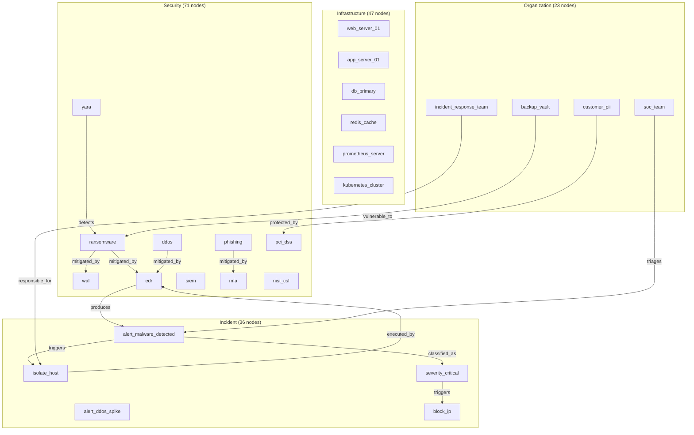

# Semantic Retrieval with Relevance Feedback Showcase

> **Multi-Signal Retrieval and Learning-to-Rank on a 177-Node Cybersecurity Knowledge Base**

## 1. The Approach

Information retrieval systems typically rely on a single signal — keyword matching, vector similarity, or graph traversal. Each signal has blind spots: keyword search misses synonyms, vector similarity misses structural context, and graph traversal misses nodes outside the connected neighborhood.

**The Single-Signal Problem:** A security analyst searching for "ransomware" needs results that include both structurally related concepts (encryption, backup protection, detection tools) and semantically similar concepts (other malware types). A single retrieval method covers only part of this need.

**The Hyper3 Approach:** Combine three retrieval signals — spreading activation (graph topology), embedding similarity (semantic closeness), and Reciprocal Rank Fusion (RRF) to merge ranked lists. Then train a learning-to-rank model from user relevance feedback to weight signals based on which ones produce better results for actual queries.

## 2. Key Concepts

| Term | Plain English Meaning |
|------|----------------------|
| **Spreading Activation** | Energy propagates from a seed node through graph edges; nodes closer to the seed receive higher activation scores |
| **Embedding Similarity** | Cosine similarity between vector embeddings of node labels; captures semantic relatedness independent of graph structure |
| **Reciprocal Rank Fusion (RRF)** | Merges two ranked lists by assigning each item a score of `1/(k + rank)` from each list, then summing |
| **Relevance Feedback** | User marks retrieved results as relevant or not; the system learns which signals correlate with relevance |
| **Learning-to-Rank (LTR)** | A linear model trained on per-item features (activation, similarity, degree, depth) to predict relevance |

## 3. Quick Start

Run the showcase to build a 177-node cybersecurity knowledge base and demonstrate retrieval with feedback:

```bash
.venv/bin/python examples/showcase/retrieval/retrieval_and_feedback/retrieval_and_feedback.py
```

### What You'll See

The example builds a cybersecurity/IT operations graph and runs 11 analysis sections:

```
======================================================================
SECTION 1: Knowledge Base Construction
======================================================================
  Nodes: 177
  Edges: 251
    incident: 36 nodes
    infrastructure: 47 nodes
    organization: 23 nodes
    security: 71 nodes
```

## 4. The Scenario

The example models a cybersecurity and IT operations knowledge base with **177 nodes and 251 edges** across four categories:

- **71 Security Nodes:** Threats (ransomware, phishing, ddos), vulnerabilities (CVEs, misconfigs), controls (firewall, IDS, WAF), tools (nmap, burp_suite), protocols (TLS, OAuth2), frameworks (NIST CSF, MITRE ATT&CK)
- **47 Infrastructure Nodes:** Servers (web, app, db), networks (DMZ, internal, management), databases (Postgres, Redis, Elasticsearch), cloud resources (AWS, Azure, GCP, Kubernetes), monitoring (Prometheus, Grafana, ELK)
- **36 Incident Nodes:** Alerts (brute force, malware, data leak), logs (syslog, auth log, flow log), response actions (isolate, block, revoke), severity levels (critical through info)
- **23 Organization Nodes:** Teams (SOC, IR, DevOps), assets (PII, source code), policies (password, access control), compliance (SOC2, PCI, GDPR)

### Knowledge Base Topology

Figure 1: Four categories connected through threat-response, infrastructure-dependency, and governance edges.



### Edge Label Taxonomy

| Category | Labels | Meaning |
|----------|--------|---------|
| **Threat Response** | `mitigated_by`, `detected_by`, `detects`, `tests` | How threats are countered |
| **Vulnerability Chain** | `enables`, `part_of` | How vulnerabilities lead to threats |
| **Infrastructure** | `depends_on`, `routes_to`, `part_of`, `hosts` | Service dependency graph |
| **Monitoring** | `monitors`, `collects`, `produces`, `notifies` | Observability pipeline |
| **Incident** | `triggers`, `classified_as`, `executed_by`, `assigned_to` | Alert-to-response chain |
| **Governance** | `requires`, `enforces`, `prevents`, `protected_by` | Policy-to-control mapping |

## 5. Analysis Pipeline

### Section 1: Knowledge Base Construction

Bulk-create 177 nodes across 4 categories with typed data, then wire them together with 251 semantic edges:

```python
mem = HypergraphMemory(evolve_interval=0)
_build_kb(mem)
```

**Result:** 177 nodes, 251 edges. Security is the largest category (71 nodes) because it includes threats, vulnerabilities, controls, tools, protocols, and frameworks.

### Section 2: Spreading Activation from "ransomware"

Energy propagates outward from the seed node through graph edges. Nodes directly connected to "ransomware" receive the highest activation:

```
encryption_at_rest    0.8273  depth=1
backup_vault          0.7710  depth=1
dlp                   0.6848  depth=1
yara                  0.5157  depth=1
customer_pii          0.3116  depth=2
gdpr                  0.2552  depth=2
```

13 results returned. Depth-1 results are directly connected to ransomware (mitigated_by, detected_by, vulnerable_to edges). Depth-2 results are two hops away (e.g., `customer_pii` → `encryption_at_rest` → `ransomware`).

### Section 3: Embedding Similarity

The default `FastEmbedProvider` uses the `BAAI/bge-small-en-v1.5` ONNX model to produce semantically meaningful similarity scores:

```
phishing                    0.7190
alert_malware_detected      0.7022
ddos                        0.6968
alert_vulnerability_scan    0.6880
cve_2021_44228              0.6865
data_exfiltration           0.6820
alert_ddos_spike            0.6767
alert_privilege_escalation  0.6733
cve_2022_22965              0.6727
ssh                         0.6712
```

The similarity rankings are semantically coherent: "phishing" and "ddos" are attack types related to "ransomware"; "alert_malware_detected" is a detection alert triggered by ransomware-like activity. Note that these scores come from concept labels alone, without leveraging the graph structure. The embedding signal is orthogonal to activation, which is why RRF fusion improves retrieval.

### Section 4: Reciprocal Rank Fusion

RRF merges the activation and similarity ranked lists into a single ranking:

```
data_exfiltration       0.0294  (act rank 10, sim rank 6)
encryption_at_rest      0.0289  (act rank 1, sim rank 20)
alert_data_leak         0.0278  (act rank 11, sim rank 13)
insider_threat          0.0275  (act rank 9, sim rank 17)
backup_vault            0.0272  (act rank 2, sim rank 30)
data_retention_policy   0.0259  (act rank 13, sim rank 22)
phishing                0.0164  (act rank 14, sim rank 1)
```

15 results returned. Items that appear in both ranked lists score highest via RRF's `1/(k+rank)` summation. `encryption_at_rest` tops the activation list (rank 1) but has moderate similarity (rank 20), so it appears second. `phishing` tops similarity (rank 1) but has zero activation (not graph-reachable from ransomware), so it appears lower. Items present in both signals -- like `data_exfiltration` (activation rank 10, similarity rank 6) -- score highest overall.

### Section 5: Recording Relevance Feedback

For each of 4 queries, the script marks 9 of the 15 retrieved results as relevant:

```
Query 'ransomware': 15 judgments, 9 relevant
Query 'phishing':   15 judgments, 9 relevant
Query 'ddos':       15 judgments, 9 relevant
Query 'zero_day':   15 judgments, 9 relevant
Total feedback records: 60
```

60 total judgments (15 results x 4 queries), with 36 marked relevant (9 per query).

### Section 6: Training the Learning-to-Rank Model

The LTR model learns feature weights from the 60 feedback samples:

```
Trained: True
Samples: 60
Learned feature weights:
  activation           +0.3410
  inverse_depth        +0.3179
  degree               +0.2115
  similarity           +0.1296
```

Activation (+0.34) and inverse_depth (+0.32) dominate, but similarity (+0.13) contributes meaningfully -- the embedding model recognizes that threats like "phishing" and "ddos" are semantically related to "ransomware" even without direct graph edges. The model learned that graph topology is the strongest relevance predictor for this domain, while embedding similarity provides a useful complementary signal. This balance reflects the `FastEmbedProvider`'s semantically coherent embeddings.

### Section 7: Retrieval Comparison (Before vs After LTR)

Comparing top-5 relevant hits between RRF (untrained) and LTR (trained):

| Query | RRF Hits | LTR Hits | Change |
|-------|----------|----------|--------|
| ransomware | 2/5 | 3/5 | +1 (promoted dlp, forensic_capture; demoted data_exfiltration, insider_threat) |
| phishing | 0/5 | 2/5 | +2 (promoted mfa, apache_access_log, open_redirect, internal_wiki) |
| ddos | 3/5 | 4/5 | +1 (promoted cdn_edge, flow_log; demoted cve_2023_44487, log_aggregator) |
| zero_day | 3/5 | 4/5 | +1 (promoted alert_malware_detected, alert_privilege_escalation) |

LTR improved top-5 precision for all 4 queries. The phishing query shows the largest improvement (0 to 2 relevant hits) because the initial RRF ranking was dominated by semantically similar but structurally distant concepts. The LTR model learned to prioritize graph-connected results (mfa, open_redirect) over similarity-only matches.

### Section 8: Activation vs Embedding by Query Type

Comparing the top-5 results from activation and embedding for 5 different query types:

| Query | Type | Overlap |
|-------|------|---------|
| ransomware | threat-focused | 0/5 |
| db_primary | infrastructure-focused | 0/5 |
| severity_critical | classification-focused | 1/5 (severity_high) |
| soc_team | organizational-focused | 0/5 |
| oauth2 | protocol-focused | 0/5 |

Near-zero overlap across all query types. Activation surfaces graph neighbors (controls, alerts, infrastructure). Similarity surfaces semantically related concepts (other threats, related alerts). The two signals capture orthogonal information, which is exactly what RRF fusion exploits. The one overlap (`severity_high` for `severity_critical`) occurs because severity levels are both graph-connected (via `subclass_of` edges) and semantically similar (similar labels).

### Section 9: Threat Chain Discovery via Reasoning

Transitive rules discover multi-hop attack chains that retrieval alone cannot find. A `TransitiveRule` on the `enables` label chains vulnerability-to-threat edges:

```python
mem.add_rules(TransitiveRule(edge_label="enables", new_label="enables_chain"))
result = mem.reason(seed_concepts={"sql_injection", "phishing"}, max_depth=3, auto_commit=True)
```

In the 177-node graph, the `enables` edges form a star topology (vulnerabilities enabling individual threats) without two-hop chains, so the rule confirms existing relationships rather than discovering new ones. In denser threat graphs where vulnerabilities chain through shared CWEs or products, transitive reasoning uncovers attack paths invisible to single-hop retrieval.

**Why this matters:** Retrieval finds nodes connected to the query. Reasoning finds nodes connected to nodes connected to the query. For threat intelligence, this distinction separates "what is directly related" from "what is reachable through an attack chain."

### Section 10: Threat Cluster Identification

Community detection groups related threats with their mitigations and detection tools, enabling rapid identification of defense coverage gaps and attack surface clustering:

```
Communities detected: 25
Modularity: 0.6528
Coverage: 0.7927
  Cluster (50 nodes): buffer_overflow, ransomware, rootkit, keylogger, zero_day, apt
  Cluster (16 nodes): app_server_01, app_server_02, db_primary, api_gateway_node, internal_network
  Cluster (14 nodes): web_server_01, web_server_02, edge_router, load_balancer, ansible_inventory
  Cluster (13 nodes): ddos, brute_force, credential_stuffing, cve_2023_44487, default_credentials
```

The largest cluster (50 nodes) groups threats with their controls, detection tools, and incident response actions. The infrastructure clusters (16 and 14 nodes) group servers with their networks and monitoring. These clusters reveal whether the knowledge base has adequate detection and mitigation coverage for each threat family.

**Why this matters:** A threat without mitigation or detection tools in its cluster represents a defense gap. Community detection surfaces these gaps by showing which threats are isolated from their controls.

### Section 11: Anomalous Threat Pattern Detection

Structural anomaly detection flags threats with unusual connectivity patterns:

```
zero_day              status=low_risk     boundary_score=0.0009
apt                   status=low_risk     boundary_score=0.1217
supply_chain_attack   status=low_risk     boundary_score=0.1217
ransomware            status=low_risk     boundary_score=0.1234
insider_threat        status=low_risk     boundary_score=0.1217
```

All threats classify as low_risk because the knowledge base models them with typical threat-control-response patterns. An anomalous threat would have unusual connectivity (e.g., connected to infrastructure but not to any controls or detection tools), indicating either a novel attack vector or a modeling gap.

**Why this matters:** In a real threat intelligence graph, anomalous threats warrant deeper investigation — they may represent emerging attack techniques that haven't been mapped to existing defenses.

## 6. Understanding Output

### Activation Score Interpretation

| Score Range | Meaning |
|-------------|---------|
| 0.7-1.0 | Directly connected to seed — strong associative link |
| 0.3-0.7 | 1-2 hops away — moderate association |
| 0.0-0.3 | 2-3 hops away — indirect association |
| 0.0 | Not reached within iteration limit |

### RRF Score Interpretation

| Score Range | Meaning |
|-------------|---------|
| 0.028+ | Ranked in top tier of both activation and similarity lists |
| 0.020-0.028 | Strong in one signal, moderate in the other |
| < 0.020 | Present in both lists but ranked lower in at least one |

### LTR Weight Interpretation

| Weight | Interpretation |
|--------|----------------|
| activation +0.34 | Graph topology is the strongest relevance predictor |
| inverse_depth +0.32 | Shallower (closer) nodes are more relevant |
| degree +0.21 | Better-connected nodes are moderately more relevant |
| similarity +0.13 | Embedding similarity contributes meaningfully as a complement |

## 7. Key Metrics

| Metric | Value |
|--------|-------|
| Graph nodes | 177 |
| Graph edges | 251 |
| Security nodes | 71 |
| Infrastructure nodes | 47 |
| Incident nodes | 36 |
| Organization nodes | 23 |
| Activation results (ransomware) | 13 |
| Top activation score | encryption_at_rest 0.8273 |
| RRF results (ransomware) | 15 |
| Top RRF score | data_exfiltration 0.0294 |
| Feedback queries | 4 |
| Judgments per query | 15 |
| Relevant per query | 9 |
| Total feedback records | 60 |
| LTR training samples | 60 |
| LTR weight: activation | +0.3410 |
| LTR weight: inverse_depth | +0.3179 |
| LTR weight: degree | +0.2115 |
| LTR weight: similarity | +0.1296 |
| Activation/embedding overlap (5 queries) | 0/5 for 4 queries, 1/5 for severity_critical |
| Event log entries | 458 |
| Threat reasoning: states created | 1 |
| Threat reasoning: edges inferred | 0 |
| Threat communities detected | 25 |
| Threat community modularity | 0.6528 |
| Threat community coverage | 0.7927 |
| Anomaly detection: all threats | low_risk |

## 8. What Makes This Different

A keyword search for "ransomware" returns only nodes containing the word "ransomware." A vector similarity search returns nodes with similar labels. Neither captures the graph structure: what is ransomware connected to, and what are those connections connected to?

**Hyper3's multi-signal approach** combines three retrieval methods:

1. **Spreading activation** traverses the graph from the seed, finding nodes connected through semantic edges (ransomware → encryption_at_rest → customer_pii)
2. **Embedding similarity** finds nodes with similar vector representations, capturing semantic relatedness beyond graph topology
3. **RRF fusion** merges the two ranked lists without requiring score normalization
4. **Relevance feedback** records which results users mark as relevant
5. **Learning-to-rank** trains a model that weights each signal based on what actually predicts relevance

The feedback loop is the key difference from static retrieval. After 60 judgments across 4 queries, the LTR model learned that activation (+0.34) matters more than similarity (+0.13) for this domain, but both signals contribute. The model adapts to whatever signals are available -- with different embedding models or graph structures, the balance would shift automatically.

## 9. Code Implementation

Building a retrieval system with relevance feedback in Hyper3 requires five steps.

**1. Build the Knowledge Base**

```python
mem = HypergraphMemory(evolve_interval=0)

for label in security_threats:
    mem.add(label, data={"type": "threat", "category": "security"})

mem.link("ransomware", "encryption_at_rest", label="mitigated_by")
mem.link("ransomware", "dlp", label="mitigated_by")
```

**2. Retrieve with Spreading Activation**

```python
activated = mem.activate("ransomware", energy=1.0, top_k=15, iterations=3)
for r in activated:
    print(f"{r.label}: activation={r.activation:.4f}, depth={r.depth}")
```

**3. Find Similar Concepts**

```python
similar = mem.search.similar("ransomware", top_k=15, threshold=-1.0)
for s in similar:
    print(f"{s.label_b}: similarity={s.similarity:.4f}")
```

**4. Retrieve with RRF Fusion**

```python
rrf_results = mem.search.query("ransomware", top_k=15, iterations=3)
for r in rrf_results:
    print(f"{r.label}: rrf={r.rrf_score:.4f}, act={r.activation:.4f}, sim={r.similarity:.4f}")
```

**5. Record Feedback and Train**

```python
relevant = {"encryption_at_rest", "dlp", "edr", "backup_vault", ...}
mem.record_feedback("ransomware", rrf_results, relevant)

report = mem.train_retriever()
print(report["weights"])

results_after = mem.search.query("ransomware", top_k=15, iterations=3, use_ltr=True)
```

## 10. Real-World Gap

**Default embedding provider uses general-purpose models.** The `FastEmbedProvider` with `BAAI/bge-small-en-v1.5` produces reasonable similarity scores from concept labels, but it is not trained on cybersecurity vocabulary. Domain-specific fine-tuning would improve similarity quality for specialized terms (CVE identifiers, MITRE technique codes).

Production deployment would benefit from:

1. **Domain-specific embeddings:** Fine-tune on security text, or use a provider trained on cybersecurity corpora via `mem.set_embedding_provider(provider)`
2. **Larger feedback corpus:** 60 samples is minimal. Production LTR models benefit from thousands of relevance judgments across diverse query types
3. **Query expansion:** The current system retrieves from single seed concepts. Real retrieval often involves multi-concept queries with query expansion
4. **Evaluation framework:** This showcase uses per-query relevance sets. Production needs held-out test sets, MAP/NDCG metrics, and statistical significance testing
5. **Online learning:** The current model trains once on batch feedback. Production systems update incrementally as new feedback arrives

## 11. Reference

### Key API Methods

| Method | Purpose |
|--------|---------|
| `mem.add(label, data)` | Create a node with metadata |
| `mem.link(source, target, label)` | Create a semantic edge |
| `mem.activate(seed, energy, top_k, iterations)` | Spreading activation retrieval |
| `mem.search.similar(seed, top_k, threshold)` | Embedding-based similarity retrieval |
| `mem.search.query(seed, top_k, iterations)` | RRF fusion of activation and similarity |
| `mem.record_feedback(query, results, relevant_set)` | Record relevance judgments |
| `mem.train_retriever()` | Train LTR model from feedback |
| `mem.search.query(seed, top_k, iterations, use_ltr=True)` | Retrieve using trained LTR model |
| `mem.stats()` | Get graph statistics |
| `mem.set_embedding_provider(provider)` | Replace the default embedding provider |

### Related Examples

| Example | Focus |
|---------|-------|
| `examples/showcase/domain/threat_intelligence/knowledge_basics.py` | Threat intel graph with pattern matching, centrality |
| `examples/showcase/domain/microservices_reasoning/reasoning_walkthrough.py` | Transitive/inverse rule inference on microservices |
| `examples/showcase/core/network_analytics/graph_analytics.py` | Centrality, cycles, components, risk scoring |
| `examples/showcase/workflow/self_evolving_cognition/self_evolving_cognition.py` | Feedback-driven evolution, metamorphosis |
