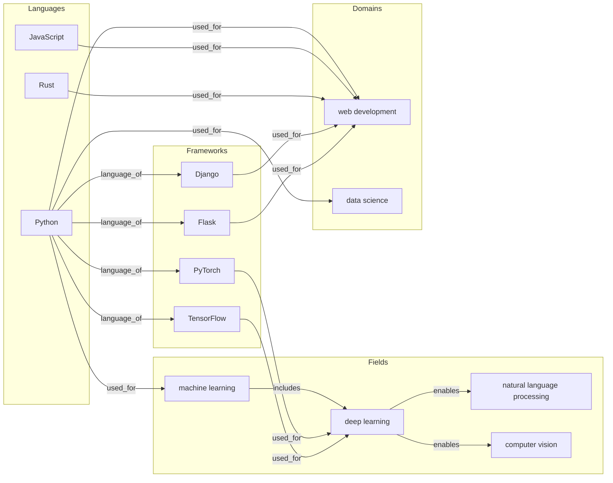

# Semantic Knowledge Graph with Sentence-Transformers

> Demonstrates pluggable embedding providers, semantic similarity, analogical reasoning, and combined activation+similarity retrieval on a 13-node technology knowledge graph.

## 1. The Approach

Traditional knowledge graphs retrieve related concepts by traversing edges. This works when relationships are explicitly encoded, but misses connections between concepts that are semantically related but not directly linked. For example, "machine learning" and "deep learning" are closely related, but a graph without a direct edge between them cannot express this.

Hyper3's embedding layer generates vector representations for each concept and uses cosine similarity to find semantically related nodes, independent of graph topology. Combined with spreading activation (graph-based retrieval), the two signals capture different aspects of relatedness.

This showcase uses `sentence-transformers` (`all-MiniLM-L6-v2`) as the embedding provider, demonstrating how to plug a real local model into Hyper3's `EmbeddingProvider` interface.

## 2. A Simple Analogy

Imagine a library catalog where books are shelved by topic (graph edges). You can walk the shelves to find related books. Now add a librarian who knows that "machine learning" and "deep learning" cover similar ground, even though they're shelved in different sections. Hyper3's embedding layer is that librarian -- it knows about semantic similarity beyond physical proximity.

## 3. Key Concepts

| Term | Plain English |
|------|---------------|
| EmbeddingProvider | A pluggable interface that converts text into vector representations. Implement `embed()` and `dimension()` to use any embedding model. |
| Semantic similarity | Cosine similarity between concept embedding vectors. Two concepts are similar when their vectors are close in embedding space. |
| Analogical reasoning | Vector arithmetic: "A is to B as C is to ?" finds concepts by computing the vector offset `B - A + C`. |
| Spreading activation | Energy propagation through graph edges, capturing topological proximity. |
| Combined retrieval | Merging activation scores with similarity scores to rank concepts by both graph connectivity and semantic closeness. |

## 4. Quick Start

Requires `sentence-transformers`:

```bash
pip install sentence-transformers
.venv/bin/python examples/showcase/retrieval/semantic_knowledge_graph/semantic_knowledge_graph.py
```

```
Loading sentence-transformers model (all-MiniLM-L6-v2)...
Embedding dimension: 384

Stored 13 concepts, 16 relations

============================================================
SEMANTIC SIMILARITY (via sentence-transformers)
============================================================

Most similar to 'Python':
  machine learning                    score=0.XXX
  ...

============================================================
ANALOGICAL REASONING (vector arithmetic)
============================================================

'Python' is to 'PyTorch' as 'JavaScript' is to ?
  ...

============================================================
ASSOCIATIVE RECALL (spreading activation)
============================================================

Activated from 'Python':
  ...

============================================================
COMBINED: activation + semantic similarity
============================================================

Activated concepts near 'Python', ranked by semantic relevance:
  ...
```

## 5. The Scenario

A 13-node technology knowledge graph with four node types and 16 directed edges:

| Node type | Count | Examples |
|-----------|-------|---------|
| language | 3 | Python, JavaScript, Rust |
| field | 4 | machine learning, deep learning, natural language processing, computer vision |
| framework | 4 | PyTorch, TensorFlow, Django, Flask |
| domain | 2 | web development, data science |

Edge labels: `used_for` (9), `language_of` (4), `enables` (2), `includes` (1) -- totaling 16 edges.



Python is the central hub with 7 outgoing edges spanning fields and frameworks.

**Comparison with `retrieval_and_similarity/`:** Both examples use a technology knowledge graph, but this one uses `sentence-transformers` for real semantic embeddings, while `retrieval_and_similarity/` uses the default `HashEmbeddingProvider` which produces hash-derived (not semantically meaningful) similarity scores. Use `retrieval_and_similarity/` for a zero-dependency introduction; use this example for realistic embedding behavior.

## 6. Analysis Pipeline

### Semantic Similarity

`mem.search.similar("Python", top_k=5, threshold=0.0)` computes cosine similarity between Python's embedding vector and all other concept vectors. With `sentence-transformers`, the similarity reflects the semantic content of concept labels and data fields (paradigm, use description).

**Why this matters:** Graph edges encode explicit relationships. Semantic similarity captures implicit ones. "Machine learning" may rank as similar to "Python" even without a direct edge, because their embedding vectors (derived from labels and descriptions) are close.

### Analogical Reasoning

`mem.analogy("Python", "PyTorch", "JavaScript", top_k=5)` computes the vector offset `PyTorch - Python + JavaScript` and finds the nearest concepts. This tests whether the embedding space captures relational structure: if Python->PyTorch represents "language has framework", then JavaScript should map to its corresponding framework.

**Why this matters:** Analogy is a form of reasoning that goes beyond similarity. It finds concepts that occupy the same relational position, not just similar content. Whether this works depends on the embedding model's ability to encode relationships in vector offsets.

### Spreading Activation

`mem.activate("Python", energy=1.0, top_k=8, iterations=3)` injects energy at Python and propagates through graph edges. This discovers concepts that are topologically close, regardless of embedding similarity.

### Combined Retrieval

The COMBINED section merges activation scores with similarity scores. For each activated concept, the script looks up its semantic similarity and displays both metrics side by side. Concepts high in both signals are the most broadly related -- structurally connected and semantically similar.

## 7. Understanding Output

### Similarity score interpretation

| Score range | Meaning |
|-------------|---------|
| 0.8-1.0 | Very similar (nearly identical meaning) |
| 0.5-0.8 | Moderately similar (related concepts) |
| 0.0-0.5 | Weakly similar or unrelated |

These thresholds assume a real embedding model. With `sentence-transformers`, scores above 0.5 generally indicate meaningful relatedness.

### Activation score interpretation

| Score range | Meaning |
|-------------|---------|
| 1.0 | Seed node |
| 0.5-1.0 | Directly connected to seed |
| 0.2-0.5 | 1-2 hops away |
| < 0.2 | Distant or indirectly connected |

### Key difference

Similarity and activation measure fundamentally different things. Two concepts can have high similarity but zero activation (semantically related but no graph path between them), or high activation but low similarity (structurally connected but describing different abstractions). The COMBINED section shows both metrics side by side to illustrate this orthogonality.

## 8. Key Metrics

| Metric | Value |
|--------|-------|
| Node count | 13 |
| Edge count | 16 |
| Languages | 3 (Python, JavaScript, Rust) |
| Fields | 4 (machine learning, deep learning, NLP, computer vision) |
| Frameworks | 4 (PyTorch, TensorFlow, Django, Flask) |
| Domains | 2 (web development, data science) |
| Embedding model | all-MiniLM-L6-v2 |
| Embedding dimension | 384 |
| Analogy probes | 3 |

## 9. What Makes This Different

**Pluggable embedding provider.** The `EmbeddingProvider` interface decouples the embedding model from the graph. This showcase implements `SentenceTransformerProvider` wrapping a local `sentence-transformers` model. Any model that implements `embed()` and `dimension()` works -- swap to OpenAI embeddings, domain-specific models, or multilingual models without changing the graph or retrieval code.

**Two independent signals.** Spreading activation captures graph topology (who is connected to whom). Semantic similarity captures meaning (what concepts describe similar things). Neither subsumes the other. A concept can be structurally close but semantically distant (e.g., "web development" is a direct neighbor of "Python" but describes a different abstraction level), or semantically close but structurally distant (e.g., "machine learning" and "data science" share meaning but have no direct edge in this graph).

**Analogical reasoning as a third mode.** Similarity finds "things like X." Analogy finds "things in the same relationship as X is to Y." This is a different query type that exploits the geometric structure of embedding space.

## 10. Code Implementation

### Custom embedding provider

```python
from hyper3 import HypergraphMemory, EmbeddingProvider
import numpy as np

class SentenceTransformerProvider(EmbeddingProvider):
    def __init__(self, model_name: str = "all-MiniLM-L6-v2") -> None:
        from sentence_transformers import SentenceTransformer
        self._model = SentenceTransformer(model_name)

    def embed(self, text: str) -> np.ndarray:
        vec = self._model.encode(text, convert_to_numpy=True)
        norm = np.linalg.norm(vec)
        if norm > 0:
            vec = vec / norm
        return vec.astype(np.float64)

    def dimension(self) -> int:
        return len(self.embed("test"))

mem = HypergraphMemory(evolve_interval=0)
mem.set_embedding_provider(SentenceTransformerProvider())
```

### Semantic similarity

```python
similar = mem.search.similar("Python", top_k=5, threshold=0.0)
for s in similar:
    print(f"{s.label}: similarity={s.similarity:.3f}")
```

### Analogical reasoning

```python
results = mem.analogy("Python", "PyTorch", "JavaScript", top_k=5)
for label, score in results:
    print(f"{label}: score={score:.3f}")
```

### Combined activation + similarity

```python
activated = mem.activate("Python", top_k=8)
similar_map = {s.label: s.similarity or 0.0
               for s in mem.search.similar("Python", top_k=len(activated), threshold=0.0)}
for r in activated:
    sim = similar_map.get(r.label, 0.0)
    print(f"{r.label}: activation={r.activation:.3f}, similarity={sim:.3f}")
```

## 11. Real-World Gap

**External dependency.** This showcase requires `sentence-transformers`, which downloads the `all-MiniLM-L6-v2` model (~90MB) on first run. It is not a core Hyper3 dependency and must be installed separately.

**Label-only embeddings.** Concepts are embedded using their label and data dictionary. Production use would embed richer content (documents, descriptions, abstracts) for more discriminative vectors. With 13 short labels, the embedding quality is limited.

**Scale.** The showcase operates on 13 concepts. Similarity computation scales linearly with node count. For graphs with millions of nodes, approximate nearest-neighbor search (FAISS, Annoy) is required.

**Analogy quality.** Vector-offset analogies work best with models specifically trained for relational reasoning (e.g., Word2Vec with large corpora). `all-MiniLM-L6-v2` is a sentence-level model; analogy results may be less structured than with word-level models.

## 12. Reference

### Key API Methods

| Method | Purpose |
|--------|---------|
| `mem.set_embedding_provider(provider)` | Set a custom embedding provider |
| `mem.search.similar(concept, top_k, threshold)` | Find semantically similar concepts |
| `mem.analogy(a, b, c, top_k)` | Solve "A is to B as C is to ?" |
| `mem.activate(concept, energy, top_k, iterations)` | Spreading activation retrieval |
| `EmbeddingProvider` | Abstract base class for custom embedding backends |

### Related Examples

| Example | Focus |
|---------|-------|
| `examples/showcase/retrieval/retrieval_and_similarity/` | Activation, similarity, RRF fusion without external dependencies |
| `examples/showcase/retrieval/combined_signal_analysis/` | Alpha-sweep evaluation of activation vs similarity trade-offs |
| `examples/showcase/retrieval/feedback_demo/` | RRF retrieval with relevance feedback on a medical knowledge base |
