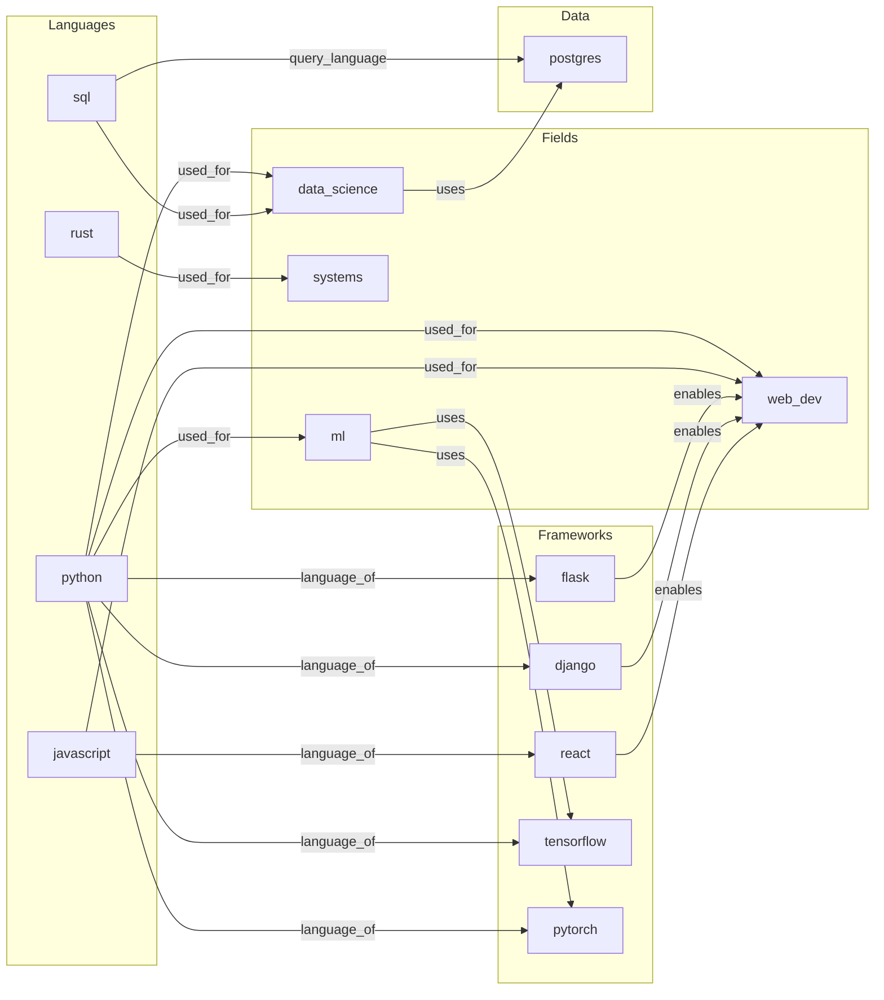

# Retrieval and Similarity in a Technology Knowledge Graph

> Demonstrates spreading activation, embedding similarity, RRF fusion retrieval, and hyperedge similarity on a 14-node technology graph.

## The Approach

Traditional graph queries return nodes that match a filter. Hyper3 retrieves related concepts by propagating energy through edges (spreading activation), computing embedding-based similarity, and fusing both signals via Reciprocal Rank Fusion. This matters because graph topology and semantic similarity capture different aspects of relatedness — a concept can be structurally close (many shared edges) but semantically distant, or vice versa. RRF fusion combines both rankings without requiring weight tuning.

## Key Concepts

| Term | What it does |
|------|-------------|
| Spreading activation | Injects energy at a seed node, then propagates it along edges. Nodes with more or stronger paths from the seed accumulate higher activation scores. |
| `find_similar` | Computes similarity between concept embedding vectors. Two concepts are similar when their vector representations are close in embedding space. |
| `retrieve` | Runs spreading activation and similarity in parallel, then merges their ranked lists via Reciprocal Rank Fusion (RRF). Each signal votes independently; RRF combines votes into a single score. |
| Hyperedge similarity | Computes Jaccard overlap between the node sets of two hyperedges. An edge from `{python}` to `{ml}` with label `used_for` shares structure with another `used_for` edge if their endpoints overlap. |
| RRF (Reciprocal Rank Fusion) | For each candidate, sums `1/(k + rank)` across all signals (k=60 by default). A node ranked 1st in activation and 5th in similarity scores `1/61 + 1/65` — higher than a node ranked 3rd in both. |

## Quick Start

```bash
.venv/bin/python examples/showcase/retrieval_and_similarity/26_retrieval_and_similarity.py
```

Expected output (14 nodes, 18 edges):

```
SECTION 1: BUILD A SEMANTIC NETWORK
concepts: 14, edges: 18

SECTION 2: SPREADING ACTIVATION RETRIEVAL
spreading activation from 'python':
           python: 1.0000 ####################
           web_dev: 0.6855 #############
                ml: 0.5587 ###########
            django: 0.4794 #########
             flask: 0.4794 #########
        tensorflow: 0.4557 #########
           pytorch: 0.4557 #########
      data_science: 0.3710 #######
        javascript: 0.2484 ####
             react: 0.2484 ####

SECTION 5: HYPEREDGE SIMILARITY
  ('used_for', 0.3333)
  ('used_for', 0.3333)
  ('used_for', 0.3333)
  ('language_of', 0.3333)
  ('language_of', 0.3333)
```

## Scenario

A 14-node technology knowledge graph with four node types and 18 labeled directed edges:

| Node type | Count | Examples |
|-----------|-------|---------|
| language | 4 | python, javascript, rust, sql |
| field | 4 | ml, web_dev, systems, data_science |
| framework | 5 | flask, django, react, tensorflow, pytorch |
| database | 1 | postgres |

Edge labels: `used_for` (7), `language_of` (5), `enables` (3), `uses` (3), `query_language` (1) — totaling 18 edges.



Python is the central hub — it connects to 3 fields and 4 frameworks, making it the highest-degree node and the natural seed for activation experiments.

## Analysis Pipeline

### 1. Graph Construction

14 concepts are stored with typed data (language/field/framework/database). 18 directed edges link them with semantic labels. Python dominates the connectivity: 7 outgoing edges span fields and frameworks, giving it the highest degree in the graph.

### 2. Spreading Activation from Python

`stimulate("python")` injects energy at the python node. `spread_activation()` propagates it outward along edges. The top-10 results:

| Concept | Activation | Why |
|---------|-----------|-----|
| python | 1.0000 | Seed node |
| web_dev | 0.6855 | Reached via 3 edges from python (flask, django, javascript) plus 1 direct edge |
| ml | 0.5587 | Direct edge from python |
| django | 0.4794 | Direct edge from python |
| flask | 0.4794 | Direct edge from python |
| tensorflow | 0.4557 | Direct edge from python |
| pytorch | 0.4557 | Direct edge from python |
| data_science | 0.3710 | Direct edge from python |
| javascript | 0.2484 | Reached via web_dev (python -> web_dev <- javascript) |
| react | 0.2484 | Reached via web_dev (python -> web_dev <- react) |

Why this matters: activation reveals *indirect* connections. Javascript and react have no direct edge to python, yet they rank in the top 10 because they share the `web_dev` neighbor. A simple neighbor query would miss these.

### 3. Semantic Similarity via `find_similar`

`find_similar("python", top_k=5)` and `find_similar("rust", top_k=5)` both return empty results in this showcase. The embedding provider for this graph does not produce discriminative vectors for these 14 short-label nodes — their embedding representations are not sufficiently distinct to rank above the similarity threshold.

Why this matters: embedding similarity depends on the quality and dimensionality of the underlying vectors. With short, generic labels and no textual descriptions, the embedding signal is weak. This is why RRF fusion is valuable — it does not rely on a single signal.

### 4. Combined Retrieval via RRF Fusion

`retrieve("python", top_k=8)` runs spreading activation and similarity independently, then fuses their rank lists via RRF:

| Concept | RRF score | Activation | Similarity |
|---------|-----------|-----------|------------|
| pytorch | 0.0320 | 0.4859 | 0.1393 |
| ml | 0.0315 | 0.5887 | 0.0190 |
| tensorflow | 0.0315 | 0.4859 | 0.0283 |
| data_science | 0.0308 | 0.3831 | 0.0796 |
| web_dev | 0.0303 | 0.6469 | -0.1841 |
| postgres | 0.0302 | 0.1319 | 0.1374 |
| django | 0.0301 | 0.4859 | -0.0430 |
| flask | 0.0301 | 0.4859 | -0.0242 |

Why this matters: web_dev has the highest activation (0.6469) but a negative similarity score. Postgres has low activation (0.1319) but positive similarity (0.1374). RRF ranks them by combined vote strength rather than by either signal alone — postgres appears in the results despite being two hops from python because the similarity signal gives it a ranking boost.

### 5. Hyperedge Similarity

`hyperedge_similarity("python", metric="jaccard")` compares the node sets of python's edges pairwise. All 5 results show Jaccard index 0.3333:

| Edge pair label | Jaccard |
|----------------|---------|
| used_for vs used_for | 0.3333 |
| used_for vs used_for | 0.3333 |
| used_for vs used_for | 0.3333 |
| language_of vs language_of | 0.3333 |
| language_of vs language_of | 0.3333 |

Each of python's edges has one endpoint `{python}` and one unique target. Two edges share the source node but not the target, producing Jaccard = 1 shared / 3 total = 0.3333. The consistent value reflects the uniform structure: every edge from python is a 1-to-1 edge with a distinct target.

## Key Metrics

| Metric | Value |
|--------|-------|
| Node count | 14 |
| Edge count | 18 |
| Languages | 4 (python, javascript, rust, sql) |
| Fields | 4 (ml, web_dev, systems, data_science) |
| Frameworks | 5 (flask, django, react, tensorflow, pytorch) |
| Databases | 1 (postgres) |
| Python activation (seed) | 1.0000 |
| Top non-seed activation | web_dev: 0.6855 |
| Lowest activation shown | react: 0.2484 |
| Top RRF score | pytorch: 0.0320 |
| Highest activation in retrieve | web_dev: 0.6469 |
| Lowest activation in retrieve | postgres: 0.1319 |
| Hyperedge Jaccard (all pairs) | 0.3333 |
| `find_similar` results | empty (embedding signal insufficient for short labels) |

## What Makes This Different

**Multi-signal retrieval.** A single ranking signal (degree, distance, similarity) captures one facet of relatedness. Spreading activation captures graph topology — how many paths connect two nodes and how strong those paths are. Embedding similarity captures semantic closeness — whether two concepts describe related ideas. RRF fusion merges both without requiring manual weight tuning: each signal votes independently via rank position, and the combined vote determines the final order.

**Activation as associative recall.** Spreading activation does not require a predefined query template. Injecting energy at one node and letting it propagate discovers concepts that are structurally close even when they share no direct edge. In this graph, javascript and react surface as related to python through their shared `web_dev` neighbor — a connection that a direct-neighbor query would miss.

**Hyperedge-level comparison.** Hyperedge similarity operates on edge structure rather than node attributes. Comparing the Jaccard overlap of edge endpoint sets reveals which edges carry similar structural roles. All of python's outgoing edges share the same source but point to distinct targets, producing uniform Jaccard values — a structural signature of a hub node.

## Code Implementation

```python
from hyper3 import HypergraphMemory

mem = HypergraphMemory(evolve_interval=0)

mem.store("python", data={"type": "language", "paradigm": "multi"})
mem.relate("python", "ml", label="used_for")

mem.stimulate("python")
activation = mem.spread_activation()

similar = mem.find_similar("python", top_k=5)

retrieval = mem.retrieve("python", top_k=8)

edge_sim = mem.hyperedge_similarity("python", metric="jaccard")
```

## Real-World Gap

- **Synthetic data.** The 14-node graph uses short string labels with no textual descriptions. Production knowledge graphs would have richer node data (documents, metadata, embeddings from actual text), producing stronger embedding similarity signals.
- **Scale.** Spreading activation and RRF retrieval run on 14 nodes here. Performance characteristics at 10K+ nodes are untested — activation propagation cost grows with graph diameter and density.
- **Embedding provider.** `find_similar` depends on the configured embedding provider. This showcase uses the default provider, which does not produce discriminative vectors for short generic labels. A production deployment would use domain-specific embeddings trained on actual content.
- **Non-determinism.** Spreading activation involves numerical propagation that may vary slightly across runs due to floating-point ordering. RRF scores are deterministic given fixed rank lists, but the underlying activation and similarity values may differ.

## Reference

### API methods

| Method | Returns | Purpose |
|--------|---------|---------|
| `stimulate(concept)` | None | Injects energy at a seed node |
| `spread_activation()` | `list[ActivationResult]` | Propagates energy, returns per-node activation scores |
| `find_similar(concept, top_k)` | `list[SimilarityResult]` | Ranks concepts by embedding vector similarity |
| `retrieve(concept, top_k)` | `list[RetrievalResult]` | RRF-fused ranking from activation + similarity |
| `hyperedge_similarity(concept, metric)` | `list[tuple]` | Pairwise Jaccard similarity of edges incident to the concept |

### Related examples

- `examples/showcase/retrieval_and_similarity/26_retrieval_and_similarity.py` — full script for this showcase
