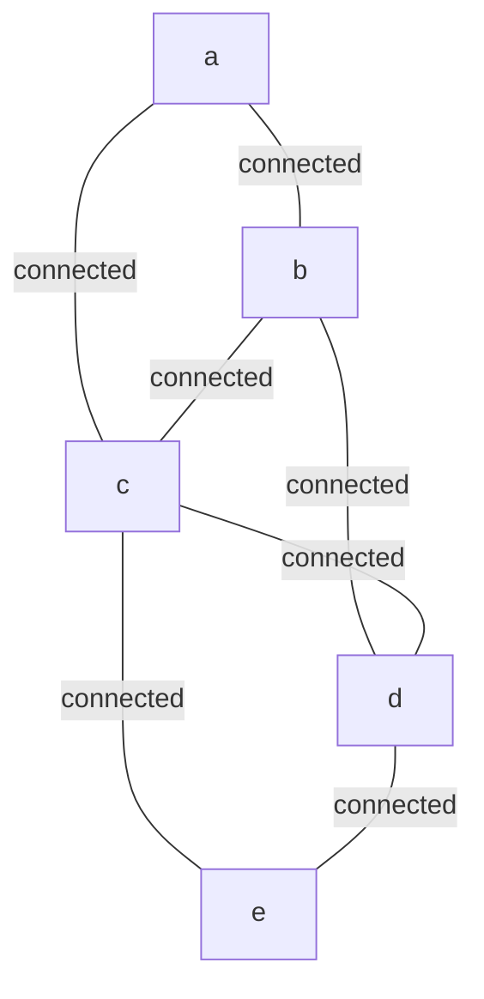

# Statistics and Metrics Showcase

> **Degree, Edge-Size, and Centrality Statistics on Hypergraphs**

## 1. The Approach

Hypergraphs require their own statistical vocabulary: degree counts incident hyperedges (not just neighbors), edge size/order distinguishes binary from higher-arity edges, and centrality metrics adapt to the n-ary structure.

This showcase demonstrates the core statistical pipeline — degree distributions, edge-size analysis, filtering, multi-stat comparison, and weighted degree — and explains when each metric is the right tool.

## 2. Key Concepts

| Term | Meaning |
|------|---------|
| **Degree** | Number of edges incident to a node |
| **Edge size** | Total number of nodes participating in an edge (`len(edge.node_ids)`) |
| **Edge order** | Edge size minus 1 (size 2 = order 1 = ordinary pair edge) |
| **Degree centrality** | Normalized degree: `degree / (n - 1)` where n is node count |
| **PageRank** | Iterative weight propagation measuring structural importance |
| **Weighted degree** | Sum of incident edge weights instead of count |

## 3. Quick Start

```bash
.venv/bin/python examples/showcase/statistics_and_metrics/16_statistics_and_metrics.py
```

### Output

```
SECTION 1: DEGREE STATISTICS
degree dict:  {'a': 2, 'b': 3, 'c': 4, 'd': 3, 'e': 2}
degree list:  [2, 3, 4, 3, 2]
degree max:   4
degree mean:  2.80
degree median: 3.0

SECTION 2: EDGE SIZE / ORDER STATISTICS
edge sizes:  [2, 2, 4]
edge orders: [1, 1, 3]
unique sizes: [2, 4]

SECTION 3: FILTERING BY DEGREE
nodes with degree >= 3: ['b', 'c', 'd']
hub-type nodes: []

SECTION 4: MULTI-STAT COMPARISON
 concept   degree   deg_cent   pagerank
       a        2     0.5000     0.1870
       b        3     0.7500     0.1947
       c        4     1.0000     0.2027
       d        3     0.7500     0.2034
       e        2     0.5000     0.2121

SECTION 5: WEIGHTED DEGREE
  p: 16.0
  q: 15.0
  r: 10.0
  s: 1.0
```

## 4. The Scenario

The showcase uses small synthetic graphs to keep each metric visible. The primary graph (Sections 1, 3, 4) has 5 nodes and 7 edges:



Node `c` is the highest-degree node (degree 4), connected to every other node. Nodes `a` and `e` are peripheral (degree 2). A second graph (Section 2) demonstrates mixed edge arities with a 4-node hyperedge, and a third graph (Section 5) illustrates weighted degree.

## 5. Analysis Pipeline

### Section 1 — Degree Statistics

`mem.degree()` returns a dict mapping each label to its incident edge count. Standard library `statistics` computes mean (2.80) and median (3.0). Node `c` has the maximum degree of 4.

### Section 2 — Edge Size and Order

A separate graph with two binary edges (size 2, order 1) and one 4-node hyperedge (size 4, order 3) shows that Hyper3 edges are not limited to pairs. Unique sizes `[2, 4]` confirm the arity mixture.

### Section 3 — Filtering by Degree

A list comprehension selects nodes with degree >= 3, yielding `['b', 'c', 'd']`. The second filter attempts `query_nodes(data={"type": "hub"})` but returns `[]`. This happens because `store()` was called on already-existing nodes with new data, and without `update=True` the new data dict does not replace the existing (empty) data — so no node actually stores `{"type": "hub"}`.

### Section 4 — Multi-Stat Comparison

`degree_centrality()` and `pagerank()` are computed on the same graph and displayed side by side. Node `c` has the highest degree centrality (1.0000) but not the highest PageRank — node `e` leads at 0.2121. Why they differ: degree centrality counts connections (who has the most edges), while PageRank weights connections by the importance of the connecting nodes. A node with fewer connections to high-importance neighbors can outrank a node with many connections to peripheral neighbors. This distinction matters when deciding what to monitor — a node with high degree but low PageRank is busy but not structurally critical.

### Section 5 — Weighted Degree

`mem.degree(weighted=True)` sums incident edge weights instead of counting edges. Node `p` has weighted degree 16.0 (edges with weight 10.0 + 5.0 + 1.0) while node `s` has 1.0 (a single weight-1.0 edge). Why this matters: unweighted degree treats every edge equally, but in real graphs some edges are much stronger than others. A node with degree 3 and weighted degree 15.0 is more central than a node with degree 5 and weighted degree 5.0 — the first node has fewer but much stronger connections. Weighted degree surfaces this distinction.

## 6. Key Metrics

### Section 1 — Degree Statistics (5-node graph)

| Metric | Value |
|--------|-------|
| Degree of `a` | 2 |
| Degree of `b` | 3 |
| Degree of `c` | 4 |
| Degree of `d` | 3 |
| Degree of `e` | 2 |
| Max degree | 4 |
| Mean degree | 2.80 |
| Median degree | 3.0 |

### Section 2 — Edge Size/Order (4-node graph)

| Metric | Value |
|--------|-------|
| Edge sizes | [2, 2, 4] |
| Edge orders | [1, 1, 3] |
| Unique sizes | [2, 4] |

### Section 3 — Degree Filtering

| Filter | Result |
|--------|--------|
| degree >= 3 | `['b', 'c', 'd']` |
| `query_nodes(data={"type": "hub"})` | `[]` |

### Section 4 — Centrality (5-node graph)

| Node | Degree | Degree Centrality | PageRank |
|------|--------|-------------------|----------|
| a | 2 | 0.5000 | 0.1870 |
| b | 3 | 0.7500 | 0.1947 |
| c | 4 | 1.0000 | 0.2027 |
| d | 3 | 0.7500 | 0.2034 |
| e | 2 | 0.5000 | 0.2121 |

### Section 5 — Weighted Degree (4-node graph)

| Node | Weighted Degree |
|------|----------------|
| p | 16.0 |
| q | 15.0 |
| r | 10.0 |
| s | 1.0 |

## 7. What Makes This Different

Three capabilities go beyond counting edges:

**Weighted degree** (`degree(weighted=True)`) sums edge weights rather than counting edges. This matters because not all edges carry equal importance. A dependency with weight 10.0 is stronger than one with weight 1.0, and the weighted degree captures this difference. Unweighted degree treats them identically.

**Multi-stat on the same graph** combines `degree()`, `degree_centrality()`, and `pagerank()` without converting to a separate data structure. The comparison between degree centrality and PageRank is illustrative: they measure different things (raw connectivity vs. structural importance), and seeing them side by side reveals nodes that are busy but not critical (high degree, low PageRank) and nodes that are critical but not busy (low degree, high PageRank).

**Edge-size statistics** distinguish binary edges (size 2) from n-ary hyperedges (size 4+). In a mixed graph, the size distribution reveals how much of the structure is captured by pairwise relationships versus collective ones. A graph with all size-2 edges could be represented as an ordinary graph; size-3+ edges are what make it a hypergraph.

## 8. Code Implementation

**Degree statistics:**

```python
mem = HypergraphMemory(evolve_interval=0)
degree_dict = mem.degree()
print(f"mean: {statistics.mean(degree_dict.values()):.2f}")
print(f"max:  {max(degree_dict.values())}")
```

**Edge size and order:**

```python
for e in mem.graph.edges:
    size = len(e.node_ids)
    order = size - 1
```

**Weighted degree:**

```python
weighted_deg = mem.degree(weighted=True)
for label, wd in sorted(weighted_deg.items()):
    print(f"  {label}: {wd:.1f}")
```

**Multi-stat comparison:**

```python
cent = mem.degree_centrality()
pr = mem.pagerank()
for label in sorted(cent.keys()):
    print(f"{label:>8} {cent[label]:>10.4f} {pr.get(label, 0.0):>10.4f}")
```

## 9. Reference

### API Methods

| Method | Returns | Notes |
|--------|---------|-------|
| `mem.degree()` | `dict[str, int]` | Label-to-degree mapping |
| `mem.degree(weighted=True)` | `dict[str, float]` | Sum of incident edge weights |
| `mem.degree_centrality()` | `dict[str, float]` | Normalized degree / (n-1) |
| `mem.pagerank()` | `dict[str, float]` | Iterative weight propagation |
| `mem.query_nodes(data=...)` | `list[str]` | Exact data-attribute match |
| `mem.graph.edges` | iterable of `Hyperedge` | Access `node_ids`, `weight` |
| `mem.relate_hyperedge(sources, targets, label)` | `Hyperedge` | Create n-ary edge |

### Related Examples

| Example | Focus |
|---------|-------|
| `examples/showcase/multiway_reasoning/` | Multiway expansion with branch scoring |
| `examples/showcase/threat_intelligence/` | Centrality-based blast radius analysis |
| `examples/showcase/microservices_reasoning/` | Dependency graph centrality |
