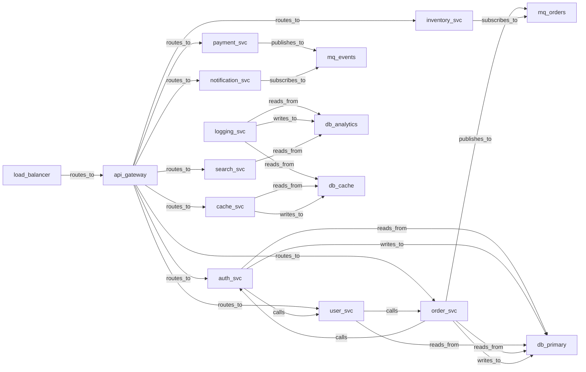

# Structural Anomaly Detection

> **Cycle Detection, Centrality Scoring, and Boundary Classification on an 18-Node Service Mesh**

## 1. The Approach

Traditional monitoring detects runtime anomalies: latency spikes, error rates, memory pressure. But some of the most dangerous problems are structural — they exist in the topology itself, independent of traffic. A circular dependency between services causes cascading failures during restarts. A single point of failure at a critical junction takes down the entire system when it fails. Contradictory routing rules create nondeterministic behavior that is invisible until a specific request pattern triggers it. These problems exist before any request is sent.

The StructuralAnomalyDetector scores each concept on four dimensions — cyclic structure, high centrality, contradiction risk, and structural anomaly — and classifies nodes as low_risk, boundary, or anomalous. It uses strongly connected components (SCC) for cycle detection, power iteration for centrality, and opposing label pairs for contradiction detection. The result is a BoundaryIndicator for every node and a BoundaryRegion map that classifies the entire graph.

## 2. Key Concepts

| Term | Plain English Meaning |
|------|----------------------|
| **BoundaryIndicator** | 4-dimensional score: cyclic_structure, high_centrality, contradiction_risk, structural_anomaly_score |
| **Boundary score** | Weighted aggregate: 0.3 * cyclic + 0.3 * centrality + 0.2 * contradiction + 0.2 * structural |
| **Anomaly status** | Classification: low_risk (< 0.3), boundary (0.3-0.5), anomalous (> 0.5) |
| **Exploration report** | Two-hop neighborhood coverage with Chernoff confidence bounds |
| **Boundary region** | Named region of the graph classified by anomaly status |
| **Cyclic structure** | Whether the node participates in a strongly connected component (cycle) |
| **Contradiction risk** | Whether the node has edges with semantically opposing labels |
| **Chernoff bounds** | Statistical bounds on how thoroughly the neighborhood has been explored |

## 3. Quick Start

```bash
.venv/bin/python examples/showcase/structural_anomaly_detection/structural_anomaly_detection.py
```

```
SECTION 1: BUILD SERVICE MESH TOPOLOGY
nodes: 18, edges: 28
edge labels: {'routes_to': 9, 'calls': 7, 'publishes_to': 2, ...}

SECTION 2: INDIVIDUAL ANOMALY ASSESSMENT
api_gateway: status=low_risk, boundary_score=0.0794
auth_svc: status=anomalous, boundary_score=0.3975
  warnings: ['Cyclic structure detected', 'Contradictory edge labels detected']
order_svc: status=anomalous, boundary_score=0.4218

SECTION 3: BOUNDARY INDICATOR DEEP DIVE
auth_svc indicators:
  cyclic_structure: 0.8000
  high_centrality: 0.1250
  contradiction_risk: 0.6000

SECTION 4: BOUNDARY REGION MAPPING
classification: {'low_risk': 14, 'boundary': 0, 'anomalous': 4}
anomalous: auth_svc, user_svc, order_svc, db_primary

SECTION 5: EXPLORATION WITH ASSUMPTIONS
suggested assumptions for 'config_svc': 3

SECTION 6: CROSS-REFERENCE WITH CENTRALITY
top-5 betweenness centrality:
  api_gateway: centrality=0.0515, anomaly_status=low_risk
  order_svc: centrality=0.0380, anomaly_status=anomalous
```

> Output may vary slightly depending on centrality computation precision and edge weight assignments.

## 4. The Scenario

An 18-node microservices service mesh with four node categories:

- **Services** (12): api_gateway, auth_svc, user_svc, order_svc, payment_svc, inventory_svc, search_svc, notification_svc, email_svc, logging_svc, config_svc, cache_svc
- **Databases** (3): db_primary, db_analytics, db_cache
- **Message queues** (2): mq_orders, mq_events
- **Infrastructure** (1): load_balancer

Planted anomalies: a circular dependency cycle (auth_svc -> user_svc -> order_svc -> auth_svc), a high-centrality api_gateway with 9 outgoing `routes_to` edges, and logging_svc connected to all 3 databases.



Solid arrows: service mesh edges (28 total). The auth -> user -> order -> auth cycle is the planted circular dependency. api_gateway routes to 8 downstream services.

## 5. Analysis Pipeline

**Section 1 — Build service mesh topology:** 18 nodes and 28 directed edges are created with 6 edge labels: `routes_to` (9), `calls` (7), `publishes_to` (2), `subscribes_to` (2), `reads_from` (4), `writes_to` (4). The api_gateway receives 1 incoming `routes_to` from load_balancer and 8 outgoing `routes_to` edges to downstream services. The circular dependency is encoded as three `calls` edges: auth_svc -> user_svc, user_svc -> order_svc, order_svc -> auth_svc. logging_svc is connected to all 3 databases via `reads_from` and `writes_to` edges. Each service is tagged with `data={"type": "service"}` (or "database", "queue", "infrastructure").

**Section 2 — Individual anomaly assessment:** The script calls `detect_structural_anomalies()` on six representative services. api_gateway is classified as low_risk (boundary score 0.0794) despite having the highest centrality — it has no cycles, no contradictions, and no structural anomalies. auth_svc is classified as anomalous (boundary score 0.3975) with warnings about cyclic structure and contradictory edge labels. user_svc and order_svc are also anomalous with similar scores, confirming the planted circular dependency was detected. logging_svc is low_risk (0.0265) — its multi-database connections do not trigger any anomaly indicators. config_svc is low_risk (0.0088), the lowest score in the graph. Why this matters: the detector correctly distinguishes the cycle participants (anomalous) from the high-throughput gateway (low risk) and the well-connected logger (low risk). Not every well-connected node is anomalous — only those with genuine structural problems.

**Section 3 — Boundary indicator deep dive:** The script inspects the four individual indicator dimensions for api_gateway, auth_svc, logging_svc, and config_svc. api_gateway has high_centrality=0.2647 (highest in the graph) but all other indicators are 0.0 — it is a hub, not a problem. auth_svc has cyclic_structure=0.8000 (participates in a strongly connected component), high_centrality=0.1250, and contradiction_risk=0.6000 (has both `reads_from` and `writes_to` to the same target, or conflicting call/route semantics). The boundary score formula (0.3 * cyclic + 0.3 * centrality + 0.2 * contradiction + 0.2 * structural) gives auth_svc 0.3975. logging_svc has high_centrality=0.0882 and all others 0.0 — its database connections do not create contradictions or cycles. Why this matters: the four indicators can be inspected independently. A team investigating auth_svc can see that the cyclic_structure score (0.8) is the dominant contributor and focus on breaking the cycle rather than addressing centrality or contradictions.

**Section 4 — Boundary region mapping:** `map_boundaries()` classifies all 18 nodes: 14 low_risk, 0 boundary, 4 anomalous. The 4 anomalous services are auth_svc (0.3975), user_svc (0.3975), order_svc (0.4218), and db_primary (0.3450). db_primary appears anomalous because it receives `reads_from` and `writes_to` from the cycle participants, inheriting some structural anomaly through its connections. No nodes fall in the boundary category — the graph topology produces a clear split between healthy and problematic nodes. Why this matters: the boundary map provides an at-a-glance health overview of the entire service mesh. A platform team can immediately see which services need attention without scanning individual scores.

**Section 5 — Exploration with assumptions:** `suggest_assumptions()` for config_svc proposes 3 bridging edges: to api_gateway (coverage gain 0.5000), to order_svc (0.3889), and to db_primary (0.2222). These are edges that, if added, would most increase config_svc's neighborhood exploration coverage. The current coverage is already above 200% (meaning the two-hop neighborhood has been thoroughly explored relative to the graph size), so the assumptions do not change the coverage significantly. Why this matters: in a larger graph with unexplored regions, suggest_assumptions identifies the highest-impact edges to add, guiding targeted exploration of under-explored neighborhoods.

**Section 6 — Cross-reference with centrality:** The script computes betweenness centrality for all nodes and lists the top 5: api_gateway (0.0515), order_svc (0.0380), payment_svc (0.0294), user_svc (0.0245), search_svc (0.0147). Cross-referencing with anomaly status reveals that order_svc and user_svc are both high-centrality and anomalous — they sit on many shortest paths and participate in the circular dependency. api_gateway has the highest centrality but is low_risk, confirming that high centrality alone does not indicate a problem. Why this matters: combining centrality with anomaly detection reveals which high-centrality nodes are healthy (api_gateway, a designed hub) versus which are structurally risky (order_svc, a cycle participant on many paths). This distinction is invisible to centrality analysis alone.

## 6. Key Metrics

| Metric | Value |
|--------|-------|
| Nodes | 18 |
| Edges | 28 |
| Edge labels | 6 (`routes_to`: 9, `calls`: 7, `reads_from`: 4, `writes_to`: 4, `publishes_to`: 2, `subscribes_to`: 2) |
| Anomalous nodes | 4 (auth_svc, user_svc, order_svc, db_primary) |
| Boundary nodes | 0 |
| Low-risk nodes | 14 |
| Highest boundary score | order_svc (0.4218) |
| Lowest boundary score | config_svc (0.0088) |
| Highest centrality | api_gateway (0.0515) |
| Cyclic structure score (auth_svc) | 0.8000 |
| Contradiction risk (auth_svc) | 0.6000 |
| Suggested assumptions (config_svc) | 3 |

## 7. What Makes This Different

**Multi-dimensional scoring** produces four independent indicators per node rather than a single anomaly flag. A team investigating auth_svc can see that cyclic_structure (0.8) is the dominant problem, contradiction_risk (0.6) is secondary, and structural_anomaly is zero. This decomposition enables targeted remediation: break the cycle first, then investigate the contradictory labels. A single aggregate score would not reveal this prioritization.

**Topology-aware detection** uses graph algorithms — SCC for cycles, power iteration for centrality, opposing label pairs for contradictions — rather than generic statistical outlier detection. This means the detected anomalies are grounded in the actual structure of the graph. A cycle is a cycle regardless of node labels; a high-centrality node is a bottleneck regardless of its name. The detection is deterministic and reproducible.

**Exploration coverage** uses Chernoff bounds to quantify how thoroughly each node's neighborhood has been explored. Rather than simply counting edges, the bounds provide statistical confidence that the exploration has been sufficient. This prevents false confidence in under-explored regions and guides targeted exploration where coverage is low.

## 8. Code Implementation

**1. Build the service mesh:**

```python
from hyper3 import HypergraphMemory

mem = HypergraphMemory(evolve_interval=0)

services = ["api_gateway", "auth_svc", "user_svc", "order_svc", "payment_svc",
            "inventory_svc", "search_svc", "notification_svc", "email_svc",
            "logging_svc", "config_svc", "cache_svc"]
databases = ["db_primary", "db_analytics", "db_cache"]
queues = ["mq_orders", "mq_events"]
infra = ["load_balancer"]

for s in services:
    mem.store(s, data={"type": "service"})
for d in databases:
    mem.store(d, data={"type": "database"})
for q in queues:
    mem.store(q, data={"type": "queue"})
mem.store(infra[0], data={"type": "infrastructure"})

mem.relate("load_balancer", "api_gateway", label="routes_to")
mem.relate("api_gateway", "auth_svc", label="routes_to")
mem.relate("auth_svc", "user_svc", label="calls")
mem.relate("user_svc", "order_svc", label="calls")
mem.relate("order_svc", "auth_svc", label="calls")
```

**2. Detect structural anomalies:**

```python
result = mem.detect_structural_anomalies("auth_svc")
print(f"status: {result.anomaly_status}")
print(f"boundary score: {result.boundary_score:.4f}")
print(f"warnings: {result.warnings}")
```

**3. Inspect boundary indicators:**

```python
indicators = result.boundary_indicator
print(f"cyclic_structure: {indicators.cyclic_structure:.4f}")
print(f"high_centrality: {indicators.high_centrality:.4f}")
print(f"contradiction_risk: {indicators.contradiction_risk:.4f}")
```

**4. Map boundary regions:**

```python
region = mem.map_boundaries()
print(f"classification: {region.classification}")
for name, score in region.anomalous.items():
    print(f"  {name}: boundary_score={score:.4f}")
```

**5. Suggest exploration assumptions:**

```python
assumptions = mem.suggest_assumptions("config_svc")
for a in assumptions:
    print(f"  {a.assumption_id}: coverage gain {a.coverage_gain:.4f}")
```

**6. Cross-reference with centrality:**

```python
centrality = mem.betweenness_centrality()
top = sorted(centrality.items(), key=lambda x: x[1], reverse=True)[:5]
for node, score in top:
    anomaly = mem.detect_structural_anomalies(node)
    print(f"  {node}: centrality={score:.4f}, status={anomaly.anomaly_status}")
```

## 9. Real-World Gap

This showcase demonstrates structural anomaly detection on a small synthetic service mesh. Real-world adoption involves additional work:

- **Threshold calibration:** The classification thresholds (0.3 for low_risk/boundary, 0.5 for boundary/anomalous) are heuristics. Production systems would calibrate these from historical incident data and adjust per service criticality.
- **Temporal analysis:** The detector operates on a single graph snapshot. Real service meshes evolve over time, and anomalies can develop gradually. Temporal comparison of boundary scores across versions would detect emerging problems.
- **Contradiction detection:** The detector uses hardcoded opposing label pairs (e.g., reads_from vs. writes_to). Real domains require configurable contradiction rules that reflect domain semantics.
- **Scale:** The showcase runs on 18 nodes and 28 edges. SCC detection and centrality computation scale differently — SCC is linear, but betweenness centrality is O(VE) on unweighted graphs.
- **Exploration assumptions:** The suggested bridging edges are topologically optimal but may not be semantically valid. Human review is needed to determine which assumptions make sense in the domain.
- **Integration:** The showcase runs standalone. Production use requires integration with service discovery, deployment pipelines, and alerting systems.

## 10. Reference

| Method | Purpose |
|--------|---------|
| `mem.detect_structural_anomalies(concept)` | Assess a single node's anomaly status and boundary indicators |
| `mem.map_boundaries()` | Classify all nodes into low_risk/boundary/anomalous regions |
| `mem.suggest_assumptions(concept)` | Propose bridging edges to improve exploration coverage |
| `mem.betweenness_centrality()` | Compute betweenness centrality for all nodes |
| `mem.store(concept, data)` | Create a node with optional data dict |
| `mem.relate(source, target, label, weight)` | Add a pairwise directed edge |
| `mem.neighbors(concept, direction, edge_label)` | Query neighbors filtered by direction and/or label |

### Related Examples

| Example | Connection |
|---------|-----------|
| `centrality_and_ranking` | Centrality algorithms used in cross-reference analysis |
| `communities_and_clustering` | Structural analysis and community detection |
| `construction_and_queries` | Graph construction patterns used in this showcase |
