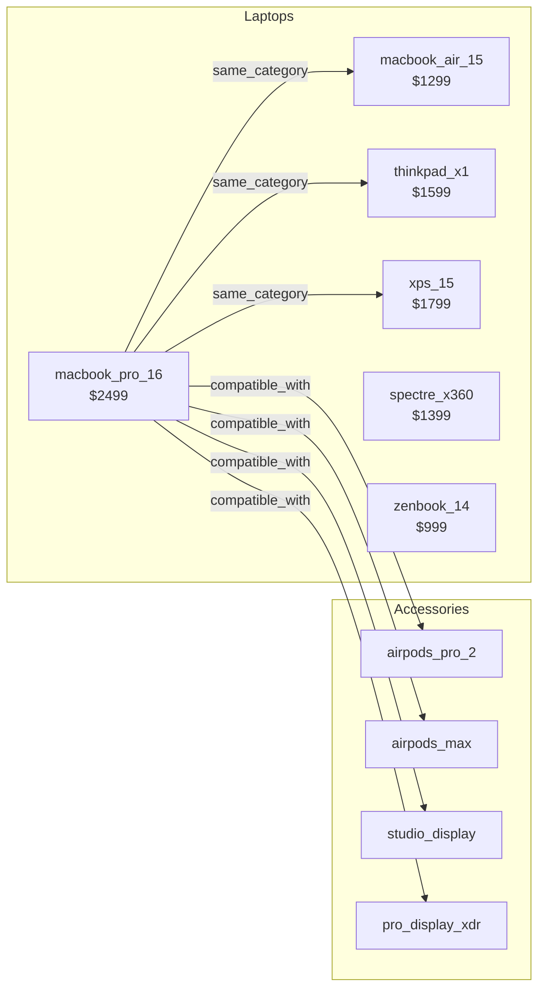
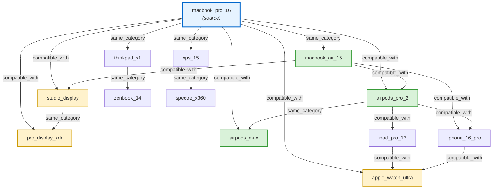
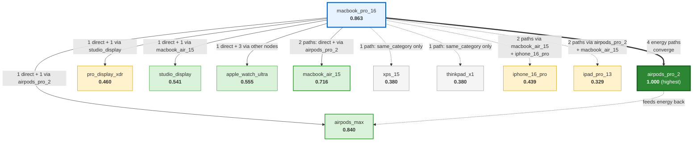

# Structured Search Showcase

> **Attribute Indexing, Faceted Navigation, Range Filtering, Parsed Queries, Multi-Signal Scoring, and SQLite Persistence across a 20-Product Catalog**

## 1. The Approach

Product catalogs, document collections, and knowledge bases all share the same retrieval problem: find items matching specific attributes, group results by category, and rank by relevance. Traditional graph libraries store nodes and edges but provide no mechanism for querying node data attributes. You iterate all nodes and filter manually.

**The Manual Bottleneck:** Finding "all laptops under $1,400 made by Apple" in a raw graph requires iterating every node, checking `data["type"] == "laptop"`, `data["price"] <= 1400`, and `data["brand"] == "apple"`. Computing facet counts (how many products per brand?) requires a separate pass. Autocomplete suggestions require another. Each query is O(N).

**The Hyper3 Approach:** The `SearchEngine` builds an inverted index over node data fields on first query. Attribute filters use the index for O(1) field-value lookups. Range queries use sorted numeric indexes with binary search. Facets compute `GROUP BY` counts over candidate sets. The query planner estimates selectivity and chooses between index-only, activation, embedding, or hybrid strategies. SQLite persistence stores the graph in a database with JSON1 attribute filtering, FTS5 text search, and auto-maintained indexes.

## 2. A Simple Analogy

Imagine a spreadsheet where each row is a product with columns for type, brand, price, and CPU. You can filter by column, sort by price, and count how many products fall into each category. Now imagine that spreadsheet can also find products *similar* to a given one by tracing connections between them (compatible accessories, same-category alternatives). Hyper3's search system is that spreadsheet with a graph engine underneath.

## 3. Key Concepts

| Term | Plain English Meaning |
|------|----------------------|
| **Attribute Index** | An inverted index mapping field-value pairs to node IDs, rebuilt lazily when the graph changes |
| **Facet** | A count of how many matching items share each value of a given field (e.g., 6 laptops, 3 tablets) |
| **Range Filter** | A numeric bounds filter using sorted indexes with binary search (e.g., price between 800 and 1500) |
| **Query Planner** | Estimates how selective a filter is and chooses a retrieval strategy accordingly |
| **Selectivity** | The fraction of nodes that pass a filter. Low selectivity (<1%) uses index-only; high selectivity uses hybrid strategies |
| **Multi-Signal Scoring** | Combines index match score, graph activation energy, and embedding similarity into a single ranked score |
| **Strategy** | The retrieval plan: `browse`, `index_only`, `index_then_activate`, `index_then_embed`, `activate_only`, `embed_only`, or `hybrid` |
| **Parsed Query** | A query string like `type:laptop price:800..1500 -brand:sony ^price:2.0` parsed into filters, negations, and boosts |
| **Dirty Tracking** | The index is marked dirty on graph mutations and rebuilt automatically on the next search |
| **SQLite Store** | A persistence layer storing the graph in SQLite with WAL concurrent reads, JSON1 filtering, and FTS5 text search |
| **Spreading Activation** | Energy injected at a source node propagates through edges, decaying with each hop. Nodes reachable through multiple paths accumulate more energy than nodes reachable through a single path, even at the same hop distance. This produces a relevance ranking based on connectivity strength, not just proximity. |

## 4. Quick Start

Run the showcase to build a 20-product catalog:

```bash
.venv/bin/python examples/showcase/structured_search/structured_search.py
```

### What You'll See

The example builds a product catalog and demonstrates 12 sections:

```
======================================================================
SECTION 1: Product Catalog Construction
======================================================================
  nodes: 20, edges: 33

======================================================================
SECTION 3: Filtered Search
======================================================================
  laptops (type=laptop): 6 results

======================================================================
SECTION 5: Faceted Navigation
======================================================================
  browse results: 20 products
  facets:
    type (20 values):
               laptop: 6
               tablet: 3
                audio: 3
              display: 3
                phone: 3
             wearable: 2

======================================================================
SECTION 8: Multi-Signal Scoring
======================================================================
  hybrid search for 'macbook_pro_16' (type=laptop, boosted brand):
                   label   score    idx    act    sim  boost   strategy
          macbook_pro_16   1.001  1.000  0.838  0.000   1.50     hybrid
          macbook_air_15   0.959  1.000  0.695  0.000   1.50     hybrid

======================================================================
SECTION 12: SQLite Persistence and Serving
======================================================================
  saved to SQLite: /tmp/tmpXXXXXX.db
    file size:    73,728 bytes
  apple products (via SQLite): 10
  text search 'macbook' (via SQLite): 2 results
```

## 5. The Scenario

The example models a consumer electronics catalog with **20 products and 33 edges** across six product types:

- **6 Laptops:** macbook_pro_16, macbook_air_15, thinkpad_x1, xps_15, spectre_x360, zenbook_14
- **3 Tablets:** ipad_pro_13, surface_pro_11, galaxy_tab_s9
- **3 Phones:** iphone_16_pro, pixel_9_pro, galaxy_s25_ultra
- **3 Audio:** airpods_pro_2, sony_wh1000xm5, airpods_max
- **2 Wearables:** apple_watch_ultra, galaxy_watch_7
- **3 Displays:** studio_display, pro_display_xdr, ultrafine_5k

Each product has data attributes: `type`, `brand`, `price`, `ram_gb`, `year`, `cpu`, `weight_kg`. Two edge types connect them:

- `compatible_with` — accessory compatibility (e.g., macbook_pro_16 -> studio_display)
- `same_category` — same-product-type alternatives (e.g., macbook_pro_16 -> thinkpad_x1)

### Product Catalog Topology



## 6. The Analysis Pipeline

The example walks through 12 sections that demonstrate the search system's capabilities.

### Section 1: Product Catalog Construction

Build the graph from product data dictionaries and edge lists:

```python
mem = HypergraphMemory(evolve_interval=0)

for name, data in products:
    mem.add(name, data=data)

for src, tgt, label in edges:
    mem.link(src, tgt, label=label, weight=2.0)
```

**Result:** 20 nodes, 33 edges. Each node carries typed data attributes. Each edge connects compatible products or same-category alternatives.

### Section 2: Indexing and Index Statistics

Build the attribute index on first search (or explicitly via `reindex()`):

```python
stats = mem.search.reindex()
```

**Why this matters:** The index maps every field-value pair to a set of node IDs. Without it, every attribute query scans all 20 nodes. With it, `type=laptop` is a single dictionary lookup returning 6 node IDs. The index auto-rebuilds when the graph changes, so you never manage it manually.

**Result:** 8 indexed fields, 58 unique values, 119 total index entries. Range fields (price, ram_gb, year, weight_kg, size_inch) use sorted numeric indexes. Text fields (type, brand, cpu) use token-based lookup.

### Section 3: Filtered Search

Find all laptops using an attribute filter:

```python
laptops = mem.search.find(filters={"type": "laptop"}, top_k=20)
```

**Why this matters:** The query planner detects no text query and a filter-only request, choosing the `browse` strategy. The index resolves `type=laptop` to 6 node IDs in O(1). Without the index, this would scan all 20 nodes checking each `data` dict.

**Result:** 6 laptops returned with score 1.000 (index match). Brands include dell ($1,799), hp ($1,399), apple ($1,299 and $2,499), asus ($999), and lenovo ($1,599).

### Section 4: Range Filtering

Find laptops in a price range using parsed query syntax:

```python
range_q = parse_query("type:laptop price:800..1500")
results = mem.search.search(range_q)
```

**Why this matters:** Range queries use sorted numeric indexes with binary search (`bisect_left`/`bisect_right`), not linear scans. The `parse_query()` function parses `field:min..max` syntax into range filters automatically. Combined with `type:laptop`, the query intersects the laptop set with the price range set.

**Result:** 3 laptops under $1,500: spectre_x360 ($1,399), macbook_air_15 ($1,299), zenbook_14 ($999).

### Section 5: Faceted Navigation

Browse the full catalog with facet counts grouped by type and brand:

```python
browse_all = mem.search.browse(facet_fields=["type", "brand"], top_k=5)
```

**Why this matters:** Facets answer "how many products are in each category?" in a single query. E-commerce sites use this to render sidebar filters (Laptops [6], Tablets [3], ...). The `FacetedAggregation` counts candidates per field value, producing `FacetResult` objects with `FacetBucket` lists. Filtering by `brand=apple` then computing type facets shows 2 laptops, 2 audio, 2 displays, 1 tablet, 1 phone, 1 wearable.

**Result:** Type breakdown: laptop 6, tablet 3, audio 3, display 3, phone 3, wearable 2. Brand breakdown: apple 9, samsung 3, and 7 brands with 1 each.

### Section 6: Autocomplete Suggestions

Suggest field values matching a prefix:

```python
mem.search.suggest("brand", "a")
mem.search.suggest("cpu", "snap")
```

**Why this matters:** Autocomplete is the standard interaction pattern for search boxes. The value registry stores all known values per field, enabling prefix matching without scanning nodes.

**Result:** Brand prefix "a" returns `['apple', 'asus']`. CPU prefix "snap" returns `['snapdragon_8elite', 'snapdragon_8gen2', 'snapdragon_x']`.

### Section 7: Parsed Query Strings

Parse complex query strings into structured filters, negations, and boosts:

```python
parsed = parse_query("type:laptop brand:apple,samsung -brand:sony ^price:2.0")
```

**Why this matters:** The parsed query syntax supports exact match (`field:value`), multi-value (`field:a,b,c`), range (`field:min..max`), negation (`-field:value`), and boost (`^field:factor`) in a single string. This is the search box syntax; `parse_query()` converts it into a `SearchQuery` object that the engine executes. Multi-value filters use OR within a field (type in [phone, tablet] matches 6 products).

**Result:** 3 filters (type=laptop, brand in [apple, samsung], brand not sony) and 1 boost (price x2.0).

### Section 8: Multi-Signal Scoring

Combine index match, graph activation, and embedding similarity into a single score:

```python
scored = mem.search.find(
    "macbook_pro_16",
    filters={"type": "laptop"},
    boosts={"brand": 1.5},
    top_k=6,
)
```

**Why this matters:** A real search system needs more than attribute matching. The `ScoringPipeline` combines three signals: index score (did the node pass the filter?), activation score (how much energy reached this node from the query?), and similarity score (how semantically close is the embedding?). Brand boost multiplies Apple products by 1.5x. The query planner selects the `hybrid` strategy because both text and filters are present.

**Result:** macbook_pro_16 scores 1.001 (index 1.0 + activation 0.838, boosted by 1.5x). macbook_air_15 scores 0.959 (activation 0.695). Non-Apple laptops score lower (xps_15 and thinkpad_x1 at 0.861) or lowest (zenbook_14 and spectre_x360 at 0.750, zero activation).

#### How Spreading Activation Energy Works

When `mem.search.find("macbook_pro_16", ...)` executes, the scoring pipeline injects 1.0 energy at the `macbook_pro_16` node and spreads it through the graph over 3 iterations. At each step, every active node distributes its energy to neighbors through incident edges, scaled by a decay factor (0.85). After each step, activations are normalized so the maximum stays at 1.0 and nodes below 0.01 are pruned.

> **What is an iteration?** A single iteration is one full sweep across all currently-active nodes. On iteration 1, only `macbook_pro_16` is active — it distributes energy to its direct neighbors. On iteration 2, those neighbors are also active — each distributes its accumulated energy to *its* neighbors, reaching nodes 2 hops away. On iteration 3, the wave reaches 3-hop nodes like `zenbook_14` and `spectre_x360`. More iterations mean energy reaches further into the graph but with diminishing returns due to the 0.85 decay factor.

**The key insight is multi-path accumulation, not hop distance.** Two nodes at the same hop distance can receive very different activation levels depending on how many paths carry energy to them. A node reachable through 4 independent paths accumulates energy from all of them; a node reachable through 1 path does not.

The two diagrams below illustrate this. The first shows the actual edge topology around `macbook_pro_16`. The second shows the resulting activation values after 3 spreading iterations, with arrows indicating which paths contribute energy.

##### Diagram 1: Graph Topology Around macbook_pro_16



Note that both `airpods_pro_2` and `airpods_max` are **direct** 1-hop neighbors of `macbook_pro_16` via `compatible_with` edges. But `airpods_pro_2` is also connected to 4 other active nodes (`macbook_air_15`, `iphone_16_pro`, `ipad_pro_13`) that themselves receive energy from `macbook_pro_16`. Each of those nodes spreads additional energy into `airpods_pro_2` on subsequent iterations. `airpods_max` has only one additional connection (`same_category` to `airpods_pro_2`).

##### Diagram 2: Activation Values After 3 Spreading Iterations



The activation values after 3 iterations (with `normalize_per_step=True`) reveal four energy tiers:

| Tier | Activation | Nodes | Why |
|------|-----------|-------|-----|
| **Hub** | 1.000 | airpods_pro_2 | 4 independent energy paths converge here (macbook_pro_16 direct, macbook_air_15, iphone_16_pro, ipad_pro_13). Normalization caps it at 1.0. |
| **Strong** | 0.7–0.9 | macbook_pro_16 (0.863), airpods_max (0.840), macbook_air_15 (0.716) | Each receives energy from 2+ paths. airpods_max gets a direct edge plus energy from airpods_pro_2 via same_category. |
| **Moderate** | 0.3–0.6 | apple_watch_ultra (0.555), studio_display (0.541), pro_display_xdr (0.460), iphone_16_pro (0.439), xps_15 (0.380), thinkpad_x1 (0.380), ipad_pro_13 (0.329) | Reached through 1-2 paths but further from the energy concentration. |
| **Weak** | <0.1 | spectre_x360 (0.051), zenbook_14 (0.051) | 2 hops away through a single path (via xps_15 or thinkpad_x1). |

The hub effect is the central mechanism: `airpods_pro_2` accumulates more energy than the source node itself because energy from multiple branches of the graph converges on it. After normalization, it becomes the reference point (1.0) against which all other activations are measured.

The energy values feed directly into the final score. In the hybrid strategy, the `ScoringPipeline` computes `score = (index_weight + activation * act_weight + similarity * sim_weight) / total_weight`. For macbook_pro_16, the 0.863 activation pushes its score above 1.0. For zenbook_14, the near-zero activation (0.051) means its score comes almost entirely from the index match.

### Section 9: Pagination and Offset

Page through results with `top_k` and `offset`:

```python
page1 = mem.search.find(top_k=5, offset=0)
page2 = mem.search.find(top_k=5, offset=5)
```

**Result:** Page 1 returns 5 products (airpods_max, galaxy_watch_7, spectre_x360, ipad_pro_13, pro_display_xdr). Page 2 returns the next 5 (galaxy_s25_ultra, zenbook_14, thinkpad_x1, studio_display, xps_15).

### Section 10: Strategy Selection

Compare retrieval strategies explicitly:

```python
for strat in ["index", "browse", "auto"]:
    result = mem.search.find(filters={"brand": "apple"}, top_k=5, strategy=strat)
```

**Why this matters:** The `index` strategy assigns score 1.0 to all matching nodes. The `browse` strategy assigns score 0.0 (no relevance ranking, just filtering). The `auto` strategy selects `browse` for filter-only queries with no text. Understanding these differences helps choose the right strategy for your use case.

**Result:** All three return 9 Apple products. Index strategy: score 1.0. Browse strategy: score 0.0. Auto strategy: selects browse, score 1.0. All complete in 0.06ms.

### Section 11: Index Stats After Operations

Observe dirty tracking as the graph changes:

```python
mem.add("iphone_17_pro", data={"type": "phone", "brand": "apple", ...})
dirty_stats = mem.search.index_stats()  # dirty: True
mem.search.find(filters={"brand": "apple"}, top_k=3)
clean_stats = mem.search.index_stats()  # dirty: False, entries: 124
```

**Why this matters:** The index stays in sync with the graph automatically. Adding a node marks the index dirty. The next search detects the dirty flag and rebuilds the index before querying. You never call `reindex()` manually after mutations.

**Result:** After adding iphone_17_pro, index is dirty. After the next search, index auto-rebuilds with 124 entries (5 new from the added node's data fields).

### Section 12: SQLite Persistence and Serving

Save the graph to SQLite and query it directly without loading into memory:

```python
mem.save_sqlite(db_path)

store = SqliteStore(db_path)
apple_db = store.find_nodes(filters={"brand": "apple"})
facets_db = store.facets(["type", "brand"])
text_db = store.search_text("macbook")
neighbors_db = store.neighbors("macbook_pro_16", direction="out")
store.close()
```

**Why this matters:** The SQLite store serves queries directly from the database file without loading the full Hypergraph into memory. This enables two usage modes: (1) build in memory, persist to SQLite for durability, and (2) open a saved database and run serving queries against it. The store supports attribute filtering via JSON1 (`json_extract`), facets via `GROUP BY`, full-text search via FTS5, autocomplete via `LIKE`, and neighbor lookups via the adjacency table. WAL mode enables concurrent reads from multiple processes.

**Result:** 73,728-byte database containing 21 nodes and 33 edges. Direct SQLite queries return 10 Apple products, type/brand facets, 2 results for "macbook" text search, brand suggestions `['samsung', 'sony']` for prefix "s", and 8 neighbors of macbook_pro_16. Loading back into a fresh `HypergraphMemory` preserves all nodes, edges, and data attributes.

## 7. Understanding the Output

### Search Score Interpretation

| Score Range | Meaning |
|-------------|---------|
| 1.0 | Pure index match (filter passed, no activation or embedding) |
| >1.0 | Multi-signal score combining index + activation + boost |
| 0.0 | Browse result (no relevance ranking, just filtering) |

### Strategy Interpretation

| Strategy | When Selected | Scoring |
|----------|--------------|---------|
| `browse` | Filter-only, no text query | Index match only (0.0 or 1.0) |
| `index_only` | Very selective filter (<1% of nodes) | Index match only |
| `index_then_activate` | Moderate filter + text | Index + activation |
| `index_then_embed` | Moderate filter + text + embeddings available | Index + embedding |
| `activate_only` | Text query, no filters | Activation only |
| `embed_only` | Text query, embeddings available, no filters | Embedding only |
| `hybrid` | Text + filters + activation + embedding | All signals combined |

### Facet Bucket Interpretation

| Field | Value | Count | Meaning |
|-------|-------|-------|---------|
| type | laptop | 6 | 6 products have `data["type"] = "laptop"` |
| brand | apple | 9 | 9 products have `data["brand"] = "apple"` |

### Dirty Flag Interpretation

| State | Meaning |
|-------|---------|
| `dirty: False` | Index is up-to-date with the graph |
| `dirty: True` | Graph has changed since last index build; next search will rebuild |

## 8. Key Metrics

| Metric | Value |
|--------|-------|
| Products (nodes) | 20 |
| Compatibility + category edges | 33 |
| Indexed fields | 8 |
| Unique indexed values | 58 |
| Total index entries | 119 |
| Range-indexed fields | 5 (price, ram_gb, year, weight_kg, size_inch) |
| Text-indexed fields | 3 (type, brand, cpu) |
| Filtered laptops | 6 |
| Laptops under $1,400 | 3 |
| Apple products | 9 (initial), 10 (after adding iphone_17_pro) |
| Product types | 6 (laptop, tablet, phone, audio, wearable, display) |
| Brands | 9 (apple, samsung, sony, asus, dell, lenovo, hp, microsoft, lg, google) |
| Parsed query filters | 3 (type=laptop, brand in [apple,samsung], -brand=sony) |
| Multi-signal top score | 1.001 (macbook_pro_16, activation 0.838, boost 1.5x) |
| Strategy execution time | 0.06ms (all three strategies) |
| SQLite file size | 73,728 bytes |
| SQLite Apple products | 10 |
| SQLite text search "macbook" | 2 results |
| SQLite neighbors of macbook_pro_16 | 8 |

## 9. What Makes This Different

**Lazy attribute indexing** replaces manual node iteration. The `AttributeIndex` builds on first search and auto-rebuilds when the graph changes. Without it, every attribute query scans all nodes. The index tracks dirty state internally, so callers never manage rebuilds.

**Query planning by selectivity** chooses the cheapest strategy automatically. A filter matching 1% of nodes uses index-only lookup. A filter matching 50% activates the full pipeline. This avoids the cost of activation and embedding computation when the index alone produces a small enough candidate set.

**Faceted aggregation over candidates** computes category counts on the filtered result set, not the full graph. This is how e-commerce sites render sidebar filters: the facet counts reflect the current query context, not the total catalog.

**Multi-signal scoring** combines graph structure with attribute matching. Spreading activation rewards connectivity, not just proximity: `airpods_pro_2` accumulates the highest activation (1.0) because energy from 4 independent paths converges on it, even though it is the same 1-hop distance from the source as `airpods_max` (0.84) which has only 2 paths. The index ensures only laptops pass the filter. The final score blends both signals.

**SQLite as a serving layer** persists the graph with JSON1 attribute filtering, FTS5 text search, and auto-maintained adjacency indexes. Queries run directly against the database file without loading the full Hypergraph into memory. WAL mode enables concurrent reads from multiple processes.

## 10. Code Implementation

**1. Build the Catalog**

```python
mem = HypergraphMemory(evolve_interval=0)

for name, data in products:
    mem.add(name, data=data)

for src, tgt, label in edges:
    mem.link(src, tgt, label=label, weight=2.0)
```

**2. Filtered Search**

```python
results = mem.search.find(filters={"type": "laptop"}, top_k=20)
for r in results.results:
    print(f"{r.label}  brand={r.data['brand']}  price=${r.data['price']}")
```

**3. Range Filtering**

```python
from hyper3 import parse_query

q = parse_query("type:laptop price:800..1500")
results = mem.search.search(q)
```

**4. Faceted Navigation**

```python
browse = mem.search.browse(facet_fields=["type", "brand"], top_k=5)
for field_name, facet in browse.facets.items():
    for bucket in facet.buckets:
        print(f"{field_name}={bucket.value}: {bucket.count}")
```

**5. Autocomplete**

```python
suggestions = mem.search.suggest("brand", "a")
```

**6. Multi-Signal Scoring**

```python
scored = mem.search.find(
    "macbook_pro_16",
    filters={"type": "laptop"},
    boosts={"brand": 1.5},
    top_k=6,
)
for r in scored.results:
    print(f"{r.label}  score={r.score:.3f}  act={r.activation_score:.3f}")
```

**7. SQLite Persistence**

```python
from hyper3 import SqliteStore

mem.save_sqlite("catalog.db")

store = SqliteStore("catalog.db")
results = store.find_nodes(filters={"brand": "apple"})
facets = store.facets(["type"])
matches = store.search_text("macbook")
neighbors = store.neighbors("macbook_pro_16", direction="out")
store.close()
```

**8. Load from SQLite**

```python
mem2 = HypergraphMemory(evolve_interval=0)
mem2.load_sqlite("catalog.db")
assert "macbook_pro_16" in mem2
```

## 11. Real-World Gap

1. **Catalog Data Pipeline:** The showcase constructs 20 products from Python dictionaries. Real adoption requires ETL from product databases, PIM systems, or vendor feeds into labeled nodes.

2. **Scale:** The showcase operates on 20 products with 8 fields. Production catalogs have millions of SKUs with hundreds of attributes. The in-memory index scales well to tens of thousands of nodes; beyond that, SQLite's JSON1 and FTS5 are the appropriate serving layer.

3. **Embedding Quality:** The showcase uses hash-based embeddings (deterministic but not semantically meaningful). Production semantic search requires trained embeddings from sentence transformers or similar models, provided via `mem.search.set_provider()`.

4. **Real-Time Updates:** The showcase adds a product and observes dirty tracking. Production catalogs receive continuous updates. The dirty-tracking + lazy rebuild pattern works for moderate update rates; high-throughput scenarios would need incremental index updates.

5. **User Intent Parsing:** The `parse_query()` function supports attribute syntax but does not handle natural language ("show me cheap apple laptops"). Production search requires NLP-based intent parsing that converts natural language into structured `SearchQuery` objects.

6. **Personalization:** Scoring uses uniform boost factors. Production search personalizes results based on user history, preferences, and context, which would require per-user boost parameters.

## 12. Reference

### Key API Methods

| Method | Purpose |
|--------|---------|
| `mem.add(label, data)` | Create a node with metadata |
| `mem.link(source, target, label)` | Create a typed edge |
| `mem.search.find(text, filters, boosts, facet_fields)` | Structured search with attribute filtering |
| `mem.search.browse(filters, facet_fields)` | Filter-only browse with facets |
| `mem.search.search(query)` | Execute a structured `SearchQuery` object |
| `mem.search.reindex()` | Build or rebuild the attribute index |
| `mem.search.index_stats()` | Return index statistics |
| `mem.search.suggest(field, prefix)` | Autocomplete suggestions |
| `parse_query(text)` | Parse query string into `SearchQuery` |
| `mem.save_sqlite(path)` | Persist graph to SQLite |
| `mem.load_sqlite(path)` | Load graph from SQLite |
| `SqliteStore(path)` | Open SQLite database for direct queries |
| `store.find_nodes(filters)` | Attribute filtering via JSON1 |
| `store.facets(fields)` | Facet aggregation via GROUP BY |
| `store.search_text(query)` | Full-text search via FTS5 |
| `store.suggest(field, prefix)` | Autocomplete via LIKE |
| `store.neighbors(label, direction)` | Neighbor lookup via adjacency table |

### Related Examples

| Example | Focus |
|---------|-------|
| `examples/showcase/retrieval_and_similarity/` | Spreading activation, embedding similarity, RRF retrieval |
| `examples/showcase/retrieval_and_feedback/` | Security knowledge retrieval with learning-to-rank |
| `examples/showcase/centrality_and_ranking/` | Degree, betweenness, PageRank comparison |
