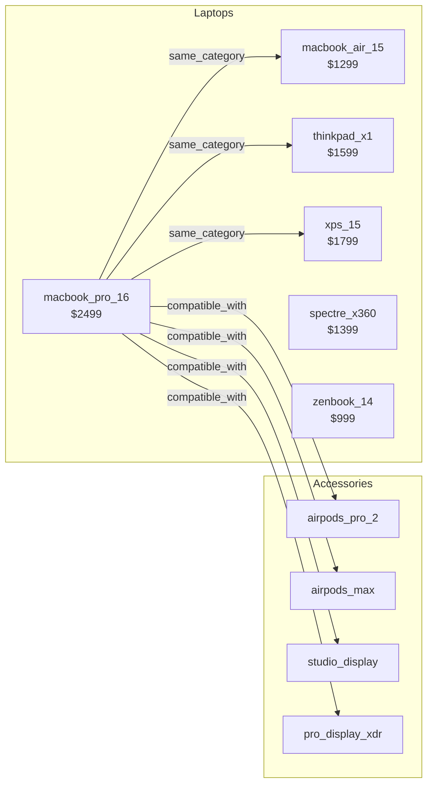
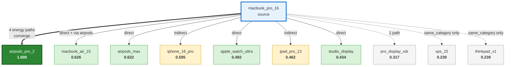
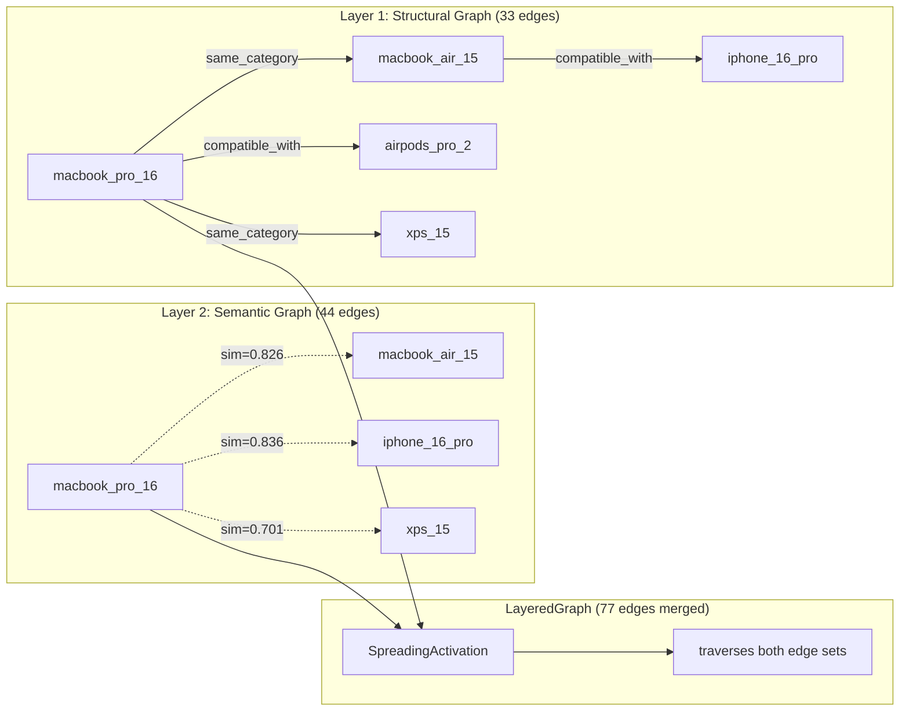

# Structured Search Showcase

> **Attribute Indexing, Faceted Navigation, Semantic Retrieval, and SQLite Persistence across a 20-Product Catalog**

## 1. The Approach

Product catalogs, document collections, and knowledge bases share the same retrieval problem: find items matching specific attributes, group results by category, and rank by relevance. Traditional graph libraries store nodes and edges but provide no mechanism for querying node data attributes -- you iterate all nodes and filter manually.

Hyper3's `SearchEngine` builds an inverted index over node data fields on first query. Attribute filters use the index for O(1) field-value lookups. Range queries use sorted numeric indexes with binary search. Facets compute `GROUP BY` counts over candidate sets. The query planner estimates selectivity and chooses between index-only, activation, embedding, or hybrid strategies. A semantic layer builds a second hypergraph from embedding similarity and merges both graphs so spreading activation traverses structural and semantic edges together. SQLite persistence stores the graph in a database with JSON1 attribute filtering, FTS5 text search, and auto-maintained indexes.

## 2. A Simple Analogy

Imagine a spreadsheet where each row is a product with columns for type, brand, price, and CPU. You can filter by column, sort by price, and count how many products fall into each category. Now imagine that spreadsheet can also find products *similar* to a given one by tracing connections between them (compatible accessories, same-category alternatives). Hyper3's search system is that spreadsheet with a graph engine underneath.

## 3. Key Concepts

| Term | Plain English Meaning |
|------|----------------------|
| **Attribute Index** | An inverted index mapping field-value pairs to node IDs, rebuilt lazily when the graph changes |
| **Facet** | A count of how many matching items share each value of a given field (e.g., 6 laptops, 3 tablets) |
| **Range Filter** | A numeric bounds filter using sorted indexes with binary search (e.g., price between 800 and 1500) |
| **Query Planner** | Estimates how selective a filter is and chooses a retrieval strategy accordingly |
| **Multi-Signal Scoring** | Combines index match score, graph activation energy, and embedding similarity into a single ranked score |
| **Parsed Query** | A query string like `type:laptop price:800..1500 -brand:sony ^price:2.0` parsed into filters, negations, and boosts |
| **Dirty Tracking** | The index is marked dirty on graph mutations and rebuilt automatically on the next search |
| **Spreading Activation** | Energy injected at a source node propagates through edges, decaying with each hop |
| **Semantic Layer** | A second hypergraph whose edges are derived from embedding similarity, merged with the structural graph |
| **LayeredGraph** | A read-only adapter that merges edges from the structural graph and the semantic graph into a single view |
| **SQLite Store** | A persistence layer storing the graph in SQLite with WAL concurrent reads, JSON1 filtering, and FTS5 text search |

## 4. Quick Start

```bash
.venv/bin/python examples/showcase/structured_search/structured_search.py
```

After running the example, you will understand how to: build a hypergraph from structured product data; measure node connectivity with spreading activation; add a semantic layer from embedding similarity and observe its effect on activation; build an inverted index for attribute filtering, range queries, and faceted navigation; combine index, activation, and similarity signals into a single relevance score; track index freshness with dirty flags; and persist the entire graph to SQLite for out-of-process queries.

The example builds a product catalog and demonstrates 11 sections:

```
SECTION 1: Product Catalog Construction
  nodes: 20, edges: 33

SECTION 2: Activation Energy (Structural Graph)
  structural activation from macbook_pro_16 (top 10):
              airpods_pro_2  energy=1.000
             macbook_air_15  energy=0.626
              iphone_16_pro  energy=0.595

SECTION 3: Building the Semantic Layer
  structural edges:    33
  semantic edges:      44
  layered graph total: 77

SECTION 10: Index Maintenance and Dirty Tracking
  semantic layer dirty:  False
  after adding iphone_17_pro:
    index dirty:    True
    semantic dirty: True

SECTION 11: SQLite Persistence and Serving
  file size: 73,728 bytes, nodes: 21, edges: 33
  apple products (via SQLite): 10
```

## 5. The Scenario

The example models a consumer electronics catalog with **20 products and 33 edges** across six product types:

- **6 Laptops:** macbook_pro_16, macbook_air_15, thinkpad_x1, xps_15, spectre_x360, zenbook_14
- **3 Tablets:** ipad_pro_13, surface_pro_11, galaxy_tab_s9
- **3 Phones:** iphone_16_pro, pixel_9_pro, galaxy_s25_ultra
- **3 Audio:** airpods_pro_2, sony_wh1000xm5, airpods_max
- **2 Wearables:** apple_watch_ultra, galaxy_watch_7
- **3 Displays:** studio_display, pro_display_xdr, ultrafine_5k

Each product has data attributes: `type`, `brand`, `price`, `ram_gb`, `year`, `cpu`, `weight_kg`. Two edge types connect them:

- `compatible_with` -- accessory compatibility (19 edges)
- `same_category` -- same-product-type alternatives (14 edges)

## 6. Three Readings of the Same Graph

The search system reads the same hypergraph through three lenses. The first two are independent (topology and activation). The third (layered architecture) unifies them with embedding-derived semantic edges.

### Diagram 1: Graph Topology

The physical edge structure -- who is connected to whom, via what label.



**What it shows:** Edges exist because someone explicitly created them. `compatible_with` reflects real accessory relationships. `same_category` reflects product categorization.

**What it ignores:** Node content, semantic meaning, and any relationship not explicitly encoded as an edge.

### Diagram 2: Spreading Activation Energy (Structural)

Energy injected at `macbook_pro_16` propagates through structural edges, decaying with each hop. `mem.activate()` uses 5 iterations by default. Nodes reachable through multiple paths accumulate more energy than nodes reachable through a single path, even at the same hop distance.



The key insight is **multi-path accumulation, not hop distance.** `airpods_pro_2` receives the highest activation (1.000) because energy from 4 independent paths converges on it: the direct edge from `macbook_pro_16`, plus paths through `macbook_air_15`, `iphone_16_pro`, and `ipad_pro_13`.

| Tier | Activation | Nodes | Why |
|------|-----------|-------|-----|
| **Hub** | 1.000 | airpods_pro_2 | 4 independent energy paths converge. Normalization caps at 1.0. |
| **Strong** | 0.6-0.7 | macbook_air_15, airpods_max | Each receives energy from 2+ paths. |
| **Moderate** | 0.4-0.6 | iphone_16_pro, apple_watch_ultra, ipad_pro_13, studio_display | Reached through 1-2 indirect paths. |
| **Weak** | 0.2-0.3 | pro_display_xdr, xps_15, thinkpad_x1 | Single path or distant connection. |

### Diagram 3: Layered Architecture

The semantic layer builds a second hypergraph whose edges are derived from embedding similarity (cosine similarity >= 0.7 threshold), then merges both graphs so spreading activation traverses structural and semantic edges together.



Without the semantic layer, `iphone_16_pro` receives activation only through an indirect path: `macbook_pro_16 -> macbook_air_15 -> iphone_16_pro` (2 hops, energy diluted). With the semantic layer, it receives direct energy via the `sim=0.836` edge -- a shortcut created by the embedding model.

**Structural vs. Layered Activation (from Section 4 output):**

| Node | Structural | Layered | Delta | Semantic edge? |
|------|-----------|---------|-------|----------------|
| airpods_pro_2 | 1.000 | 1.000 | -0.000 | No |
| iphone_16_pro | 0.595 | 0.872 | +0.276 | Yes (sim=0.836) |
| ipad_pro_13 | 0.462 | 0.740 | +0.278 | Yes (sim=0.743) |
| macbook_air_15 | 0.626 | 0.684 | +0.058 | Yes (sim=0.826) |
| xps_15 | 0.239 | 0.404 | +0.165 | Yes (sim=0.701) |
| thinkpad_x1 | 0.239 | 0.316 | +0.077 | No (sim=0.696, below 0.7) |
| studio_display | 0.434 | 0.344 | -0.090 | No (sim=0.608, below 0.7) |

Nodes with semantic edges receive large activation boosts (+0.165 to +0.278). Nodes without semantic edges either stay flat or decrease slightly because the semantic edges redirect energy flow toward semantically similar nodes.

**Reading the Three Diagrams Together:**

| Diagram | What it measures | What it ignores | Analogy |
|---------|-----------------|----------------|---------|
| **Topology** | Edge structure: who is connected to whom | Node content, semantics | A subway map -- shows stops and connections |
| **Activation** | Connectivity: how much energy accumulates at each node | Node labels, semantic meaning | A heat map of foot traffic |
| **Layered** | Combined propagation through structural + semantic edges | Nothing -- merges all signals | A transit system with express lines bypassing intermediate stops |

## 7. The Analysis Pipeline

### Section 1: Product Catalog Construction

Build the graph from product data dictionaries and edge lists.

```python
mem = HypergraphMemory(evolve_interval=0)

for name, data in products:
    mem.add(name, data=data)

for src, tgt, label in edges:
    mem.link(src, tgt, label=label, weight=2.0)
```

**Result:** 20 nodes, 33 edges. Each node carries typed data attributes. Each edge connects compatible products or same-category alternatives.

### Section 2: Activation Energy (Structural Graph)

Inject energy at `macbook_pro_16` on the structural graph (no semantic layer yet):

```python
struct_results = mem.activate("macbook_pro_16", energy=1.0, top_k=20)
```

**Why this matters:** This establishes a baseline for connectivity. Later, after adding semantic edges, we can measure how much the semantic layer changes the activation landscape. `airpods_pro_2` tops the list at 1.000 because 4 independent energy paths converge on it.

### Section 3: Building the Semantic Layer

Build a second hypergraph from embedding similarity and merge it with the structural graph:

```python
sem_count = mem.build_semantic_layer(top_k=10, threshold=0.7)
```

**Result:** 33 structural + 44 semantic = 77 total edges in the layered view. Pairs above the 0.7 cosine similarity threshold get `semantic_sim` edges: iphone_16_pro (0.836), macbook_air_15 (0.826), ipad_pro_13 (0.743), xps_15 (0.701). Pairs below the threshold do not: thinkpad_x1 (0.696), airpods_pro_2 (0.670).

### Section 4: Activation Energy (Layered Graph)

Run the same activation query on the layered graph:

```python
results = mem.activate("macbook_pro_16", energy=1.0, top_k=10)
```

**Why this matters:** The comparison table (see Diagram 3) shows the semantic layer's effect. `iphone_16_pro` jumps from 0.595 to 0.872 (+0.276) because the direct semantic edge carries energy in 1 hop instead of 2. `studio_display` drops from 0.434 to 0.344 (-0.090) because energy is redirected toward semantically similar nodes.

### Section 5: Indexing and Filtered Search

Build the attribute index and filter by type:

```python
stats = mem.search.reindex()
laptops = mem.search.find(filters={"type": "laptop"}, top_k=20)
```

**Result:** 8 indexed fields, 57 unique values, 119 total index entries. `type=laptop` is a single dictionary lookup returning 6 node IDs.

### Section 6: Range Filtering and Parsed Queries

Find laptops in a price range using parsed query syntax:

```python
from hyper3 import parse_query

range_q = parse_query("type:laptop price:800..1500")
results = mem.search.search(range_q)
```

**Result:** 3 laptops (spectre_x360 $1,399, macbook_air_15 $1,299, zenbook_14 $999). Range queries use sorted numeric indexes with binary search. Multi-value filters use OR: `type:phone,tablet` matches 6 products.

### Section 7: Faceted Navigation and Autocomplete

Browse with facet counts and prefix suggestions:

```python
browse_all = mem.search.browse(facet_fields=["type", "brand"], top_k=5)
brand_suggestions = mem.search.suggest("brand", "a")
```

**Result:** Type breakdown: laptop 6, tablet 3, audio 3, display 3, phone 3, wearable 2. Brand: apple 9, samsung 3, plus 7 brands with 1 each. Autocomplete: brand prefix "a" returns `['apple', 'asus']`, cpu prefix "snap" returns `['snapdragon_8elite', 'snapdragon_8gen2', 'snapdragon_x']`.

### Section 8: Multi-Signal Scoring

Combine index match, graph activation, and embedding similarity:

```python
scored = mem.search.find(
    "macbook_pro_16",
    filters={"type": "laptop"},
    boosts={"brand": 1.5},
    top_k=6,
)
```

**Scoring formula:** `score = (index_weight + activation * 0.4 + similarity * 0.6) / total_weight * boost_multiplier` where `total_weight = 1.0 + 0.4 + 0.6 = 2.0` for the hybrid strategy.

| Label | Score | idx | act | sim | boost | Strategy |
|-------|-------|-----|-----|-----|-------|----------|
| macbook_air_15 | 1.380 | 1.000 | 0.860 | 0.826 | 1.50 | hybrid |
| xps_15 | 1.241 | 1.000 | 0.586 | 0.701 | 1.50 | hybrid |
| macbook_pro_16 | 1.050 | 1.000 | 1.000 | 0.000 | 1.50 | hybrid |
| thinkpad_x1 | 0.879 | 1.000 | 0.431 | 0.000 | 1.50 | hybrid |
| zenbook_14 | 0.785 | 1.000 | 0.116 | 0.000 | 1.50 | hybrid |
| spectre_x360 | 0.783 | 1.000 | 0.110 | 0.000 | 1.50 | hybrid |

> **Note:** The `act` column uses 3 iterations in the scoring pipeline, while `mem.activate()` (Sections 2 and 4) uses 5 iterations (the default `max_iterations`). This means the activation values in this table differ from the standalone activation output -- both are correct, they use different iteration counts.

`macbook_pro_16` has sim=0.000 because the embedding engine excludes the source node from its own similarity results. `thinkpad_x1` has sim=0.000 because its cosine similarity (0.696) falls below the 0.7 threshold. `zenbook_14` and `spectre_x360` receive low activation (0.116, 0.110) through the semantic layer -- they would be 0.000 without it.

### Section 9: Strategy Selection and Pagination

Compare retrieval strategies and page through results:

```python
for strat in ["index", "browse", "auto"]:
    result = mem.search.find(filters={"brand": "apple"}, top_k=5, strategy=strat)

page1 = mem.search.find(top_k=5, offset=0)
page2 = mem.search.find(top_k=5, offset=5)
```

**Result:** All three strategies return 9 Apple products. Page 1 and page 2 each return 5 results.

### Section 10: Index Maintenance and Dirty Tracking

Observe dirty tracking for both the attribute index and the semantic layer as the graph changes:

```python
# Before mutation: both clean
mem.search.index_stats().dirty        # False
mem.semantic_layer_dirty()             # False

# After adding a node: both dirty
mem.add("iphone_17_pro", data={"type": "phone", "brand": "apple", ...})
mem.search.index_stats().dirty        # True
mem.semantic_layer_dirty()             # True

# Index auto-rebuilds on next search; semantic layer stays dirty
mem.search.find(filters={"brand": "apple"}, top_k=3)
mem.search.index_stats().dirty        # False
mem.semantic_layer_dirty()             # True (stays dirty until rebuild)
```

**Result:** After adding `iphone_17_pro`, both the index and semantic layer are dirty. The index auto-rebuilds on the next search (124 entries). The semantic layer remains dirty because it must be explicitly rebuilt via `build_semantic_layer()`.

### Section 11: SQLite Persistence and Serving

Save the graph to SQLite and query it directly:

```python
from hyper3 import SqliteStore

mem.save_sqlite(db_path)

store = SqliteStore(db_path)
apple_db = store.find_nodes(filters={"brand": "apple"})
facets_db = store.facets(["type", "brand"])
text_db = store.search_text("macbook")
suggest_db = store.suggest("brand", "s")
neighbors_db = store.neighbors("macbook_pro_16", direction="out")
store.close()
```

**Result:** 73,728-byte database with 21 nodes and 33 edges. Direct SQLite queries return 10 Apple products, 2 results for "macbook" text search, brand suggestions `['samsung', 'sony']` for prefix "s", and 8 neighbors of `macbook_pro_16`. Loading back into a fresh `HypergraphMemory` preserves all nodes, edges, and data attributes.

## 8. Understanding the Output

### Search Score Interpretation

| Score Range | Meaning |
|-------------|---------|
| >1.0 | Multi-signal score combining index + activation + embedding similarity + boost |
| 1.0 | Pure index match (filter passed, no activation, embedding, or boost) |
| 0.0 | Browse result (no relevance ranking, just filtering) |

### Strategy Interpretation

| Strategy | When Selected | Scoring |
|----------|--------------|---------|
| `browse` | Filter-only, no text query | Index match only (0.0 or 1.0) |
| `index_only` | Very selective filter | Index match only |
| `hybrid` | Text + filters + activation + embedding | All signals combined |

### Dirty Flag Interpretation

| Flag | Dirty | Meaning |
|------|-------|---------|
| `index_stats().dirty` | `False` | Index is up-to-date with the graph |
| `index_stats().dirty` | `True` | Graph has changed since last index build; next search will rebuild |
| `semantic_layer_dirty()` | `False` | Semantic layer matches current graph structure |
| `semantic_layer_dirty()` | `True` | New nodes or edges added since last `build_semantic_layer()` |

## 9. Key Metrics

| Metric | Value |
|--------|-------|
| Products (nodes) | 20 |
| Structural edges | 33 |
| Semantic edges | 44 |
| Layered graph total edges | 77 |
| Indexed fields | 8 |
| Unique indexed values | 57 |
| Total index entries | 119 (initial), 124 (after adding iphone_17_pro) |
| Dirty tracking | Both index and semantic layer dirty after mutation; index auto-rebuilds on search |
| Filtered laptops | 6 |
| Laptops in price range 800..1500 | 3 |
| Apple products | 9 (initial), 10 (after adding iphone_17_pro) |
| Product types | 6 (laptop, tablet, phone, audio, wearable, display) |
| Brands | 10 |
| Multi-signal top score | 1.380 (macbook_air_15, activation 0.860, similarity 0.826, boost 1.5x) |
| SQLite file size | 73,728 bytes |
| SQLite nodes (after adding iphone_17_pro) | 21 |
| SQLite Apple products | 10 |
| SQLite text search "macbook" | 2 results |
| Neighbors of macbook_pro_16 | 8 |

## 10. Real-World Gap

1. **Catalog Data Pipeline:** The showcase constructs 20 products from Python dictionaries. Real adoption requires ETL from product databases, PIM systems, or vendor feeds into labeled nodes.

2. **Scale:** The showcase operates on 20 products with 8 fields. Production catalogs have millions of SKUs with hundreds of attributes. The in-memory index scales well to tens of thousands of nodes; beyond that, SQLite's JSON1 and FTS5 are the appropriate serving layer.

3. **Embedding Quality:** The showcase uses `FastEmbedProvider` with the ONNX model `BAAI/bge-small-en-v1.5` for semantically meaningful cosine similarity. Production semantic search may require domain-specific fine-tuned models for specialized vocabularies, configured via `mem.search.set_provider()`.

4. **Real-Time Updates:** The showcase adds a product and observes dirty tracking. Production catalogs receive continuous updates. The dirty-tracking + lazy rebuild pattern works for moderate update rates; high-throughput scenarios would need incremental index updates.

5. **User Intent Parsing:** The `parse_query()` function supports attribute syntax but does not handle natural language ("show me cheap apple laptops"). Production search requires NLP-based intent parsing that converts natural language into structured `SearchQuery` objects.

6. **Personalization:** Scoring uses uniform boost factors. Production search personalizes results based on user history, preferences, and context, which would require per-user boost parameters.

## 11. Reference

### Key API Methods

| Method | Purpose |
|--------|---------|
| `mem.add(label, data)` | Create a node with metadata |
| `mem.link(source, target, label)` | Create a typed edge |
| `mem.build_semantic_layer(top_k, threshold)` | Build semantic graph from embeddings |
| `mem.semantic_layer_dirty()` | Check if semantic layer needs rebuild |
| `mem.activate(label, energy, top_k)` | Spreading activation from a source node |
| `mem.search.find(text, filters, boosts, top_k)` | Structured search with multi-signal scoring |
| `mem.search.browse(filters, facet_fields)` | Filter-only browse with facets |
| `mem.search.search(query)` | Execute a parsed `SearchQuery` object |
| `mem.search.reindex()` | Build or rebuild the attribute index |
| `mem.search.index_stats()` | Return index statistics and dirty flag |
| `mem.search.suggest(field, prefix)` | Autocomplete suggestions for a field |
| `parse_query(text)` | Parse query string into `SearchQuery` |
| `mem.save_sqlite(path)` | Persist graph to SQLite |
| `mem.load_sqlite(path)` | Load graph from SQLite |
| `SqliteStore(path)` | Open SQLite database for direct queries |
| `store.find_nodes(filters)` | Attribute filtering via JSON1 |
| `store.facets(fields)` | Facet aggregation via GROUP BY |
| `store.search_text(query)` | Full-text search via FTS5 |
| `store.suggest(field, prefix)` | Autocomplete via LIKE |
| `store.neighbors(label, direction)` | Neighbor lookup via adjacency table |

### Related Examples

| Example | Focus |
|---------|-------|
| `examples/showcase/retrieval_and_similarity/` | Spreading activation, embedding similarity, RRF retrieval |
| `examples/showcase/retrieval_and_feedback/` | Security knowledge retrieval with learning-to-rank |
| `examples/showcase/centrality_and_ranking/` | Degree, betweenness, PageRank comparison |
