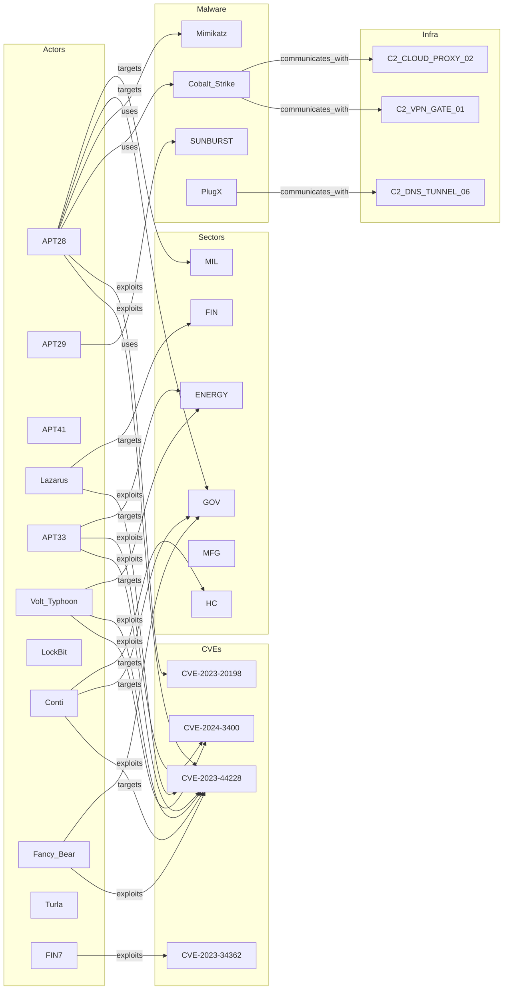

# Full-Chain Threat Intelligence Analysis

> A 73-node CTI knowledge graph demonstrating rule-based reasoning, spreading activation for alert triage, Born-rule belief sampling for attribution, self-evolution for stale IOC pruning, and centrality ranking — in a single script with zero network calls.

## 1. The Approach

Cyber threat intelligence analysis requires chaining multiple techniques that answer different questions. Rule-based inference finds hidden connections between entities. Spreading activation triages alerts by graph proximity — when a CVE is exploited, which actors and sectors light up? Belief sampling handles uncertain attribution where multiple APT groups are suspects. Self-evolution prunes stale indicators that accumulate in every CTI platform. Centrality ranking identifies which actors and vulnerabilities sit at the intersection of the most attack paths.

No single technique covers the full chain. This showcase demonstrates how they compose inside Hyper3's hypergraph, operating on a shared graph so that each technique's output is immediately available to the next.

## 2. Key Concepts

| Term | What it means here |
|---|---|
| **Labeled hyperedge** | A directed relationship between nodes — `APT28 -[exploits]-> CVE-2023-44228` is one edge with a semantic label |
| **Inverse rule** | For every `A -[exploits]-> B`, create `B -[exploited_by]-> A`, enabling reverse lookups |
| **Abductive rule** | Given an effect (APT targets sector), hypothesize a cause (suspected attacker), producing attribution hypotheses |
| **Spreading activation** | Inject energy into a node (the alert), propagate it along edges, measure which nodes receive the most |
| **Born-rule sampling** | Each attribution hypothesis has a complex amplitude; sampling uses \|amplitude\|² as the probability, matching quantum measurement statistics |
| **Self-evolution** | The graph decays unused edges, prunes below-threshold nodes, and merges equivalent nodes based on structural and data similarity |
| **Degree centrality** | Fraction of nodes a given node connects to — measures how many attack paths pass through it |
| **IOC** | Indicator of Compromise — an IP, domain, or hash associated with malicious activity |

## 3. Quick Start

```bash
.venv/bin/python examples/showcase/threat_intel_full_chain/threat_intel_full_chain.py
```

Expected output (6 sections):

```
SECTION 1: Building the Threat Intelligence Knowledge Graph
  Nodes:  73
  Edges:  122

SECTION 2: Rule-Based Reasoning -- Discovering Hidden Relationships
  States explored:    31
  Rules applied:      30
  New edges total:    30

SECTION 3: Spreading Activation -- Alert Triage and Impact Scoring
  Total activated nodes: 25

SECTION 4: Belief Layer -- Competing Attribution Hypotheses
  Prior distribution (raw Born rule):
    APT28       probability=0.5636
    APT29       probability=0.2108

SECTION 5: Self-Evolution -- Decay Stale IOCs, Reinforce Active Threats
  Nodes pruned:     3
  Nodes merged:     14

SECTION 6: Pattern Matching and Centrality -- Who Is Most Dangerous?
  APT28  centrality=0.4182
```

Full run takes under 2 seconds. Zero API calls. Zero LLM. Zero cloud.

## 4. The Scenario

The graph contains 73 nodes across 7 entity types, connected by 122 labeled edges:

| Entity type | Count | Examples |
|---|---|---|
| Threat actors | 21 | APT28, Lazarus, Volt_Typhoon, Conti |
| CVEs | 10 | CVE-2023-44228 (Log4j), CVE-2024-3400 (PAN-OS) |
| Malware | 14 | Cobalt_Strike, Emotet, SUNBURST, Mimikatz |
| Industries | 11 | GOV, FIN, ENERGY, MFG, HC |
| Infrastructure | 7 | C2 servers, botnets, exfil servers |
| TTPs | 7 | T1566_Phishing, T1190_Exploit_Public_App |
| Stale IOCs | 3 | Old IPs, domains, hashes from 2019-2021 |

Six edge labels model the relationships: `exploits`, `targets`, `uses`, `communicates_with`, `attributed_to`, `uses_tactic`.



The diagram above shows a representative subset of the 122 edges. The actual graph connects all 21 actors to CVEs, malware, sectors, infrastructure, and TTPs.

Why labeled edges matter: CTI analysts think in terms of relationships — "APT28 exploits CVE-2023-44228 using Cobalt Strike to target government." Each clause in that sentence is a labeled edge. Storing them as labeled directed edges preserves the semantic structure that flat node-attribute graphs lose.

## 5. Analysis Pipeline

### 5.1 Knowledge Graph Construction

The script creates 73 nodes with typed data payloads and 122 labeled edges across 6 relationship types. Each node stores its entity type, origin, and domain-specific attributes (CVSS score for CVEs, tactic for TTPs, platform for malware). Three stale IOC nodes are inserted with weight 0.05 to test pruning later.

Why this matters: The hypergraph is the single substrate. Every subsequent analysis step — reasoning, activation, sampling, evolution, centrality — operates on this same graph. No data is copied to a separate store.

### 5.2 Rule-Based Reasoning

Four `InverseRule` instances and one `AbductiveRule` are registered. The engine explores 31 states, applies 30 rules, and produces 30 new edges. Inferred edge types include:

- **`exploited_by`** (reverse of `exploits`): `CVE-2023-44228 -[exploited_by]-> Conti`, `CVE-2023-34362 -[exploited_by]-> FIN7`, and 23 more. This enables the query "who exploits this vulnerability?" without scanning all forward edges.
- **`targeted_by`** (reverse of `targets`): `GOV -[targeted_by]-> APT28`.
- **`used_by`** (reverse of `uses`): `Cobalt_Strike -[used_by]-> APT28`.
- **`suspected_attacker`** (abductive): If a sector is targeted, hypothesize which actors might be responsible.

After reasoning, the graph contains 39 total inferred edges (30 from this round plus any overlap), enabling bidirectional traversal without manual index construction.

### 5.3 Spreading Activation — Alert Triage

The scenario: a SOC alert fires on `CVE-2023-44228` (Log4j). Energy is injected into that node and spreads along edges for 4 iterations.

Results: 25 nodes activate. Among them:

- **14 threat actors** — APT28 (energy=0.198), Fancy_Bear (0.173), Conti (0.172), Volt_Typhoon (0.169), LockBit (0.163), Turla (0.159), Lazarus (0.159), APT33 (0.159), and 6 more.
- **4 sectors** — GOV (0.241), MFG (0.133), MIL (0.120), HC (0.116).
- **2 related CVEs** — CVE-2024-3400 (0.212), CVE-2023-20198 (0.108).

Why spreading activation matters: Without it, answering "who does this CVE affect?" requires a manual breadth-first traversal and aggregation across multiple edge types. Spreading activation does this in a single call, producing energy scores that reflect both direct connections (depth=1) and indirect reach (depth=2+). The energy values quantify blast radius — GOV scores highest because it is connected to the most Log4j-exploiting actors.

### 5.4 Belief Layer — Attribution Sampling

Four suspects (APT28, APT29, Lazarus, Volt_Typhoon) are assigned prior amplitudes [0.7, 0.5, 0.4, 0.3]. The Born rule converts these to probabilities via |amplitude|², normalized:

| Suspect | Amplitude | \|Amp\|² | Probability |
|---|---|---|---|
| APT28 | 0.7 | 0.49 | 0.5636 |
| APT29 | 0.5 | 0.25 | 0.2108 |
| Lazarus | 0.4 | 0.16 | 0.1394 |
| Volt_Typhoon | 0.3 | 0.09 | 0.0863 |

Over 1000 sampling trials, the empirical frequencies match the theoretical distribution: APT28 at 54.5%, APT29 at 22.5%, Lazarus at 13.0%, Volt_Typhoon at 10.0%.

When context weights favor APT28 (weight=3.0) and disfavor Lazarus (weight=0.5), the distribution shifts: APT28 rises to 82.4%, Lazarus drops to 3.5%.

**Honest assessment**: The Born-rule sampling with complex amplitudes adds mathematical structure (interference effects between correlated beliefs), but for this specific use case — ranking a small set of discrete suspects with known priors — a simple Bayesian update would produce similar results with less overhead. The belief layer's advantage is composability: the same mechanism handles correlated beliefs across multiple concepts via `create_correlation()`, which simpler Bayesian methods would require custom code to replicate.

### 5.5 Self-Evolution — Stale IOC Pruning

Before evolution, the graph has 73 nodes and 152 edges (including the 30 inferred). Three stale IOCs — `STALE_IP_192.168.1.1`, `STALE_DOMAIN_old-c2.biz`, `STALE_HASH_e3b0c442` — sit at weight 0.05 with zero access count. Active nodes like APT28, Lazarus, and CVE-2023-44228 were recalled 5 times each.

After calling `mem.evolve()`:

| Metric | Result |
|---|---|
| Edges decayed | 0 |
| Nodes pruned | 3 |
| Nodes merged | 14 |
| Nodes reinforced | 0 |
| Final graph | 56 nodes, 152 edges |

All 3 stale IOCs are pruned. The 14 merged nodes reflect structural equivalence — nodes with identical data payloads and overlapping neighborhoods are collapsed.

Why evolution matters: CTI platforms accumulate stale indicators. Old IPs, expired domains, and superseded hashes clutter the graph and dilute query results. Manual curation does not scale. The evolution engine applies a consistent policy (decay by inactivity, prune below threshold, merge by similarity) that keeps the graph focused on active threats.

### 5.6 Centrality — Ranking by Attack Path Connectivity

Degree centrality measures what fraction of the graph a node connects to directly. The results:

**Top 5 threat actors:**

| Rank | Actor | Centrality | Exploits | Targets | Uses |
|---|---|---|---|---|---|
| 1 | APT28 | 0.4182 | 4 | 3 | 5 |
| 2 | Volt_Typhoon | 0.3091 | 4 | 3 | 3 |
| 3 | FIN6 | 0.2545 | 2 | 3 | 4 |
| 4 | APT33 | 0.2364 | 3 | 3 | 4 |
| 5 | Turla | 0.2364 | 3 | 4 | 3 |

**Top 5 CVEs:**

| Rank | CVE | Centrality | CVSS | Product |
|---|---|---|---|---|
| 1 | CVE-2023-44228 | 0.5091 | 10.0 | Apache Log4j2 |
| 2 | CVE-2024-3400 | 0.1818 | 10.0 | PAN-OS |
| 3 | CVE-2023-20198 | 0.0727 | 10.0 | Cisco IOS XE WebUI |
| 4 | CVE-2023-34362 | 0.0727 | 9.8 | MOVEit Transfer |
| 5 | CVE-2023-22515 | 0.0727 | 10.0 | Atlassian Confluence |

CVE-2023-44228 (Log4j) has the highest centrality of any node in the graph at 0.5091 — it connects to more than half the nodes because 12 threat actors exploit it. APT28's full profile subgraph spans 14 nodes and 21 edges.

Why centrality matters: CVSS scores rate severity in isolation. Centrality rates impact in context — how many attack paths pass through a vulnerability or actor. CVE-2024-3400 and CVE-2023-20198 both have CVSS 10.0, but CVE-2024-3400 has 2.5x the centrality because it sits on more active exploitation paths. This distinction is invisible without graph analysis.

## 6. Understanding Output

### Spreading activation energy

Energy is a relative measure of graph proximity to the stimulated node. Direct neighbors receive the most energy (depth=1), with decay at each hop. The absolute values depend on branching factor and iteration count — use them for ranking, not as absolute thresholds.

### Born-rule probability vs. context-weighted probability

The raw Born-rule probability is `|amplitude|²` normalized across all outcomes. Context weights scale individual outcome amplitudes before sampling, shifting the distribution. In the showcase, context evidence favoring APT28 shifts its probability from 56% to 82%.

### Centrality scores

Degree centrality = (number of neighbors) / (total nodes - 1). A score of 0.4182 means APT28 connects to 41.82% of all other nodes in the graph. This counts all edge types (exploits, targets, uses, etc.) through `incident_edges()`.

### Evolution metrics

- **Pruned**: nodes whose weight fell below the pruning threshold, removed from the graph
- **Merged**: structurally equivalent nodes collapsed into one
- **Decayed**: edges whose weights were reduced but not removed
- **Reinforced**: edges whose weights were increased due to frequent access

## 7. Key Metrics

| Metric | Value |
|---|---|
| Initial nodes | 73 |
| Initial edges | 122 |
| Threat actors | 21 |
| CVEs | 10 |
| Malware | 14 |
| Industries | 11 |
| Infrastructure | 7 |
| TTPs | 7 |
| Stale IOCs | 3 |
| States explored (reasoning) | 31 |
| Rules applied | 30 |
| New edges from reasoning | 30 |
| Total inferred edges | 39 |
| Activated nodes (spreading) | 25 |
| Activated threat actors | 14 |
| Affected sectors | 4 |
| Related CVEs | 2 |
| APT28 activation energy | 0.198 |
| GOV activation energy | 0.241 |
| CVE-2024-3400 activation energy | 0.212 |
| APT28 prior probability | 0.5636 |
| APT29 prior probability | 0.2108 |
| Lazarus prior probability | 0.1394 |
| Volt_Typhoon prior probability | 0.0863 |
| APT28 empirical sample rate | 54.5% (1000 trials) |
| APT28 context-weighted rate | 82.4% |
| Nodes pruned (evolution) | 3 |
| Nodes merged (evolution) | 14 |
| Final nodes | 56 |
| Final edges | 152 |
| APT28 centrality | 0.4182 |
| CVE-2023-44228 centrality | 0.5091 |
| APT28 subgraph | 14 nodes, 21 edges |
| Event log entries | 4213 |

## 8. What Makes This Different

**Composable techniques on a shared graph.** Reasoning produces new edges. Spreading activation traverses those edges. Evolution prunes nodes that activation never reaches. Centrality ranks what remains. Each technique reads and writes the same hypergraph, so later steps incorporate earlier results without data pipeline glue.

**Labeled directed edges for CTI semantics.** The relationship "APT28 exploits CVE-2023-44228 to target GOV using Cobalt Strike" is four labeled edges, not a flat attribute blob. This structure enables rule matching (find all `exploits` edges), directional traversal (outgoing from the actor vs. incoming to the CVE), and pattern queries (`mem.pattern_match(source_label="APT28", edge_label="exploits")`).

**Inverse rules generate reverse indexes.** Rather than maintaining a separate lookup table for "who exploits CVE-X?", the `InverseRule` creates `exploited_by` edges during reasoning. The reverse lookup is a standard graph traversal — no special index code.

**Self-evolution as data hygiene.** Stale indicators accumulate in every CTI platform. The evolution engine applies a consistent policy (decay by inactivity, prune below threshold, merge by similarity) rather than requiring manual curation or scheduled cleanup scripts.

**Probabilistic attribution with honest tradeoffs.** The belief layer provides Born-rule sampling with context weighting for attribution, but for small suspect sets with known priors, simpler Bayesian methods would achieve similar results with less mathematical overhead. The belief layer's advantage is composability across correlated beliefs, not superior accuracy on single-attribute ranking.

## 9. Code Implementation

### Graph construction with typed data

```python
from hyper3 import HypergraphMemory, Modality

mem = HypergraphMemory(evolve_interval=0)

mem.add("APT28", data={"sophistication": "high", "origin": "Russia", "type": "threat_actor"},
          modalities={Modality.CAUSAL})
mem.add("CVE-2023-44228", data={"cvss": 10.0, "product": "Apache_Log4j2", "type": "vulnerability"},
          modalities={Modality.SENSORY})

mem.link("APT28", "CVE-2023-44228", label="exploits")
mem.link("APT28", "GOV", label="targets")
```

### Rule-based reasoning

```python
from hyper3 import InverseRule, AbductiveRule

mem.add_rules(
    InverseRule(edge_label="exploits", inverse_label="exploited_by"),
    InverseRule(edge_label="targets", inverse_label="targeted_by"),
    AbductiveRule(effect_label="targets", cause_label="suspected_attacker"),
)

result = mem.reason(
    seeds={"APT28", "CVE-2023-44228", "GOV"},
    depth=3,
    auto_commit=True,
)
```

### Spreading activation for alert triage

```python
activated = mem.activate("CVE-2023-44228", energy=1.0, iterations=4)

for r in activated[:5]:
    print(f"{r.label:22s}  energy={r.activation:.3f}  depth={r.depth}")
```

### Belief sampling for attribution

```python
suspects = ["APT28", "APT29", "Lazarus", "Volt_Typhoon"]
qs = mem.belief.create(suspects, amplitudes=[0.7, 0.5, 0.4, 0.3])

answer = mem.sample(qs, context={"APT28": 3.0, "Lazarus": 0.5})
node = mem.engine.graph.get_node(answer.node_id)
print(f"Attribution: {node.label}")
```

### Self-evolution

```python
evo = mem.evolve()
print(f"Pruned: {evo.pruned}, Merged: {evo.merged}")
```

### Centrality ranking

```python
from hyper3 import top_k

centrality = mem.analyze.centrality("degree")
actors = {a["label"] for a in THREAT_ACTORS}
top_actors = top_k({k: v for k, v in centrality.items() if k in actors}, k=5)
for label, score in top_actors:
    print(f"{label:22s}  centrality={score:.4f}")
```

## 10. Real-World Gap

**Data pipeline.** The showcase constructs a synthetic graph with hand-coded relationships. Real adoption requires ETL from threat intelligence platforms (MISP, OpenCTI, STIX/TAXII feeds), SIEM alerts, vulnerability scanners, and incident reports. Mapping these sources to labeled hyperedges is integration work the showcase does not address.

**Scale.** The graph runs on 73 nodes. Performance at 10K+ nodes (a realistic enterprise IOC corpus) is untested. Centrality computation and spreading activation scale with edge count and may require approximation algorithms.

**Temporal dynamics.** The showcase models staleness as a single weight value. Real CTI data has temporal semantics — a vulnerability's exploitation window, an actor's active campaign period, an indicator's rotation frequency. The evolution engine does not reason about time windows.

**Probabilistic variability.** Born-rule sampling produces different results on each run. The showcase runs 1000 trials to show the distribution shape, but a single `sample()` call returns one outcome. Production use would require decision thresholds, not single samples.

**Correlation modeling.** The belief layer supports `create_correlation()` to link outcome sampling between concepts (e.g., "if the actor is Russian, the infrastructure is likely Eastern European"). The showcase does not demonstrate this feature. Exploiting it for CTI would require domain-specific correlation data.

**External enrichment.** The showcase uses no external services. Production CTI analysis enriches graph nodes with OSINT, Shodan data, passive DNS, and sandbox reports. These would require network calls gated behind the `[faiss]` or custom extras.

## 11. Reference

### API methods used

| Method | Purpose |
|---|---|
| `HypergraphMemory(evolve_interval=0)` | Create memory with auto-evolution disabled |
| `mem.add(label, data=..., modalities=...)` | Create a hypernode with typed data |
| `mem.link(source, target, label=..., weight=...)` | Create a labeled directed hyperedge |
| `mem.add_rules(*rules)` | Register inference rules |
| `mem.reason(seeds=..., depth=..., auto_commit=True)` | Run multiway reasoning |
| `mem.activate(concept, energy=..., iterations=...)` | Inject activation energy and propagate along edges |
| `mem.belief.create(outcomes, amplitudes=...)` | Create a belief state |
| `mem.sample(distribution, context=...)` | Sample an outcome via Born rule |
| `mem.evolve()` | Run decay/prune/merge/reinforce cycle |
| `mem.analyze.centrality("degree")` | Compute degree centrality for all nodes |
| `mem.pattern_match(source_label=..., edge_label=...)` | Find edges matching a pattern |
| `mem.subgraph(node_labels)` | Extract a subgraph |
| `mem.recall(concept, depth=..., max_nodes=...)` | Retrieve neighborhood (accesses nodes, affecting evolution) |
| `top_k(scores, k=5)` | Return top-k items from a score dict |

### Inference rules used

| Rule | What it does |
|---|---|
| `InverseRule(edge_label, inverse_label)` | Creates reverse edges for bidirectional lookup |
| `AbductiveRule(effect_label, cause_label)` | Hypothesizes causes from observed effects |

### Glossary

| Term | Definition |
|---|---|
| **CTI** | Cyber Threat Intelligence — information about threats, adversaries, and vulnerabilities |
| **APT** | Advanced Persistent Threat — a sustained, targeted attack campaign |
| **CVE** | Common Vulnerabilities and Exposures — a standardized vulnerability identifier |
| **IOC** | Indicator of Compromise — observable evidence of a security breach |
| **TTP** | Tactics, Techniques, and Procedures — adversary behavior patterns (MITRE ATT&CK) |
| **CVSS** | Common Vulnerability Scoring System — numerical severity rating (0-10) |
| **SOC** | Security Operations Center — the team that monitors and responds to alerts |
| **C2** | Command and Control — infrastructure used to communicate with compromised systems |
