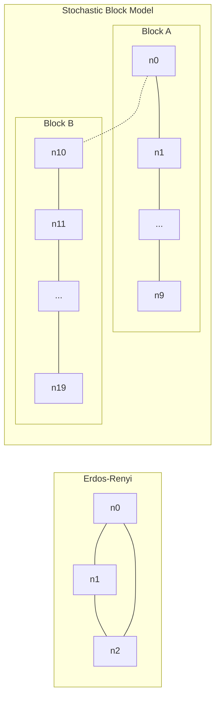
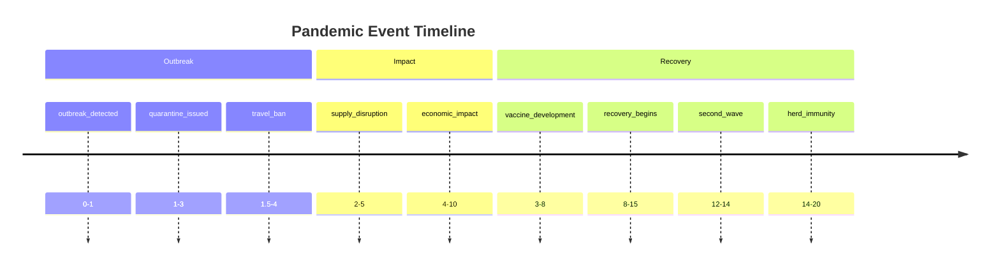
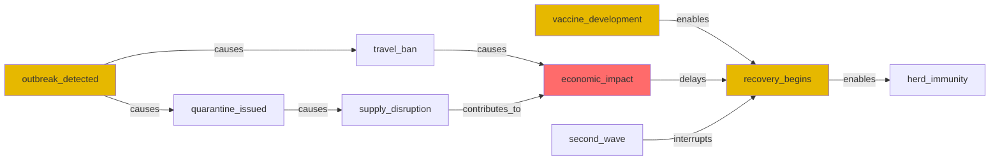
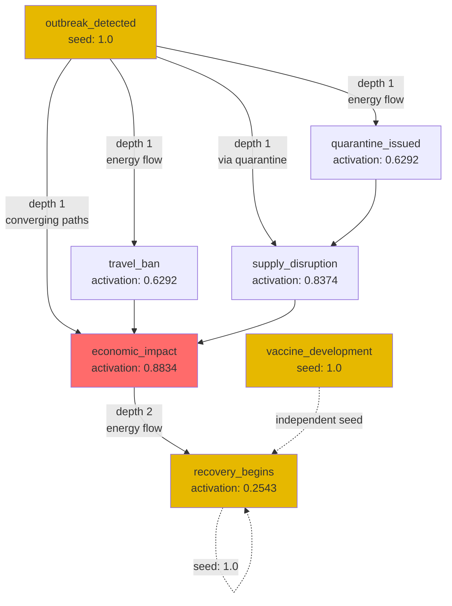
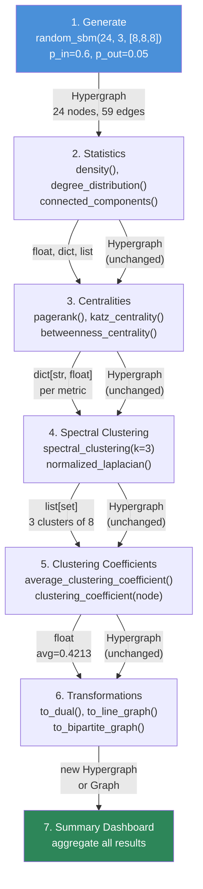

# Generative Models and Complete Workflow Showcase

> **Synthetic Hypergraph Generation, Temporal Reasoning, and End-to-End Analysis Pipelines**

---

**Learning Path**

This showcase follows a three-stage progression. Each stage builds on the capabilities of the previous one:

1. **Generative Models** -- Learn to produce hypergraphs with controlled structural properties (random, community-structured, deterministic). These give you reproducible inputs for benchmarking and testing.
2. **Temporal Reasoning** -- Add time-aware event networks with Allen interval algebra, causal chain detection, and belief distributions. This introduces semantic relationships that go beyond static graph structure.
3. **Complete Workflow** -- Combine generation with the full analysis stack (statistics, centralities, spectral clustering, coefficients, transformations) in a single reproducible pipeline.

Start with generative models to understand the graph primitives, then see how temporal reasoning layers richer semantics on top, and finally run the complete workflow to see all analysis APIs operating end-to-end.

---

## 1. The Approach

This group covers three capabilities that form a natural progression:

- **Generative models** produce hypergraphs with known structural properties, giving you controlled inputs for benchmarking, testing, and experimentation.
- **Temporal reasoning** adds Allen interval algebra to event networks, enabling fine-grained temporal relationship detection beyond simple before/after ordering.
- **The complete workflow** ties everything together -- generate a structured graph, compute statistics, run centralities, cluster spectrally, measure coefficients, and transform -- in a single reproducible pipeline.

## 2. Key Concepts

| Term | Meaning |
|------|---------|
| **Generative model** | A function that produces a `Hypergraph` with controlled random structure (edge probability, community structure, degree sequence) |
| **Stochastic Block Model (SBM)** | Generates hypergraphs with planted community structure: high edge probability within blocks, low between blocks |
| **Allen interval algebra** | A set of 13 relations between time intervals (before, meets, overlaps, contains, etc.) that capture every possible temporal relationship |
| **Causal chain** | A directed path through temporal events where each step is connected by a causal edge label |
| **Belief distribution** | A set of possible outcomes for an uncertain concept, each with a probability derived from complex amplitudes via the Born rule |
| **Spreading activation** | An iterative process that propagates stimulation energy from seed nodes outward through the graph |
| **Complete workflow** | An end-to-end pipeline: generate -> statistics -> centralities -> spectral clustering -> coefficients -> transformations |

## 3. Quick Start

```bash
.venv/bin/python examples/showcase/workflow/generative_and_workflow/generative_models.py
.venv/bin/python examples/showcase/workflow/generative_and_workflow/temporal_reasoning.py
.venv/bin/python examples/showcase/workflow/generative_and_workflow/complete_workflow.py
```

### Generative Models

```
SECTION 1: random_hypergraph (Erdos-Renyi)
nodes: 15, edges: 18
degree distribution: {1: 6, 2: 5, 3: 4}
unique edge sizes: [1, 2]

SECTION 3: random_sbm (Stochastic Block Model)
nodes: 20, edges: 62
density: 0.1632
connected components: 1

SECTION 4: complete_hypergraph and star_hypergraph
complete(5): nodes=5, edges=10
star(7): nodes=7, edges=6
  center degree: 6

SECTION 7: ANALYSIS ON GENERATED GRAPHS
  communities found: 2
  modularity: 0.4161
  reasoning edges produced: 1
  reasoning states created: 2
```

### Temporal Reasoning

```
SECTION 1: BUILD A TEMPORAL EVENT NETWORK
events: 9, causal edges: 9

SECTION 2: ALLEN INTERVAL RELATIONS
             event_a              event_b        relation
------------------------------------------------------------
   outbreak_detected    quarantine_issued AllenRelation.MEETS
   quarantine_issued           travel_ban AllenRelation.OVERLAPS
     supply_disruption      economic_impact AllenRelation.OVERLAPS
       recovery_begins          second_wave AllenRelation.CONTAINS
 vaccine_development      recovery_begins AllenRelation.MEETS

SECTION 3: CAUSAL CHAIN DETECTION
causal chains found: 48

SECTION 4: TEMPORAL CONSISTENCY
temporal consistency: consistent

SECTION 6: BELIEF DISTRIBUTIONS
  number of outcomes: 3
  lockdown_possible: probability=0.3333
  travel_restriction: probability=0.3333
  vaccine_mandate: probability=0.3333

SECTION 7: SPREADING ACTIVATION
stimulated 3 key events, spread 3 iterations:
  total activated: 5
    economic_impact: activation=0.8834, depth=1
    supply_disruption: activation=0.8374, depth=1
    quarantine_issued: activation=0.6292, depth=1
    travel_ban: activation=0.6292, depth=1
    recovery_begins: activation=0.2543, depth=2
```

> **Note:** Belief sampling via the Born rule is probabilistic. The sampled outcome varies across runs. Spreading activation values are deterministic given the same graph structure and seed energies.

### Complete Workflow

```
SECTION 1: Generate a Random SBM Hypergraph
nodes: 24, edges: 59

SECTION 7: Summary Dashboard
    Nodes:              24
    Edges:              59
    Density:            0.1069
    Avg clustering:     0.4213
    Spectral clusters:  3
    LP communities:     3
    LP modularity:      0.5192
    Dual nodes:         59
    Line graph edges:   262
```

## 4. Script Walkthroughs

### generative_models.py -- Random and Structured Hypergraphs

This script exercises seven generator functions and then applies analysis (community detection, reasoning) to the generated graphs.



**Erdos-Renyi (`random_hypergraph`)** -- Each possible edge of each arity is included independently with a given probability. Produces graphs with no planted structure. With 15 nodes and probabilities `{0: 0.3, 1: 0.1}`, the output has 18 edges and degree distribution `{1: 6, 2: 5, 3: 4}` -- a roughly bell-shaped spread. The probability keys are edge *orders* (0 = 1-node edges, 1 = 2-node pairwise edges).
> **When to use:** Baseline comparisons, stress-testing algorithms on structure-free graphs, Monte Carlo benchmarks.

**k-uniform (`random_uniform_hypergraph`)** -- Every edge has exactly k+1 nodes. The output shows `unique edge sizes: [3]` for k=3, confirming uniformity. Degree distribution ranges from 0 to 5 across 10 nodes with 8 edges.
> **When to use:** Experiments requiring strict edge-arity control, testing algorithms that assume uniform hyperedge size.

**Stochastic Block Model (`random_sbm`)** -- Plants community structure by using high intra-block edge probability (`p_in=0.6`) and low inter-block probability (`p_out=0.05`). With 20 nodes in two blocks of 10, the result is a single connected component with density 0.1632.
> **When to use:** Clustering algorithm validation, benchmarking community detection against known ground truth.

**Complete and Star** -- Deterministic generators. `complete(5)` produces all 10 pairwise edges among 5 nodes (density 0.5000). `star(7)` produces 6 edges all incident to the center node (degree 6).
> **When to use:** Exhaustive connection testing (complete), hub and bottleneck analysis (star).

**Ring lattice (`ring_lattice`)** -- Nodes arranged in a ring, each connected to its d nearest neighbors in edges of size k. `ring(8, d=2, k=3)` yields 8 edges of size 3. `ring(10, d=4, k=2)` is connected.
> **When to use:** Modeling spatial or temporal locality, nearest-neighbor structures, transport or communication topologies.

**Chung-Lu (`random_chung_lu`)** -- Matches a prescribed degree sequence. Given expected degrees `[3, 3, 3, 2, 2, 1, 1, 1]` and edge sizes `[2, 2, 3, 3]`, produces 5 edges across 8 nodes.
> **When to use:** Reproducing a target degree distribution, realistic graph models with known expected degrees.

**Analysis of Generated Graphs (Section 7)** -- After generation, the script applies community detection to the SBM graph and reasoning to the random hypergraph. Community detection via label propagation finds 2 communities matching the two planted blocks (n0-n9 and n10-n19, modularity 0.4161) -- the SBM's high intra-block probability (0.6) versus low inter-block probability (0.05) produces clear community structure that label propagation successfully recovers. Reasoning with `TransitiveRule` on the Erdos-Renyi graph from seed node `n0` produces 1 new inferred edge via 1 rule application across 2 multiway states. This demonstrates that generated graphs can be used directly as inputs to analysis and reasoning pipelines without manual construction.

### temporal_reasoning.py -- Allen Interval Algebra, Causal Chains, Belief, and Activation

This script models a pandemic scenario with 9 events, each assigned a time interval via `add_temporal_event()`.



**Allen interval algebra** defines 13 mutually exclusive relations between two intervals. The script computes relations for five event pairs:

- `outbreak_detected` [0, 1] meets `quarantine_issued` [1, 3] -- the first ends exactly when the second starts.
- `quarantine_issued` [1, 3] overlaps `travel_ban` [1.5, 4] -- they share a partial time window but neither contains the other.
- `supply_disruption` [2, 5] overlaps `economic_impact` [4, 10] -- concurrent effects with partial intersection.
- `recovery_begins` [8, 15] contains `second_wave` [12, 14] -- the second interval falls entirely within the first.
- `vaccine_development` [3, 8] meets `recovery_begins` [8, 15] -- another boundary-to-boundary transition.

These relations capture temporal nuance that simple "before/after" comparisons miss. Two events that overlap have concurrent effects; two that meet represent a direct handoff.

**Causal chain detection** finds 48 directed paths through the event graph. The chains range from length-2 (`outbreak_detected -> quarantine_issued`) to length-5 (`outbreak_detected -> quarantine_issued -> economic_impact -> second_wave -> herd_immunity`). The count is high because the 9-node graph has multiple outgoing edges per node, creating combinatorial path diversity.

**Temporal consistency checking** verifies that no event is marked as causing another event that starts earlier. The output reports `consistent` -- no temporal contradictions detected.

**Temporal + reasoning** applies the `TransitiveRule` on the `causes` edge label to infer indirect causal links. Starting from `outbreak_detected`, reasoning produces 2 new edges: `outbreak_detected -> economic_impact` and `outbreak_detected -> supply_disruption`, both labeled `indirectly_causes`.

**Belief Distributions (Section 6)** -- The script creates three uncertain policy outcomes (`lockdown_possible`, `travel_restriction`, `vaccine_mandate`) and represents them as a belief distribution. Each outcome starts with equal probability (0.3333). Sampling via the Born rule collapses this superposition to a single outcome. Because sampling is probabilistic, the chosen outcome varies across runs.

Why this matters: traditional knowledge graphs represent uncertainty as a single confidence score. Belief distributions represent it as a full probability distribution over outcomes, enabling probabilistic reasoning, correlation tracking between uncertain concepts, and context-dependent sampling.

**Spreading Activation (Section 7)** -- Three key events (`outbreak_detected`, `vaccine_development`, `recovery_begins`) receive stimulation energy of 1.0 each via `mem.search.activate()`. Then `mem.activate("outbreak_detected", iterations=3)` propagates energy outward. After 3 iterations, 5 nodes are activated. `economic_impact` reaches the highest activation (0.8834) at depth 1, reflecting its position as a convergence point with multiple incoming causal paths.



In the diagram above, yellow nodes are activation seeds and the red node (`economic_impact`) receives the highest activation through converging paths. `recovery_begins` (depth=2) is reached indirectly through the causal chain, demonstrating that spreading activation discovers nodes beyond direct neighbors.

The activation flow through the causal graph follows this pattern:



Energy from the seed nodes propagates along causal edges. Nodes with multiple incoming paths accumulate more energy: `economic_impact` receives contributions from both `travel_ban` and `supply_disruption`, giving it the highest non-seed activation. `recovery_begins` is reached at depth 2 through the indirect chain, receiving attenuated energy.

### complete_workflow.py -- End-to-End Pipeline

This script runs the full analysis stack on a single reproducible graph.


The pipeline stages and their data flow:



Every stage receives the same `Hypergraph` object produced by `random_sbm()`. No data export, format conversion, or intermediate representation is needed between stages.

**Generate** -- `random_sbm(24, 3, [8, 8, 8], p_in=0.6, p_out=0.05)` creates a 24-node, 59-edge hypergraph with three planted communities of 8 nodes each. The SBM ensures within-community edges are more likely than between-community edges.

**Statistics** -- Density is 0.1069, the graph is connected (1 component), and degree distribution spans 3-8 with the most common degrees at 3 and 6 (6 nodes each).

**Centralities** -- Three centrality metrics produce different rankings:
- PageRank top node: `n23` (0.049335)
- Katz top node: `n4` (0.215994)
- Betweenness top node: `n8` (0.050758)

The three metrics identify different nodes as most central because they measure different structural properties: PageRank measures propagation importance, Katz measures influence with path-length decay, and betweenness measures how often a node lies on shortest paths.

**Spectral clustering** -- `spectral_clustering(k=3)` recovers the three planted communities exactly: 3 clusters of 8 nodes each. The Laplacian eigenvalues show a clear spectral gap: the first nonzero eigenvalue is 0.0395, and the gap between the third (0.3262) and fourth (0.3436) eigenvalues separates the three-cluster structure from the continuous spectrum. Label propagation independently finds 3 communities with modularity 0.5192.

**Clustering coefficients** -- Average clustering coefficient is 0.4213. Two nodes (`n11`, `n12`) achieve the maximum of 1.0000, meaning all their neighbors are connected to each other.

**Transformations** -- Three structural views of the same graph:
- Dual: 59 nodes (one per original edge), 24 edges (one per original node) -- edges become nodes and vice versa.
- Line graph: 59 nodes, 262 edges -- each pair of edges sharing a node becomes a connection.
- Bipartite graph: 83 nodes (24 original + 59 edge nodes), 118 edges -- the incidence structure as a bipartite network.

## 5. Key Metrics

### Generative Models

| Generator | Nodes | Edges | Density | Connected |
|-----------|-------|-------|---------|-----------|
| `random_hypergraph(15, {0: 0.3, 1: 0.1})` | 15 | 18 | -- | False |
| `random_uniform_hypergraph(10, 8, 3)` | 10 | 8 | -- | -- |
| `random_sbm(20, 2, [10, 10])` | 20 | 62 | 0.1632 | True (1 comp) |
| `complete_hypergraph(5)` | 5 | 10 | 0.5000 | True |
| `star_hypergraph(7)` | 7 | 6 | -- | True |
| `ring_lattice(8, 2, 3)` | 8 | 8 | -- | -- |
| `ring_lattice(10, 4, 2)` | 10 | 20 | -- | True |
| `random_chung_lu(8, ...)` | 8 | 5 | -- | -- |

### Generative Models -- Analysis on Generated Graphs

| Metric | Value |
|--------|-------|
| SBM communities found (label propagation) | 2 |
| SBM modularity | 0.4161 |
| Reasoning edges produced (from n0) | 1 |
| Reasoning rules applied | 1 |
| Reasoning states created | 2 |

### Temporal Reasoning (9-event pandemic scenario)

| Metric | Value |
|--------|-------|
| Events | 9 |
| Causal edges | 9 |
| Causal chains detected | 48 |
| Allen relations computed | 5 pairs |
| Temporal consistency | Consistent |
| Inferred indirect causes | 2 |
| Belief distribution outcomes | 3 |
| Belief probability per outcome | 0.3333 |
| Spreading activation seeds | 3 |
| Spreading activation total activated | 5 |
| Highest activation (non-seed) | economic_impact (0.8834) |

### Temporal Reasoning -- Spreading Activation Detail

| Node | Activation | Depth |
|------|-----------|-------|
| economic_impact | 0.8834 | 1 |
| supply_disruption | 0.8374 | 1 |
| quarantine_issued | 0.6292 | 1 |
| travel_ban | 0.6292 | 1 |
| recovery_begins | 0.2543 | 2 |

### Complete Workflow (24-node SBM)

| Metric | Value |
|--------|-------|
| Nodes | 24 |
| Edges | 59 |
| Density | 0.1069 |
| Connected | True |
| Components | 1 |
| Spectral clusters | 3 (8 nodes each) |
| LP communities | 3 |
| LP modularity | 0.5192 |
| Average clustering coefficient | 0.4213 |
| Dual graph nodes | 59 |
| Line graph edges | 262 |
| Bipartite graph nodes | 83 |
| Bipartite graph edges | 118 |

## 6. What Makes This Different

**Generative models produce hypergraphs with known structure for validation.** An SBM with three blocks of 8 nodes lets you verify that spectral clustering recovers the planted partition -- which it does, finding exactly 3 clusters of 8. Without generative models, you need hand-constructed graphs or real data with unknown ground truth.
> **Takeaway:** Generated graphs feed directly into analysis pipelines -- community detection on SBM output and reasoning on Erdos-Renyi output work without manual construction.

**Allen interval algebra captures temporal relationships beyond simple before/after ordering.** Two events can meet (boundary-to-boundary handoff), overlap (concurrent with partial intersection), or contain one another (one entirely within the other). The 48 causal chains detected in the pandemic scenario emerge from the combination of temporal intervals and causal edge labels -- neither alone would produce the same result.
> **Takeaway:** Overlapping events have concurrent effects; meeting events represent direct handoffs -- distinctions that matter in event-driven systems.

**Belief distributions represent uncertainty as full probability distributions, not single scores.** Three uncertain policy outcomes are modeled as a belief distribution with equal probability (0.3333 each). Sampling via the Born rule collapses this to a single outcome. The system holds multiple interpretations simultaneously and commits only when forced.
> **Takeaway:** Probabilistic reasoning over uncertain futures requires distributions, not scalar confidence values.

**Spreading activation surfaces structurally important nodes that are not directly connected to seeds.** Stimulating three key events activates 5 additional nodes. `economic_impact` achieves the highest activation (0.8834) despite not being a seed, because it receives energy from multiple converging causal paths.
> **Takeaway:** Convergence points with multiple incoming paths are discovered automatically -- no manual path tracing needed.

**The complete workflow demonstrates that all analysis APIs operate on the same graph object.** The same `Hypergraph` produced by `random_sbm()` is passed directly to `density()`, `pagerank()`, `spectral_clustering()`, `average_clustering_coefficient()`, `to_dual()`, and `to_line_graph()`.
> **Takeaway:** No glue code or format conversion between generation, analysis, and transformation steps.

## 7. Code Implementation

**Generate an SBM with planted communities:**

```python
from hyper3 import random_sbm

g = random_sbm(24, 3, [8, 8, 8], p_in=0.6, p_out=0.05, seed=42)
print(f"nodes: {g.node_count}, edges: {g.edge_count}")
```

**Register temporal events and compute Allen relations:**

```python
from hyper3 import HypergraphMemory

mem = HypergraphMemory(evolve_interval=0)

mem.add("outbreak", data={"type": "event"})
mem.add_temporal_event("outbreak", start=0.0, end=1.0)

mem.add("quarantine", data={"type": "event"})
mem.add_temporal_event("quarantine", start=1.0, end=3.0)

relation = mem.allen_relation("outbreak", "quarantine")
print(relation)  # AllenRelation.MEETS
```

**Create a belief distribution and sample:**

```python
mem.add("option_a")
mem.add("option_b")
mem.add("option_c")

qs = mem.belief.create(["option_a", "option_b", "option_c"], use_context=False)
print(f"outcomes: {qs.outcome_count}")  # 3

sampled = mem.belief.sample(qs)
print(f"sampled: {sampled}")  # probabilistic -- varies across runs
```

**Run spreading activation from seed nodes:**

```python
mem.search.activate("outbreak_detected", energy=1.0)
mem.search.activate("vaccine_development", energy=1.0)
mem.search.activate("recovery_begins", energy=1.0)

activated = mem.activate("outbreak_detected", iterations=3)
for act in activated:
    print(f"  {act.label}: activation={act.activation:.4f}, depth={act.depth}")
```

**Detect causal chains in the temporal graph:**

```python
chains = mem.temporal.detect_causal_chains()
for chain in chains[:5]:
    print(f"  {' -> '.join(chain)}")
```

**Full analysis pipeline on a generated graph:**

```python
from hyper3 import random_sbm, CommunityDetector

g = random_sbm(24, 3, [8, 8, 8], p_in=0.6, p_out=0.05, seed=42)

density = g.density()
pr = g.pagerank(alpha=0.85)
clusters = g.spectral_clustering(k=3)
avg_cc = g.average_clustering_coefficient()

detector = CommunityDetector(g)
communities = detector.detect_label_propagation(seed=42)
print(f"modularity: {communities.modularity:.4f}")

dual = g.to_dual()
lg = g.to_line_graph()
```

## 8. Real-World Gap

The generative models produce pairwise (size-2) edges in most configurations. Real hypergraphs often contain higher-arity edges (size 3+), and the generators that support them -- `random_uniform_hypergraph` and `complete_hypergraph(order=...)` -- produce uniform arities. Mixed-arity random generation (some size-2, some size-3, some size-5 edges with realistic distributions) is not yet available.

The temporal reasoning operates on intervals attached to nodes and does not integrate with the hypergraph's edge structure. Temporal constraints on edges (e.g., "this causal relationship was only valid during this time window") require manual enforcement.

The spectral clustering and community detection produce non-overlapping partitions. Real communities in co-authorship or protein-interaction networks are overlapping -- a node belongs to multiple groups simultaneously.

Belief distributions in this showcase use uniform initial probabilities. Real-world usage would require domain-specific prior distributions and correlation structures between uncertain outcomes to produce meaningful probabilistic reasoning. Sampling is probabilistic via the Born rule -- results vary across runs.

Spreading activation parameters (energy, iterations, decay) require manual tuning. Adaptive parameter selection based on graph structure is not yet implemented.

## 9. Reference

### API Methods

| Method | Returns | Script |
|--------|---------|--------|
| `random_hypergraph(n, ps, seed)` | `Hypergraph` | generative_models |
| `random_uniform_hypergraph(n, m, k, seed)` | `Hypergraph` | generative_models |
| `random_sbm(n, k, sizes, p_in, p_out, seed)` | `Hypergraph` | generative_models, complete_workflow |
| `complete_hypergraph(n, order)` | `Hypergraph` | generative_models |
| `star_hypergraph(n)` | `Hypergraph` | generative_models |
| `ring_lattice(n, d, k, prefix)` | `Hypergraph` | generative_models |
| `random_chung_lu(n, k1, k2, seed)` | `Hypergraph` | generative_models |
| `mem.add_temporal_event(concept, start, end, **metadata)` | `None` | temporal_reasoning |
| `mem.allen_relation(source, target)` | `AllenRelation` | temporal_reasoning |
| `mem.temporal.detect_causal_chains()` | `list[list[str]]` | temporal_reasoning |
| `mem.temporal.check_constraint_consistency()` | `list` | temporal_reasoning |
| `mem.belief.create(concepts, use_context=False)` | `QuantumState` | temporal_reasoning |
| `mem.belief.sample(qs)` | `Outcome` | temporal_reasoning |
| `mem.search.activate(concept, energy=1.0)` | `list[ActivationHit]` | temporal_reasoning |
| `mem.activate(concept, iterations=N)` | `list[ActivationResult]` | temporal_reasoning |
| `g.density()` | `float` | generative_models, complete_workflow |
| `g.degree_distribution()` | `dict[int, int]` | generative_models, complete_workflow |
| `g.pagerank(alpha)` | `dict[str, float]` | complete_workflow |
| `g.katz_centrality(alpha)` | `dict[str, float]` | complete_workflow |
| `g.betweenness_centrality()` | `dict[str, float]` | complete_workflow |
| `g.spectral_clustering(k)` | `list[set[str]]` | complete_workflow |
| `g.normalized_laplacian()` | `(matrix, array)` | complete_workflow |
| `g.average_clustering_coefficient()` | `float` | complete_workflow |
| `g.clustering_coefficient(node_id)` | `float` | complete_workflow |
| `g.to_dual()` | `Hypergraph` | complete_workflow |
| `g.to_line_graph()` | `Graph` | complete_workflow |
| `g.to_bipartite_graph()` | `Graph` | complete_workflow |
| `CommunityDetector(graph).detect_label_propagation(seed)` | `CommunityResult` | generative_models, complete_workflow |

### Related Examples

| Example | Focus |
|---------|-------|
| `examples/showcase/workflow/temporal_reasoning/` | Full 46-event security incident timeline with Allen relations |
| `examples/showcase/workflow/temporal_incident_forensics/` | Infrastructure + temporal forensics |
| `examples/showcase/workflow/hypergraph_native/` | N-ary edges, spectral embedding, s-persistence |
