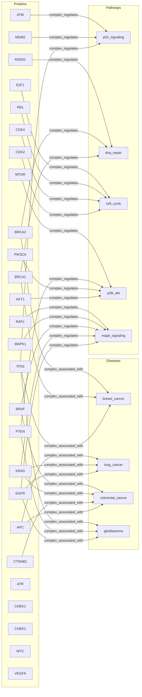

# Hypergraph-Native Algorithms on a Protein Interaction Network

> **N-ary hyperedges, s-persistence, spectral embedding, Jaccard hyperedge similarity, and gated diffusion (AND/OR/majority) on a 35-node protein interaction network**

## 1. The Approach

Protein complexes involve multiple proteins acting together as a single functional unit. A standard pairwise graph represents each protein-protein interaction as a separate edge, losing the collective semantics — the fact that TP53, MDM2, and ATM jointly regulate p53 signaling is a single n-ary relationship, not three separate ones.

Hypergraph-native algorithms treat n-ary edges as first-class objects. An edge connecting 3 source proteins to 1 target pathway is stored and queried as a single hyperedge with cardinality 3. This enables analyses that pairwise graphs cannot support: filtering edges by how many nodes participate, measuring overlap between hyperedge node sets (Jaccard similarity), and controlling how signals propagate through multi-source edges (gated diffusion).

The six capabilities demonstrated in this showcase:

1. **N-ary hyperedges** — `relate_hyperedge()` connects multiple sources to multiple targets in one edge
2. **Hyperedge querying** — filter by node membership, minimum source cardinality, or both
3. **S-persistence** — multi-resolution analysis revealing which structures survive across scale thresholds
4. **Spectral embedding** — Laplacian eigenvectors map proteins into coordinate space, where structural similarity becomes geometric proximity
5. **Hyperedge similarity** — Jaccard overlap between node sets of edges sharing a protein
6. **Gated diffusion** — AND/OR/majority modes control how activation flows through n-ary edges

## 2. Analogy

Imagine a committee that votes on a proposal. A pairwise graph would record "Alice knows Bob," "Bob knows Carol" — individual relationships. A hypergraph records "Alice, Bob, and Carol together voted yes on Proposal 7." The committee membership is a single n-ary fact. Gated diffusion asks: does the proposal pass if every member must agree (AND), if any member can trigger it (OR), or if a simple majority suffices?

## 3. Key Concepts

| Concept | What it is | Why it matters |
|---------|-----------|----------------|
| N-ary hyperedge | An edge connecting multiple source nodes to multiple target nodes | Represents protein complexes, committee decisions, and other collective relationships in a single edge |
| S-persistence | Varies a resolution parameter `s` and tracks how connected components fragment | Reveals nested structure: a 25-node cluster at s=1 may split into a 10-node cluster at s=2 and a 6-node cluster at s=3 |
| Spectral embedding | Projects nodes into coordinate space using eigenvectors of the hypergraph Laplacian | Proteins that co-participate in complexes map to nearby coordinates — structural similarity becomes geometric distance |
| Jaccard hyperedge similarity | Measures node-set overlap between edges sharing a given node | Two edges sharing 2 out of 6 total distinct nodes score 0.333 — quantifies how related two protein complexes are |
| Gated diffusion | Controls signal propagation through n-ary edges via AND/OR/majority gates | Models biological reality: a complex may only activate its target when sufficient members are present (AND) or when any member triggers (OR) |
| Source cardinality | Number of source nodes in a hyperedge's tail set | Filters for complex-level relationships (cardinality 3+) vs. individual interactions |

## 4. Quick Start

```bash
.venv/bin/python examples/showcase/workflow/hypergraph_native/hypergraph_native.py
```

### What You Will See

```
SECTION 1: N-ary Hyperedge Construction
  Proteins: 26, Pathways: 5, Diseases: 4
  Total edges (including n-ary): 14
  N-ary hyperedges: 9

SECTION 2: Hyperedge Querying
  Hyperedges containing TP53: 4
    [ATM, MDM2, TP53] --[complex_regulates]--> [p53_signaling]
    [BRCA1, BRCA2, TP53] --[complex_associated_with]--> [breast_cancer]
    [EGFR, PTEN, TP53] --[complex_associated_with]--> [glioblastoma]
    [TP53] --[participates_in]--> [dna_repair]
  Hyperedges with 3+ sources: 9

SECTION 3: Multi-Resolution Structure (s-persistence)
  s=1: 7 components  (largest: 25 nodes)
  s=2: 15 components  (largest: 10 nodes)
  s=3: 19 components  (largest: 6 nodes)

SECTION 4: Spectral Embedding from Hypergraph Laplacian
  Computed 35 embeddings in 4D
    TP53: magnitude=0.4315
    BRCA1: magnitude=0.3667
    KRAS: magnitude=0.4518
    EGFR: magnitude=0.3425
  Cosine similarity(TP53, BRCA1) = 0.9995
  Cosine similarity(TP53, KRAS)  = 0.0464

SECTION 5: Hyperedge Similarity
  TP53: top similar edge (Jaccard=0.3333)
  EGFR: top similar edge (Jaccard=0.3333)
  KRAS: top similar edge (Jaccard=0.3333)

SECTION 6: Gated Diffusion (AND/OR/majority)
  mode=linear  : 4 pathway/disease nodes activated  top: dna_repair=4.250
  mode=or      : 4 pathway/disease nodes activated  top: p53_signaling=4.250
  mode=majority: 1 pathway/disease nodes activated  top: dna_repair=4.250
  mode=and     : 1 pathway/disease nodes activated  top: dna_repair=4.250
```

> **Note:** Individual spectral embedding dimension values vary across runs due to eigendecomposition sign ambiguity. The magnitudes and cosine similarities are stable.

## 5. The Scenario

The graph represents a protein interaction network with **35 nodes** across three categories:

| Category | Count | Examples |
|----------|-------|---------|
| Proteins | 26 | TP53, BRCA1, KRAS, EGFR, AKT1, ... |
| Pathways | 5 | p53_signaling, dna_repair, cell_cycle, pi3k_akt, mapk_signaling |
| Diseases | 4 | breast_cancer, lung_cancer, colorectal_cancer, glioblastoma |

The 14 edges divide into two types:

| Label | Count | Source cardinality | Semantics |
|-------|-------|-------------------|-----------|
| `complex_regulates` | 5 | 3–5 proteins to 1 pathway | Multi-protein complex regulating a signaling pathway |
| `complex_associated_with` | 4 | 3–4 proteins to 1 disease | Protein complex linked to a cancer type |
| `participates_in` | 5 | 1 protein to 1 pathway | Individual protein participation (pairwise) |

### Network Topology

Figure 1: Five protein complexes regulate pathways and four complexes associate with diseases. Proteins that appear in multiple complexes (TP53, BRCA1, KRAS, EGFR) serve as bridges between functional groups. Five additional proteins (ATR, CHEK1, CHEK2, MYC, VEGFA) are present in the graph but not shown in edges — they participate in pairwise `participates_in` connections.



## 6. Analysis Pipeline

### Section 1: N-ary Hyperedge Construction

The script stores 26 proteins, 5 pathways, and 4 diseases, then creates 9 n-ary hyperedges (`relate_hyperedge()`) and 5 pairwise edges (`relate()`). The result is 14 total edges with 9 classified as n-ary (source cardinality 2 or more).

Why n-ary edges matter: the `{TP53, MDM2, ATM} -> {p53_signaling}` edge is a single object. It means the three-protein complex jointly regulates the pathway. Decomposing this into three pairwise edges would lose the collective semantics — removing ATM would require finding and updating individual edges, rather than modifying one hyperedge's source set.

### Section 2: Hyperedge Querying

`query_hyperedges(containing="TP53")` returns 4 edges — two `complex_regulates` and two `complex_associated_with` edges that include TP53 in their source set, plus the pairwise `participates_in` edge. This shows TP53 participates in multiple functional contexts: p53 signaling regulation, breast cancer association, and glioblastoma association.

`query_hyperedges(min_source_cardinality=3)` returns all 9 n-ary edges. This filter distinguishes complex-level relationships from individual protein interactions, which is useful when you want to analyze only multi-protein behaviors.

### Section 3: Multi-Resolution Structure (s-persistence)

S-persistence varies a resolution parameter `s` that controls how aggressively nodes are grouped:

| s | Components | Largest component | Interpretation |
|---|-----------|-------------------|----------------|
| 1 | 7 | 25 nodes | Most proteins are connected through shared complex membership |
| 2 | 15 | 10 nodes | Complexes fragment into pathway-specific groups |
| 3 | 19 | 6 nodes | Fine-grained — individual complexes and small clusters |

The fragmentation from 7 to 15 to 19 components shows the network has multi-scale structure. At s=1, the 25-node cluster spans multiple pathways (connected through bridge proteins like TP53 and KRAS that appear in multiple complexes). At s=2, this cluster breaks into pathway-aligned groups of roughly 10 nodes. At s=3, the structure is near-atomic — individual complexes with their member proteins.

Why this matters: a single clustering run at a fixed resolution would show one view. S-persistence reveals that the protein interaction network is organized hierarchically — pathways at one scale, individual complexes at another.

### Section 4: Spectral Embedding

The hypergraph Laplacian produces 35 node embeddings in 4 dimensions. The cosine similarity between protein embeddings reveals structural relationships:

| Pair | Cosine similarity | Shared structure |
|------|------------------|-----------------|
| TP53–BRCA1 | 0.9995 | Co-members of the breast_cancer complex; both participate in dna_repair |
| TP53–KRAS | 0.0464 | No shared complex membership |

TP53 and BRCA1 have near-identical spectral coordinates (0.9995) because they co-participate in the `{TP53, BRCA1, BRCA2} -> {breast_cancer}` edge and both connect to `dna_repair`. The Laplacian encodes this shared neighborhood structure into their embeddings. KRAS participates in different complexes (MAPK signaling, colorectal cancer, lung cancer) with no direct overlap with TP53, resulting in near-orthogonal embeddings (0.0464).

Why this matters: spectral embedding converts graph topology into geometric proximity. Proteins that participate in shared complexes map to nearby coordinates, enabling similarity search, clustering, and visualization without manually defining similarity measures.

### Section 5: Hyperedge Similarity

`hyperedge_similarity(protein, metric="jaccard")` computes node-set overlap (Jaccard index) between edges sharing the given protein:

| Protein | Top Jaccard score | Interpretation |
|---------|------------------|----------------|
| TP53 | 0.3333 | Two of TP53's 4 edges share 2 out of 6 distinct nodes |
| EGFR | 0.3333 | Two of EGFR's edges share 2 out of 6 distinct nodes |
| KRAS | 0.3333 | Two of KRAS's edges share 2 out of 6 distinct nodes |

For TP53, the `complex_regulates` edge `{TP53, MDM2, ATM} -> {p53_signaling}` and the `complex_associated_with` edge `{TP53, BRCA1, BRCA2} -> {breast_cancer}` share only TP53, giving a Jaccard of 1/4 = 0.25. The score of 0.3333 reflects a pair with 2 shared nodes out of 4 distinct — for instance, edges that both contain TP53 and another shared protein.

Why this matters: Jaccard similarity between hyperedge node sets quantifies functional overlap between protein complexes. Two complexes sharing 2 out of 6 proteins (Jaccard 0.333) have partial functional overlap, while complexes sharing 0 proteins (Jaccard 0.0) operate independently.

### Section 6: Gated Diffusion (AND/OR/majority)

`spread_hyperedge("TP53", mode=...)` propagates activation from TP53 through n-ary edges. The gating mode controls when a multi-source edge activates its target:

| Mode | Gate condition | Pathway/disease nodes activated | Top activation |
|------|---------------|-------------------------------|---------------|
| `linear` | No gating — all edges contribute | 4 | dna_repair=4.250 |
| `or` | Any source active | 4 | p53_signaling=4.250 |
| `majority` | More than half of sources active | 1 | dna_repair=4.250 |
| `and` | All sources must be active | 1 | dna_repair=4.250 |

The key difference: `linear` and `or` modes activate 4 pathway/disease nodes, while `majority` and `and` modes activate only 1. In `or` mode, spreading from TP53 activates p53_signaling (because TP53 is in its source set), and then reaches additional nodes through subsequent edges. In `and` mode, only the pairwise `participates_in` edge (where TP53 is the sole source) fires — the n-ary edges require all source proteins to be simultaneously active, which does not happen when starting from TP53 alone.

Why gated diffusion matters: a protein complex only activates its target when sufficient members are present. The `and` gate models strict co-occurrence — the `{TP53, MDM2, ATM} -> {p53_signaling}` complex only activates p53 signaling when all three proteins are present. Starting from TP53 alone, the `and` gate correctly prevents activation, reflecting biological reality. The `or` gate is more permissive, useful when any member of a complex can initiate downstream signaling.

## 7. Understanding Output

### S-persistence levels

| Observation | Meaning |
|------------|---------|
| Large component at low s | Strong overall connectivity; proteins link through shared complexes |
| Rapid fragmentation as s increases | Clear hierarchical structure; pathway groups are distinct |
| Largest component drops from 25 to 6 | Multi-scale organization: broad connections at s=1, fine-grained at s=3 |

### Spectral embedding magnitudes

| Observation | Meaning |
|------------|---------|
| Magnitudes between 0.34 and 0.45 | Normalized embeddings; all proteins have comparable spectral presence |
| Cosine similarity near 1.0 (TP53–BRCA1) | Shared complex membership produces near-identical coordinates |
| Cosine similarity near 0.0 (TP53–KRAS) | No shared complex membership produces orthogonal coordinates |

### Gated diffusion modes

| Observation | Meaning |
|------------|---------|
| `linear` and `or` activate 4 nodes | Permissive spreading reaches most of the network |
| `majority` and `and` activate 1 node | Restrictive gating requires sufficient co-activation |
| `dna_repair` activated in all modes | TP53 has a pairwise `participates_in` edge to dna_repair — no gate applies |

## 8. Key Metrics

| Metric | Value |
|--------|-------|
| Total nodes | 35 |
| Protein nodes | 26 |
| Pathway nodes | 5 |
| Disease nodes | 4 |
| Total edges | 14 |
| N-ary hyperedges (source cardinality 2+) | 9 |
| `complex_regulates` edges | 5 |
| `complex_associated_with` edges | 4 |
| `participates_in` edges | 5 |
| Hyperedges containing TP53 | 4 |
| Hyperedges with 3+ sources | 9 |
| s=1 components | 7 (largest: 25 nodes) |
| s=2 components | 15 (largest: 10 nodes) |
| s=3 components | 19 (largest: 6 nodes) |
| Spectral embedding dimensions | 4 |
| Spectral embeddings computed | 35 |
| TP53 magnitude | 0.4315 |
| BRCA1 magnitude | 0.3667 |
| KRAS magnitude | 0.4518 |
| EGFR magnitude | 0.3425 |
| Cosine similarity(TP53, BRCA1) | 0.9995 |
| Cosine similarity(TP53, KRAS) | 0.0464 |
| Top Jaccard similarity (TP53) | 0.3333 |
| Top Jaccard similarity (EGFR) | 0.3333 |
| Top Jaccard similarity (KRAS) | 0.3333 |
| Diffusion linear: nodes activated | 4 (top: dna_repair=4.250) |
| Diffusion or: nodes activated | 4 (top: p53_signaling=4.250) |
| Diffusion majority: nodes activated | 1 (top: dna_repair=4.250) |
| Diffusion and: nodes activated | 1 (top: dna_repair=4.250) |
| Graph density | 0.0118 |
| Connected components | 7 |

## 9. What Makes This Different

**N-ary edges represent collective relationships, not decomposed pairwise links.** The `{TP53, MDM2, ATM} -> {p53_signaling}` hyperedge is one object with source cardinality 3. Querying `min_source_cardinality=3` filters for complex-level relationships directly. Decomposing this into pairwise edges would require post-hoc reconstruction to recover the collective semantics — and would conflate "TP53 regulates p53 signaling" with "TP53, MDM2, and ATM jointly regulate p53 signaling."

**Gated diffusion models activation constraints in multi-source edges.** A protein complex activates its target only when sufficient members are present. The `and` gate requires all sources to be active simultaneously — starting from TP53 alone, none of the n-ary edges fire because the other complex members are absent. The `or` gate requires any source to be active — starting from TP53, every edge where TP53 appears in the source set fires immediately. Without gating, diffusion treats n-ary edges identically to pairwise edges, losing the biological constraint that complex activation requires co-occurrence.

**Spectral embedding generalizes to n-ary edge structure.** The hypergraph Laplacian accounts for edge cardinality through its normalization factor `D_e^{-1}`, which down-weights the per-node contribution of high-cardinality edges. This produces embeddings where proteins co-participating in the same complex (TP53 and BRCA1, cosine 0.9995) map to nearby coordinates, while proteins in unrelated complexes (TP53 and KRAS, cosine 0.0464) map to orthogonal coordinates — without manually defining protein similarity measures.

**S-persistence reveals hierarchical structure without fixing a resolution.** The network fragments from 7 to 15 to 19 components as resolution increases. A single clustering run at a fixed threshold would show one view; s-persistence shows that the network has pathway-scale groups (10-node clusters at s=2) nested inside a broader 25-node connectivity at s=1.

## 10. Code Implementation

**1. Create an n-ary hyperedge:**

```python
mem.link_hyper(
    sources={"TP53", "MDM2", "ATM"},
    targets={"p53_signaling"},
    label="complex_regulates",
)
```

**2. Query hyperedges by membership and cardinality:**

```python
tp53_edges = mem.query_hyperedges(containing="TP53")
complex_edges = mem.query_hyperedges(min_source_cardinality=3)
```

**3. Compute s-persistence:**

```python
sp = mem.s_persistence(max_s=3)
for level in sp.levels:
    print(f"s={level.s}: {level.num_components} components")
```

**4. Spectral embedding and cosine similarity:**

```python
import math

emb = mem.spectral_embedding(dimensions=4)
tp53 = emb["TP53"]
brca1 = emb["BRCA1"]
kras = emb["KRAS"]

def cosine(a, b):
    return sum(x * y for x, y in zip(a, b)) / (
        math.sqrt(sum(x * x for x in a)) * math.sqrt(sum(y * y for y in b)) + 1e-12
    )

print(f"TP53-BRCA1: {cosine(tp53, brca1):.4f}")  # 0.9995 (shared complex)
print(f"TP53-KRAS:  {cosine(tp53, kras):.4f}")   # 0.0464 (no shared complex)
```

**5. Hyperedge Jaccard similarity:**

```python
sims = mem.hyperedge_similarity("TP53", metric="jaccard")
for label, score in sims:
    print(f"{label}: {score:.4f}")
```

**6. Gated diffusion with AND/OR/majority:**

```python
for mode in ["linear", "or", "majority", "and"]:
    results = mem.spread_hyperedge("TP53", mode=mode)
    active = [(r.label, r.activation) for r in results if r.activation > 0]
    print(f"mode={mode}: {len(active)} nodes activated")
```

## 11. Real-World Gap

- **Scale**: This network has 35 nodes and 14 edges. Real protein interaction databases contain tens of thousands of proteins and hundreds of thousands of interactions. Spectral decomposition of the Laplacian is O(n^3) for dense matrices; at scale, approximate methods (Lanczos, randomized SVD) would be needed.
- **Data pipeline**: Proteins, pathways, and disease associations are hand-curated in the script. Real use requires importing from databases (STRING, UniProt, KEGG) with identifier normalization, confidence scoring, and edge-weight calibration.
- **Edge weight calibration**: All hyperedges use the default weight (1.0). In production, edge weights should reflect experimental evidence strength, confidence scores, or literature co-occurrence counts. Gated diffusion results are sensitive to weight values.
- **Probabilistic interpretation**: Gated diffusion produces activation scores, not biological predictions. The `and` gate's 1-node activation from TP53 alone is structurally correct (a three-protein complex needs all three members), but biological pathways have feedback loops, partial activation, and context-dependent behavior that the current model does not capture.
- **Temporal dynamics**: The network is static. Real protein interactions change over time (phosphorylation events, expression levels, degradation). Temporal hypergraphs would require extending the model with time-indexed edge states.

## 12. Reference

### API Methods

| Method | Returns | Description |
|--------|---------|-------------|
| `mem.link_hyper(sources, targets, label, weight)` | `Hyperedge` | Create an n-ary directed hyperedge |
| `mem.query_hyperedges(containing=, min_source_cardinality=)` | `list[Hyperedge]` | Filter edges by node membership or minimum source cardinality |
| `mem.s_persistence(max_s=)` | `SPersistenceResult` | Multi-resolution component analysis at s-levels 1 through max_s |
| `mem.spectral_embedding(dimensions=)` | `dict[str, ndarray]` | Node label to embedding vector via hypergraph Laplacian eigenvectors |
| `mem.hyperedge_similarity(concept, metric=)` | `list[tuple[str, float]]` | Node-set overlap scores for edges containing the given concept |
| `mem.spread_hyperedge(concept, mode=)` | `list[ActivationResult]` | Gated diffusion from a seed node; modes: `linear`, `or`, `majority`, `and` |

### Gated diffusion modes

| Mode | Activation condition | Use case |
|------|---------------------|----------|
| `linear` | No gating — all edges contribute proportional to weight | Baseline spreading, similar to standard activation diffusion |
| `or` | Any source node active | Any member of a complex can initiate downstream signaling |
| `majority` | More than half of source nodes active | Consensus activation — requires agreement among most complex members |
| `and` | All source nodes active | Strict co-occurrence — all complex members must be present |

### Script in this showcase

| Script | Nodes | Focus |
|--------|-------|-------|
| `hypergraph_native.py` | 35 | N-ary edges, s-persistence, spectral embedding, Jaccard similarity, gated diffusion |
