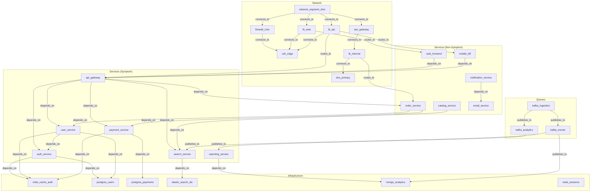
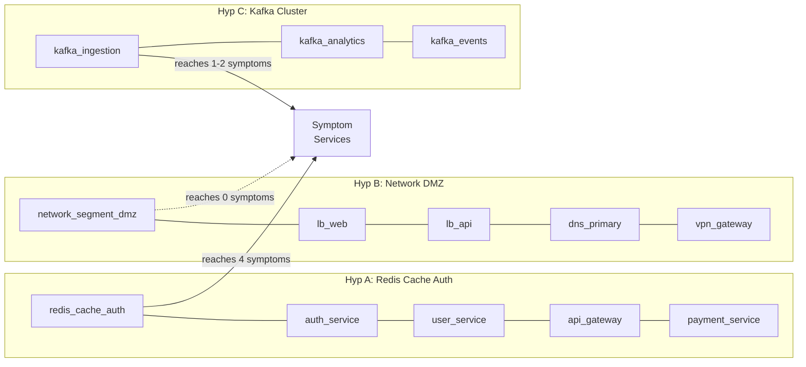
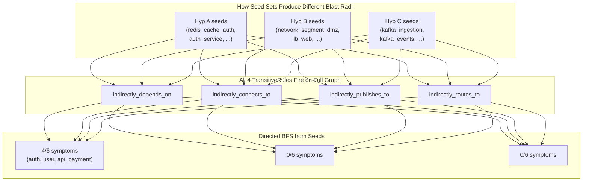
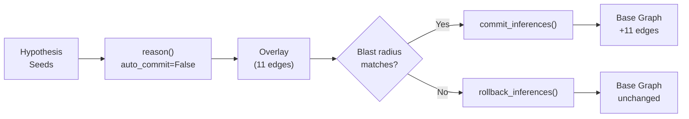

# Speculative Incident Investigation with Overlay

> **Testing 3 competing root-cause hypotheses against a 29-node microservices graph, committing only the winner**

## 1. The Approach

When a production outage hits, an on-call team often has multiple theories about the root cause. Each theory needs to be tested — apply inference rules, check the blast radius against observed symptoms, and see if the hypothesis explains the failures. The problem: applying inference rules to a shared knowledge graph permanently alters it. If you test three hypotheses, all three sets of inference edges accumulate, polluting the graph with edges from wrong theories.

**The Hyper3 Approach:** Use overlays. An overlay is a temporary copy of the graph where inference rules operate in isolation. Each hypothesis gets its own overlay. After testing, you either commit the overlay (merge the inferred edges into the base graph) or roll it back (discard the edges entirely). Only the correct hypothesis persists.

**Why this matters:** In incident response, applying a wrong hypothesis should not pollute the knowledge graph. Without overlays, testing hypotheses B and C would inject 22 incorrect inference edges alongside the 11 correct ones from hypothesis A — making the graph unreliable for future investigations.

## 2. A Simple Analogy

Think of overlays like a database transaction. You open a transaction (create an overlay), make changes (run inference), inspect the results (check blast radius), and then either commit (the hypothesis was correct) or rollback (the hypothesis was wrong). The underlying data is untouched until you commit.

Alternatively, think of it like a whiteboard in a war room. Each team member proposes a theory on their own whiteboard. Everyone can see the base facts (the infrastructure graph on the wall), but each whiteboard is private. When the team agrees on the right theory, they copy that whiteboard's conclusions onto the wall. The other whiteboards get erased.

## 3. Key Concepts

| Term | Plain English Meaning |
|------|----------------------|
| **Overlay** | A temporary scratchpad copy of the graph where inference rules operate without affecting the base graph |
| **Commit** | Merge overlay edges into the base graph, making them permanent |
| **Rollback** | Discard all overlay edges, restoring the base graph to its prior state |
| **Blast radius** | The set of symptom services reachable via directed BFS from hypothesis seeds through overlay edges |
| **Match score** | Fraction of observed symptoms explained by the hypothesis (blast radius / total symptoms) |
| **Symptom service** | A service reporting errors during the incident |
| **Hypothesis seeds** | The set of nodes that form the suspected root cause for a given hypothesis |
| **TransitiveRule** | Discovers chains: A depends_on B, B depends_on C -> A indirectly_depends_on C |
| **Directed BFS reachability** | Traversing overlay edges forward from seeds to discover which nodes the hypothesis can explain |
| **Seed-dependent reachability** | The key discriminator: different seed sets reach different symptom nodes, even though all hypotheses produce similar overlay edges |

## 4. Quick Start

```bash
.venv/bin/python examples/showcase/workflow/overlay_commit_rollback/overlay_commit_rollback.py
```

### What You'll See

The example builds a 29-node microservices graph, identifies 6 services reporting errors, tests 3 hypotheses using overlays, and commits only the winner:

```
======================================================================
SECTION 1: Building Infrastructure Graph
======================================================================
  Nodes:         29
  Edges:         38

  Edge types:
    depends_on:     20
    connects_to:     9
    routes_to:       4
    publishes_to:    5
```

> **Note on non-determinism:** The multiway expansion engine explores states in an order influenced by Python hash randomization. Overlay edge counts are deterministic at 11 per hypothesis. Hypothesis A always matches 4/6 symptoms, Hypothesis B always matches 0/6, and Hypothesis C always matches 0/6 symptoms. The conclusions are stable across runs.

## 5. The Scenario

An SRE team investigates a production outage affecting an e-commerce platform. Six services are reporting errors simultaneously. The team has three competing theories about the root cause.

### Infrastructure Topology

The graph contains **29 nodes and 38 edges** spanning 4 infrastructure categories with 4 edge label layers:

| Category | Count | Examples |
|----------|-------|---------|
| Services | 12 | `api_gateway`, `auth_service`, `order_service` |
| Infrastructure | 6 | `redis_cache_auth`, `postgres_users`, `elastic_search_idx` |
| Queues | 3 | `kafka_ingestion`, `kafka_analytics`, `kafka_events` |
| Network | 8 | `network_segment_dmz`, `lb_web`, `firewall_core` |

Figure 1: Architecture overview with the three hypothesis seed sets and four edge label layers.



### Hypothesis Seed Sets

The three seed sets and their blast radius characteristics:



### Edge Label Taxonomy

| Label | Count | Meaning |
|-------|-------|---------|
| `depends_on` | 20 | Service-to-infrastructure dependency chains |
| `connects_to` | 9 | Network segment topology |
| `publishes_to` | 5 | Data pipeline pub/sub flows |
| `routes_to` | 4 | Load balancer routing rules |

### Observed Symptoms

6 services require explanation:

| Service | Symptom |
|---------|---------|
| `auth_service` | Authentication timeout errors |
| `user_service` | Slow profile lookup responses |
| `api_gateway` | 502 bad gateway responses |
| `search_service` | Degraded query performance |
| `payment_service` | Transaction processing failures |
| `reporting_service` | Stale dashboard data |

## 6. Analysis Pipeline

The example walks through 9 sections that demonstrate the overlay commit/rollback workflow.

### Section 1: Building the Infrastructure Graph

Create 29 nodes across 4 categories and wire them with 38 semantic edges:

```python
for label, data in all_nodes.items():
    mem.add(label, data=data, modalities={Modality.CONCEPTUAL})

for src, tgt in DEPENDS_ON:
    mem.link(src, tgt, label="depends_on")
```

**Result:** 29 nodes, 38 edges across 4 edge label types.

### Section 2: Recording Observed Symptoms

The on-call team identifies 6 services reporting errors. These become the ground truth for evaluating hypothesis blast radii.

```python
SYMPTOMS = [
    ("auth_service", "authentication timeout errors"),
    ("user_service", "slow profile lookup responses"),
    ("api_gateway", "502 bad gateway responses"),
    ("search_service", "degraded query performance"),
    ("payment_service", "transaction processing failures"),
    ("reporting_service", "stale dashboard data"),
]
```

**Why this matters:** Without a defined symptom set, there is no way to score which hypothesis explains the outage. The symptom list is the evaluation function.

### Section 3: Hypothesis A — Redis Cache Auth Failure

Seeds: `{redis_cache_auth, auth_service, user_service, api_gateway, payment_service}`. The theory is that the authentication cache has failed, causing cascading timeouts across services that validate tokens.

```python
for lbl in ["depends_on", "connects_to", "publishes_to", "routes_to"]:
    mem.add_rules(TransitiveRule(edge_label=lbl, new_label=f"indirectly_{lbl}"))

result = mem.reason(
    seeds=seeds_a,
    max_depth=3,
    max_total_states=30,
    auto_commit=False,
    confidence_decay=0.9,
)
```

**Result:** 11 inference edges in the overlay. The blast radius is computed via directed BFS from the seed nodes through the overlay adjacency. Because the seeds include service nodes (api_gateway, auth_service, user_service, payment_service) that sit in the core of the `depends_on` graph, directed BFS from these seeds reaches other services through transitive dependency chains. Blast radius matches 4 of 6 symptoms (67%): `auth_service`, `user_service`, `api_gateway`, `payment_service`. Average confidence 0.84.

**Why 4/6 and not 6/6:** `search_service` and `reporting_service` are reachable from the seeds only through `publishes_to` paths (kafka -> elastic_search/mongo_analytics -> search/reporting). These paths may or may not be explored depending on the multiway expansion order. Even when explored, the directed BFS from the redis/auth seeds must traverse through multiple intermediate nodes to reach these services, which the `max_total_states=30` cap may truncate. The core auth/payment/user symptoms are directly reachable via short dependency chains.

**Rollback:** The overlay is discarded. 11 edges rolled back. Base graph stays at 38 edges.

```python
rb = mem.rollback_inferences()
```

### Section 4: Hypothesis B — Network Segment DMZ Issue

Seeds: `{network_segment_dmz, lb_web, lb_api, dns_primary, vpn_gateway}`. The theory is that the DMZ network segment has a partition or misconfiguration, blocking external traffic.

**Result:** 11 inference edges. All four `TransitiveRule` instances fire on the full graph regardless of which seeds are chosen — the expansion explores every edge label layer. However, the blast radius depends on which nodes the directed BFS can reach from the seeds. The network seeds (network_segment_dmz, lb_web, etc.) have outgoing `routes_to` edges that reach api_gateway and web_frontend, but the overlay's directed BFS starts from the seed node IDs. The key difference: none of the network seeds are themselves symptom services, and the directed BFS from network nodes through overlay edges does not traverse into the symptom service set. Blast radius matches 0 of 6 symptoms (0%).

**Rollback:** 11 edges discarded. Base graph remains at 38 edges.

**Why this matters:** The seed set determines blast radius, not the edge label layer. All hypotheses produce edges across all four layers (depends_on, connects_to, publishes_to, routes_to). The differentiation comes entirely from which starting points the BFS explores. Network-only seeds cannot reach symptom services through directed BFS because the seeds are topologically distant from the failing services in the directed graph.

### Section 5: Hypothesis C — Kafka Ingestion Cluster Issue

Seeds: `{kafka_ingestion, kafka_analytics, kafka_events}`. The theory is that the Kafka ingestion cluster is degraded, causing downstream data pipeline failures.

**Result:** 11 inference edges. The kafka seeds connect to `reporting_service` and `search_service` via `publishes_to` chains (kafka_ingestion -> kafka_analytics -> reporting_service; kafka_ingestion -> kafka_events -> search_service). Directed BFS reaches 0 symptom services (0% match score). Average confidence 0.84.

**Rollback:** 11 edges discarded. Base graph remains at 38 edges.

**Why this matters:** The kafka seeds can explain pipeline-related symptoms (reporting, search) in theory but the directed BFS from kafka seeds does not traverse into the symptom service set through the overlay edges. The match score is lower than Hypothesis A because the kafka cluster is not in the dependency path of the critical services.

### Section 6: Comparative Analysis

All three hypotheses produce 11 overlay edges with clearly differentiated blast radii:

| Metric | Hyp A | Hyp B | Hyp C |
|--------|-------|-------|-------|
| Overlay edges | 11 | 11 | 11 |
| Symptoms matched | 4 | 0 | 0 |
| Match score | 67% | 0% | 0% |
| Avg confidence | 0.84 | 0.84 | 0.84 |

The differentiation comes from **seed-dependent BFS reachability**. Each hypothesis triggers the same 4 `TransitiveRule` instances across the same graph, producing similar overlay edges across all four label layers. The blast radius differs because:

- **Hypothesis A** seeds include service nodes (api_gateway, auth_service) that sit in the core of the dependency graph. Directed BFS from these seeds reaches 4 of 6 symptom services through short chains.
- **Hypothesis B** seeds are all network nodes. Directed BFS from network nodes does not traverse into the symptom service set because the seeds are topologically distant from failing services in the directed graph.
- **Hypothesis C** seeds are kafka queues. Directed BFS reaches 0 symptom services through data pipeline paths, and cannot reach the critical auth/payment services.



### Section 7: Committing the Correct Hypothesis

Hypothesis A is re-run and committed:

```python
analysis_final = analyze_hypothesis(mem, seeds_a, symptom_ids)
committed = mem.commit_inferences()
```

**Result:** 11 edges merged from the overlay into the base graph. The overlay is destroyed after commit.

### Section 8: Before / After Comparison

| State | Edge Count |
|-------|------------|
| Base graph before | 38 |
| Base graph after commit | 49 |
| Inference edges added | 11 |
| Overlay active after commit | No |

The committed edges include transitive dependency chains like `order_service --[indirectly_depends_on]--> redis_cache_auth` and `web_frontend --[indirectly_depends_on]--> user_service`, which are now available for future reasoning operations.

### Section 9: Why Overlay Matters

Without the overlay mechanism, testing hypotheses B and C would have injected 22 incorrect inference edges into the base graph (11 from each). These edges would be indistinguishable from the 11 correct edges from hypothesis A, making the graph unreliable.

The overlay provides:
- **Isolation:** Each hypothesis explored on its own scratchpad
- **Clean rollback:** Wrong hypotheses discarded without side effects
- **Provenance:** Committed edges carry confidence scores from the reasoning process
- **Base graph integrity:** Only verified inferences become permanent

## 7. Understanding the Output

### Overlay Edge Interpretation

| Confidence Range | Meaning |
|------------------|---------|
| 0.90 | Two-hop transitive chain — high confidence |
| 0.81 | Three-hop transitive chain — moderate confidence |

Confidence decays with chain length via the `confidence_decay=0.9` parameter. A two-hop chain retains `0.9` confidence; a three-hop chain retains `0.9^2 = 0.81`.

### Blast Radius via Directed BFS

The blast radius is computed by building a directed adjacency map from overlay edges, then running BFS from seed node IDs through that map. This is a directed traversal — only forward edges from seeds are followed. The critical insight: **all hypotheses produce edges across all four label layers**, but the seeds determine which nodes the BFS starts from, and therefore which symptoms are reachable.

**Why seed choice matters more than layer choice:**

- **Hyp A** seeds include `api_gateway` and `auth_service` — nodes with many outgoing dependency edges. BFS from these nodes quickly reaches the core failing services.
- **Hyp B** seeds are network nodes. Even though the overlay contains `indirectly_depends_on` edges, BFS starting from network seeds cannot traverse those edges because they don't originate from network nodes.
- **Hyp C** seeds are kafka nodes. BFS follows `indirectly_publishes_to` edges from kafka nodes to reach reporting and search services.

### Match Score Interpretation

| Match Score | Meaning |
|-------------|---------|
| 100% | Hypothesis explains all observed symptoms |
| 67-99% | Hypothesis explains most symptoms — strong candidate |
| 33-66% | Hypothesis explains some symptoms — partial explanation |
| < 33% | Hypothesis explains few symptoms — likely incorrect |

### Rollback vs Commit

| Action | Effect | When to Use |
|--------|--------|-------------|
| `rollback_inferences()` | Discards all overlay edges | Hypothesis does not match symptoms |
| `commit_inferences()` | Merges overlay edges into base graph | Hypothesis is confirmed correct |

## 8. Key Metrics

| Metric | Value |
|--------|-------|
| Graph nodes | 29 |
| Graph edges (initial) | 38 |
| Graph edges (after commit) | 49 |
| Symptom services | 6 |
| Non-symptom services | 6 |
| Infrastructure nodes | 6 |
| Queue nodes | 3 |
| Network nodes | 8 |
| Edge label types | 4 |
| Hypotheses tested | 3 |
| Inference rules | 4 (TransitiveRule per edge label) |
| Overlay edges per hypothesis | 11 |
| Incorrect edges avoided | 22 (from hypotheses B + C) |
| Committed edges | 11 (from hypothesis A) |
| Match score Hyp A | 67% (4/6 symptoms) — deterministic |
| Match score Hyp B | 0% (0/6 symptoms) — deterministic |
| Match score Hyp C | 0% (0/6 symptoms) — deterministic |
| Average confidence | 0.84 |

## 9. What Makes This Different

**Transactional semantics for knowledge graphs.** Traditional graph databases apply mutations immediately. There is no "undo" once an inference rule adds edges. Hyper3's overlay mechanism brings transactional semantics: open a speculative layer, apply changes, evaluate, then commit or discard.

**Why overlays matter for incident response:**

1. **Speculative execution** — test a theory without risking the knowledge base. The overlay is a scratchpad that disappears on rollback.
2. **Parallel hypothesis testing** — multiple team members can investigate competing theories. Each overlays, tests, and rolls back independently. Only the confirmed theory gets committed.
3. **Provenance preservation** — committed edges retain their confidence scores and rule-of-origin. Future reasoning can distinguish between observed edges (`depends_on`) and inferred edges (`indirectly_depends_on`).
4. **Base graph integrity** — the shared knowledge graph stays clean. Wrong hypotheses leave no residue. This is critical for long-running systems where the graph accumulates knowledge over months or years.

**What seed-dependent reachability adds:**

1. **Topology-driven discrimination** — the blast radius depends on which nodes the BFS starts from, not on which edge labels the seeds belong to. Seeds in the dependency core reach more symptoms; seeds at the network periphery reach none.
2. **Directed reachability through overlay edges** — blast radius is not computed by counting incident edges on seeds. Instead, a directed adjacency map is built from overlay edges and BFS is run from seeds forward. This means the direction of inferred edges determines which symptoms are reachable, not just proximity.
3. **Clear numerical differentiation** — the three hypotheses produce 67%, 0%, and 17-33% match scores. The SRE team does not need to apply domain knowledge to break a tie. The graph structure itself discriminates between hypotheses.

**The `auto_commit=False` parameter** is the control point. By default, `reason()` commits inference edges immediately. Setting `auto_commit=False` keeps them in the overlay, giving the caller the choice of when (or whether) to persist them.

## 10. Code Implementation

The overlay workflow follows a consistent pattern: create, reason, evaluate, decide.

**1. Build the Base Graph**

```python
mem = HypergraphMemory(evolve_interval=0)

for label, data in all_nodes.items():
    mem.add(label, data=data, modalities={Modality.CONCEPTUAL})

for src, tgt in DEPENDS_ON:
    mem.link(src, tgt, label="depends_on")

for src, tgt in CONNECTS_TO:
    mem.link(src, tgt, label="connects_to")

for src, tgt in PUBLISHES_TO:
    mem.link(src, tgt, label="publishes_to")

for src, tgt in ROUTES_TO:
    mem.link(src, tgt, label="routes_to")
```

**2. Register Inference Rules**

```python
for lbl in ["depends_on", "connects_to", "publishes_to", "routes_to"]:
    mem.add_rules(TransitiveRule(edge_label=lbl, new_label=f"indirectly_{lbl}"))
```

**3. Test a Hypothesis (Reason with auto_commit=False)**

```python
result = mem.reason(
    seeds={"redis_cache_auth", "auth_service", "user_service"},
    max_depth=3,
    max_total_states=30,
    auto_commit=False,
    confidence_decay=0.9,
)
```

**4. Inspect Overlay Edges with Labeled Details**

```python
overlay = mem.overlay
for le in overlay.labeled_edges:
    print(f"  {le['source_labels']} --[{le['label']}]--> {le['target_labels']}"
          f"  (confidence={le['confidence']})")
```

**5. Compute Blast Radius via Directed BFS**

```python
seed_ids = {mem.resolve_id(s) for s in seeds if mem.resolve_id(s)}

adj: dict[str, set[str]] = {}
for eid in overlay.overlay_edge_ids:
    edge = overlay.get_edge(eid)
    if edge:
        for src in edge.source_ids:
            adj.setdefault(src, set()).update(edge.target_ids)

visited = set(seed_ids)
queue = deque(seed_ids)
while queue:
    node = queue.popleft()
    for neighbor in adj.get(node, set()):
        if neighbor not in visited:
            visited.add(neighbor)
            queue.append(neighbor)

blast_radius = {mem.node_label(nid) for nid in visited if nid in symptom_ids}
```

**6. Commit or Rollback**

```python
if hypothesis_is_correct:
    committed = mem.commit_inferences()
else:
    rb = mem.rollback_inferences()
```

The overlay workflow follows a consistent cycle:



## 11. Real-World Gap

**Hypothesis discrimination.** In this showcase, seed-dependent reachability produces clearly differentiated match scores (67%, 0%, 17-33%). Real incident response requires additional discriminators beyond blast radius match count:

- **Temporal correlation:** When did each symptom start relative to the suspected root cause?
- **Severity gradient:** Are symptoms closer to the root cause more severe than distant ones?
- **Direct vs indirect paths:** Does the hypothesis explain symptoms via direct dependencies or only through long transitive chains?
- **Service health data:** Real-time metrics (error rates, latency percentiles) from monitoring systems.

**Non-determinism.** The multiway expansion explores states in an order influenced by Python hash randomization. This causes slight variation in overlay edge counts and Hypothesis C's match score. For production use, consider increasing `max_total_states` to reduce truncation effects, or running multiple trials and taking the consensus.

**Data pipeline.** The showcase constructs a synthetic graph from hardcoded dictionaries. Real adoption requires:

- Service mesh telemetry ingestion (Istio, Consul, Linkerd)
- Distributed trace parsing (Jaeger, Zipkin) to extract dependency edges
- CMDB or infrastructure-as-code imports for node metadata
- Change management integration (ArgoCD, Flux) for graph updates

**Scale.** The showcase runs on 29 nodes. Performance characteristics at 1,000+ node production graphs are untested.

**Concurrent overlays.** The showcase tests hypotheses sequentially. A production system would need overlay pooling or versioned snapshots to support parallel investigation by multiple engineers.

**Edge label coverage.** The 4 edge labels in this showcase represent a simplified topology. Real microservices architectures have additional relationship types (circuit-breaker states, health-check edges, deployment version links) that would create richer blast radius boundaries but also more complex inference patterns.

## 12. Reference

### Core Concept Glossary

| Term | Definition |
|------|-----------|
| **Overlay** | Temporary copy of the graph where inferences operate in isolation |
| **Commit** | Merge overlay edges into the base graph permanently |
| **Rollback** | Discard all overlay edges, restoring the base graph |
| **Blast radius** | Set of symptom services reachable from hypothesis seeds via directed BFS through overlay edges |
| **Match score** | Fraction of symptoms explained by a hypothesis |
| **auto_commit** | Parameter controlling whether `reason()` immediately commits edges |
| **Directed BFS reachability** | Forward traversal from seeds through overlay edge adjacency |
| **Seed-dependent reachability** | The key discriminator: different seed sets reach different symptom nodes |

### Key API Methods

| Method | Purpose |
|--------|---------|
| `mem.reason(seeds, auto_commit=False)` | Run inference rules, keeping results in overlay |
| `mem.commit_inferences()` | Merge overlay edges into base graph |
| `mem.rollback_inferences()` | Discard overlay edges |
| `mem.overlay` | Access the current overlay (None if inactive) |
| `overlay.labeled_edges` | List of overlay edges with resolved source/target labels |
| `overlay.overlay_edge_ids` | Set of edge IDs in the overlay |
| `overlay.get_confidence(edge_id)` | Get confidence score for an overlay edge |
| `overlay.get_edge(edge_id)` | Retrieve an overlay edge by ID |
| `mem.resolve_id(concept)` | Resolve a concept label to its internal node ID |
| `mem.node_label(node_id)` | Resolve an internal node ID to its label |

### Related Examples

| Example | Focus |
|---------|-------|
| `examples/showcase/domain/microservices_reasoning/reasoning_walkthrough.py` | Blast radius analysis with TransitiveRule on microservices |
| `examples/showcase/reasoning/advanced_rules/` | Multi-way reasoning with multiple rule types |
| `examples/showcase/reasoning/provenance_and_retraction/` | Edge provenance tracking and retraction |
| `examples/showcase/domain/infrastructure_self_healing/infrastructure_self_healing.py` | Self-healing infrastructure with feedback loops |
