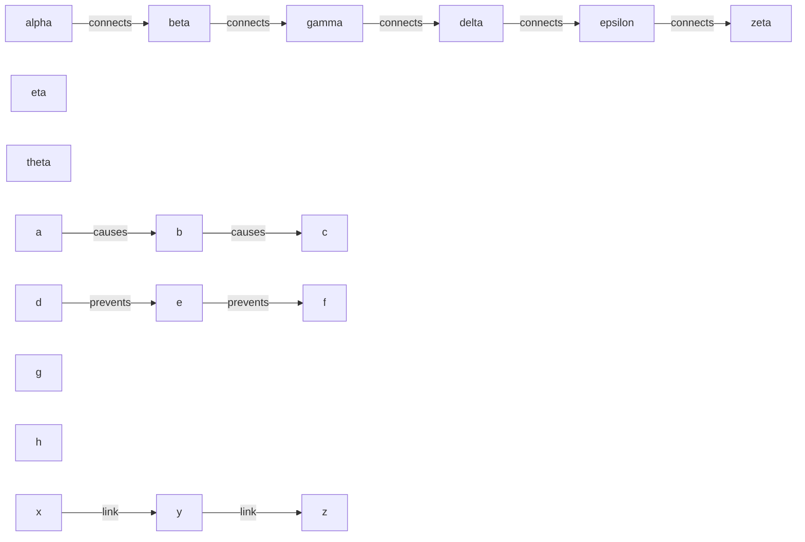
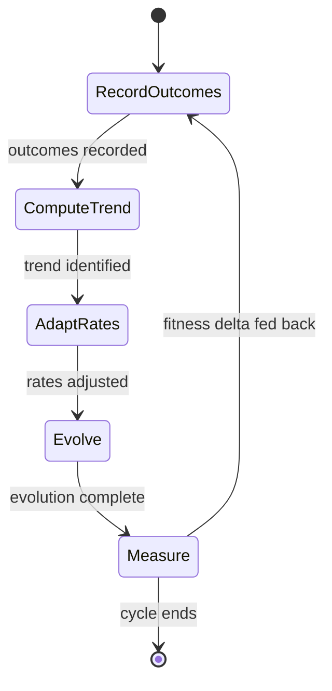
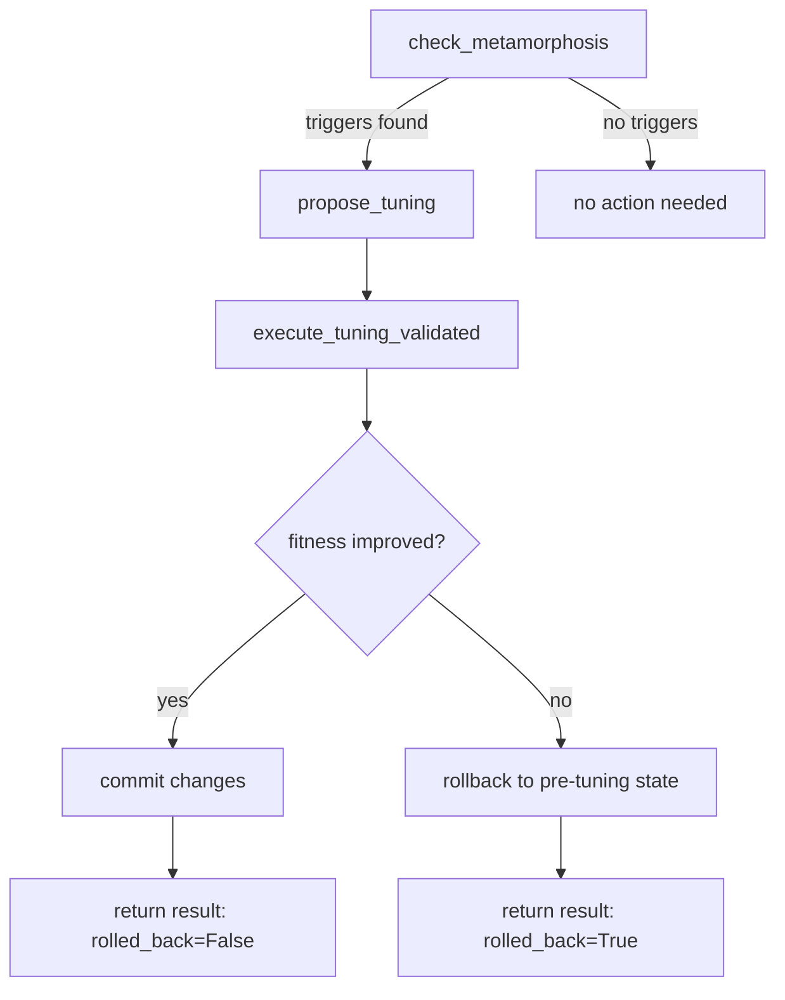

# Self-Evolving Cognition

> Feedback-driven evolution, metamorphosis validation with rollback, cross-operation feedback, bias profiling, and causal merge insight preservation on a 19-node graph.

## 1. The Approach

Self-modifying systems need safety rails. When a knowledge graph can decay edges, prune nodes, and merge equivalent concepts, unvalidated changes risk corrupting the knowledge base rather than improving it. Hyper3 addresses this with a meta-cognitive layer that records outcomes from every operation category (evolution, inference, retrieval), detects when the system needs structural adjustment, proposes a tuning plan, validates the outcome, and rolls back if fitness degrades.

This showcase exercises five capabilities on a small 19-node graph:

1. **Feedback-driven evolution** — `evolve_with_feedback()` adapts decay and reinforcement rates based on recorded evolution outcomes.
2. **Metamorphosis validation** — `execute_tuning_validated()` applies a tuning plan, checks fitness, and rolls back if the change did not help.
3. **Cross-operation feedback** — `feedback_summary()` aggregates signals from evolution, inference, and retrieval into a unified health view, identifying nodes that appear across multiple operation types.
4. **Computational bias profiling** — `compute_bias_profile()` reveals which rules dominate reasoning and which are underused.
5. **Causal merge insight preservation** — `merge_invariant_states()` tracks which unique contributions each merged state contributed, preventing knowledge loss during state convergence.

## 2. Key Concepts

| Term | Plain English |
|------|--------------|
| Feedback-driven evolution | Running evolution with rates adjusted by past outcomes rather than fixed thresholds |
| Metamorphosis | A structural change to the graph (parameter tuning, node merging) triggered by declining fitness |
| Validation with rollback | Apply the change, measure fitness; revert if fitness did not improve |
| Cross-operation feedback | Correlating outcomes across evolution, inference, and retrieval to find nodes affecting multiple subsystems |
| Bias profile | A snapshot of which inference rules dominate, which are neglected, and how skewed the distribution is |
| Insight preservation | When merging equivalent multiway states, recording each state's unique contributions so no derived knowledge is lost |

## 3. Quick Start

```bash
.venv/bin/python examples/showcase/workflow/self_evolving_cognition/self_evolving_cognition.py
```

Expected output (5 sections):

```
SECTION 1: Feedback-Driven Evolution
  Fitness trend: declining
  Evolution before feedback-driven cycle:
    decayed=0, pruned=0, reinforced=0, suppressed=0
  Inference acceptance rate: 0.67
  Reinforced nodes: 0

SECTION 2: Cross-Operation Feedback Summary
  Overall health: 0.61
  Fitness trend: improving
  Signal distribution: {'evolution': 4, 'inference': 3, 'retrieval': 3}
  Total signals recorded: 10

SECTION 3: Metamorphosis with Validation and Rollback
  Forced metamorphosis (fitness was 0.3):
    rolled_back=False
    fitness_before=0.784
    fitness_after=0.784

SECTION 4: Computational Bias Profile
  Reasoning style: focused
  Bias score: 0.444
  Rule count: 3
  Dominant rules: ['inverse(prevents->prevented_by)', 'inverse(causes->caused_by)']
  Underused rules: ['inverse(causes->caused_by)']

SECTION 5: Causal Merge Insight Preservation
  Invariants found: 1
  Merge: d83e53cf + 58746cdf (similarity=0.675)
    State d83e53cf: rule=transitive, unique_nodes=['delta'], unique_edges=1
    State 58746cdf: rule=inverse, unique_nodes=[], unique_edges=0
```

## 4. The Scenario

The script constructs a 19-node graph designed to exercise specific inference rules and produce measurable bias in the reasoning output. Each subgraph exists for a reason:

**5-node chain** (`alpha -> beta -> gamma -> delta -> epsilon`, label `"connects"`): This is the longest linear path in the graph. It provides the multi-hop chains that `TransitiveRule` needs to fire -- transitive inference requires at least two consecutive edges sharing the same label (A connects B, B connects C), and the chain provides three such overlapping pairs. Without this structure, the transitive rule would have nothing to match.

**3-node extension** (`epsilon -> zeta`, plus isolated nodes `eta` and `theta`): The edge from `epsilon` to `zeta` extends the chain to six nodes, giving the transitive rule additional reach. The isolated nodes `eta` and `theta` serve as control points -- they exist in the graph but have no edges, so they should never appear in any inference output. If they do, something is wrong.

**8-node causal cluster** (`a -> b -> c` with label `"causes"`, `d -> e -> f` with label `"prevents"`, plus isolated `g` and `h`): This cluster serves double duty. The `"causes"` chain activates `TransitiveRule(edge_label="causes")`, producing inferences like "a causes c". The `"prevents"` chain activates `InverseRule(edge_label="prevents")`, which generates the inverse relationship `"prevented_by"`. The coexistence of two labeled edge groups in one cluster tests whether the rule engine respects label boundaries -- the transitive rule on `"causes"` must not cross over into the `"prevents"` edges, and vice versa.

**3-node test cluster** (`x -> y -> z`, label `"link"`): A minimal chain with its own label, providing a third edge group. Because no rule is registered for `"link"`, these edges should produce zero inferences. This group acts as a negative control: if rules are leaking across labels, this is where it would show up.

Total: 19 nodes, multiple labeled edge groups, 3 inference rules (TransitiveRule on `"causes"`, InverseRule on `"prevents"`, InverseRule on `"causes"`).



## 5. Analysis Pipeline

### Section 1: Feedback-Driven Evolution

The script records three declining evolution outcomes (0.8, 0.7, 0.6), producing a `declining` fitness trend. It then calls `evolve_with_feedback()`, which adapts its behavior based on this recorded history. The result shows zero decayed/pruned/reinforced/suppressed -- the graph is healthy and the declining trend was from recorded feedback signals, not from actual graph degradation.

Next, the script records inference outcomes (2 accepted, 1 rejected) for three edges, producing a 0.67 inference acceptance rate.

The feedback-driven evolution cycle is a closed loop:



Why this matters: without feedback-driven evolution, the system applies the same decay rates regardless of whether past evolution cycles helped or harmed. Recording outcomes and adapting rates lets the system self-correct.

### Section 2: Cross-Operation Feedback Summary

The script records two retrieval outcomes for the `"connects"` label and calls `feedback_summary()`. The summary aggregates signals from all three operation types:

- **Overall health**: 0.61
- **Signal distribution**: evolution=4, inference=3, retrieval=3 (10 total signals)
- **Collapse accuracy**: 0.50
- **Retrieval precision**: 0.67
- **Inference acceptance**: 0.67

The summary also identifies correlated nodes -- nodes appearing in multiple operation types -- along with their positive rates and signal types.

Why this matters: each subsystem (evolution, inference, retrieval) operates semi-independently, but a node causing problems in one subsystem often affects others. Cross-operation feedback reveals these connections that single-subsystem monitoring cannot.

### Section 3: Metamorphosis with Validation and Rollback

The script first checks for metamorphosis triggers with a healthy graph -- none are found. It then forces architectural fitness to 0.3 to demonstrate the metamorphosis pipeline:

1. `check_metamorphosis()` detects triggers (low fitness)
2. `propose_tuning(triggers)` generates a plan with actions, expected improvement, and risk level
3. `execute_tuning_validated(plan)` applies the plan and measures fitness before and after

Result: `rolled_back=False`, fitness remained at 0.784. The tuning plan did not degrade fitness further, so no rollback was needed.

The metamorphosis pipeline is a guarded execution flow:



Why this matters: self-modifying systems without validation can enter death spirals -- each change degrades fitness, triggering more changes, degrading further. Rollback provides a safety net: if a proposed change does not improve fitness, the system reverts to the previous state.

### Section 4: Computational Bias Profile

After running reasoning on the graph with 3 registered rules, the script calls `compute_bias_profile()`:

- **Reasoning style**: `focused` (rules are unevenly applied)
- **Bias score**: 0.444 (moderate skew)
- **Rule count**: 3
- **Position trajectory**: `stable` (skew is not increasing)
- **Dominant rules**: `inverse(prevents->prevented_by)`, `inverse(causes->caused_by)`
- **Underused rules**: `inverse(causes->caused_by)`

Why this matters: a focused bias profile reveals that certain rules are producing most of the inferences while others contribute little. In a production system, this could indicate missing graph structure that would activate underused rules, or rules that are too specific for the current domain.

### Section 5: Causal Merge Insight Preservation

The script constructs two multiway states sharing real graph nodes (`alpha`, `beta`, `gamma`) but differing in their unique contributions:

- **State s1**: rule=`transitive`, active nodes={alpha, beta, gamma, delta}, produced edges={alpha-beta, gamma-delta}
- **State s2**: rule=`inverse`, active nodes={alpha, beta, gamma}, produced edges={alpha-beta}

> **Similarity formula**
>
> ```
> similarity = 0.7 * Jaccard(node_ids) + 0.3 * Jaccard(edge_ids)
> ```
>
> where `Jaccard(X, Y) = |X intersection Y| / |X union Y|`

- Node Jaccard: 3/4 = 0.75 (3 shared of 4 total distinct nodes)
- Edge Jaccard: 1/2 = 0.50 (1 shared of 2 total distinct edges)
- Similarity: 0.7 * 0.75 + 0.3 * 0.50 = **0.675** (above the 0.5 threshold)

The `merge_invariant_states()` call finds 1 invariant and produces a `ConvergenceRecord` with two `MergeInsight` entries:

- **s1 insight**: unique_nodes=[delta], unique_edges=1 (the gamma-delta edge) -- s1's transitive reasoning contributed a new node and edge beyond the shared baseline
- **s2 insight**: unique_nodes=[], unique_edges=0 -- s2's inverse reasoning produced only edges already in the shared set

Why this matters: when equivalent multiway states merge, the unique inferences from each branch should not be silently discarded. Insight preservation records what each state contributed so that downstream analysis can trace provenance even after convergence. In this case, the merge correctly identifies that `delta` and its connecting edge were s1's unique contribution, preserved in the `ConvergenceRecord.insights` field.

## 6. Key Metrics

| Metric | Value |
|--------|-------|
| Total nodes | 19 |
| Fitness trend (initial) | declining |
| Evolution: decayed | 0 |
| Evolution: pruned | 0 |
| Evolution: reinforced | 0 |
| Evolution: suppressed | 0 |
| Inference acceptance rate | 0.67 |
| Overall health | 0.61 |
| Fitness trend (after feedback) | improving |
| Signal distribution | evolution=4, inference=3, retrieval=3 |
| Collapse accuracy | 0.50 |
| Retrieval precision | 0.67 |
| Total signals recorded | 10 |
| Metamorphosis rolled back | False |
| Fitness before tuning | 0.784 |
| Fitness after tuning | 0.784 |
| Reasoning style | focused |
| Bias score | 0.444 |
| Rule count | 3 |
| Average effectiveness | 0.444 |
| Position trajectory | stable |
| Dominant rules | 2 |
| Underused rules | 1 |
| Invariant merges found | 1 |
| Merge similarity | 0.675 |
| s1 unique nodes (delta) | 1 |
| s1 unique edges | 1 |

## 7. What Makes This Different

**Validated self-modification**: The system proposes structural changes, measures their effect, and reverts if fitness degrades. Without this, any automated tuning is a one-way bet on correctness.

**Cross-subsystem feedback**: Rather than monitoring evolution, inference, and retrieval in isolation, the feedback summary correlates outcomes across all three. A node causing low inference acceptance and poor retrieval precision is visible as a correlated pattern.

**Bias-aware reasoning**: The bias profile quantifies rule utilization skew. Without it, a system could silently over-apply one inference rule while under-using others, producing lopsided knowledge without any indication that this is happening.

**Insight preservation on merge**: Multiway state convergence discards the branch structure but retains each branch's unique contributions. In the demonstrated merge (similarity=0.675), the transitive branch contributed node `delta` and its connecting edge -- this is recorded in the `ConvergenceRecord.insights` field and survives the merge. Without this, merging equivalent states would lose the record of which inferences each branch produced.

## 8. Code Implementation

```python
from hyper3 import HypergraphMemory, TransitiveRule, InverseRule

mem = HypergraphMemory(evolve_interval=0)

# Record evolution outcomes and run feedback-driven evolution
mem.operation_feedback.record_evolution_outcome(0.8)
mem.operation_feedback.record_evolution_outcome(0.7)
result = mem.evolve_with_feedback()

# Cross-operation feedback summary
mem.operation_feedback.record_retrieval_outcome(
    "connects", {alpha_id}, {epsilon_id},
)
summary = mem.feedback_summary()
print(summary["overall_health"], summary["fitness_trend"])

# Metamorphosis with validation
triggers = mem.check_metamorphosis()
if triggers:
    plan = mem.propose_tuning(triggers)
    result = mem.execute_tuning_validated(plan)
    print(result.rolled_back, result.fitness_before, result.fitness_after)

# Bias profile
mem.add_rules(TransitiveRule(edge_label="causes"))
profile = mem.compute_bias_profile()
print(profile["reasoning_style"], profile["bias_score"])

# Merge insight preservation
from hyper3 import MultiwayGraph, StateConvergenceEngine, MultiwayState

mw_graph = MultiwayGraph()
causal = StateConvergenceEngine(mem.engine.graph, mw_graph, threshold=0.5)

s1 = MultiwayState(
    parent_id=None,
    active_node_ids=frozenset({alpha_id, beta_id, gamma_id, delta_id}),
    rule_applied="transitive",
    depth=1,
    produced_node_ids=[delta_id],
    produced_edge_ids=[f"{alpha_id}_{beta_id}", f"{gamma_id}_{delta_id}"],
)
s2 = MultiwayState(
    parent_id="other",
    active_node_ids=frozenset({alpha_id, beta_id, gamma_id}),
    rule_applied="inverse",
    depth=1,
    produced_node_ids=[],
    produced_edge_ids=[f"{alpha_id}_{beta_id}"],
)
mw_graph.add_state(s1)
mw_graph.add_state(s2)

invariants = causal.merge_invariant_states()
for inv in invariants:
    print(f"similarity={inv.similarity:.3f}")
    for insight in inv.insights:
        print(f"  {insight.rule_applied}: unique_nodes={len(insight.unique_nodes)}")
```

## 9. Real-World Gap

- **Feedback source**: The showcase manually records evolution and inference outcomes. In production, these signals would come from downstream task performance or user interactions, requiring application-specific integration.
- **Graph size**: The demo uses 19 nodes. Behavior at 10K+ nodes (feedback aggregation overhead, metamorphosis plan generation) is untested.
- **Tuning actions**: The metamorphosis plan generates actions based on built-in heuristics. Custom tuning strategies (domain-specific merge criteria, application-weighted decay) require extending the tuning engine.
- **Multiway convergence**: The constructed states use real graph node IDs and produce an actual merge (similarity=0.675). The insights correctly capture each branch's unique contributions. For more complex scenarios with naturally-occurring equivalent states from deep reasoning chains, the same mechanism applies automatically.

## 10. Reference

### API Methods

| Method | Description |
|--------|-------------|
| `evolve_with_feedback()` | Run evolution with rates adapted from recorded outcomes |
| `feedback_summary()` | Aggregate cross-operation health metrics and correlated nodes |
| `check_metamorphosis()` | Detect conditions triggering structural adjustment |
| `propose_tuning(triggers)` | Generate a tuning plan from metamorphosis triggers |
| `execute_tuning_validated(plan)` | Apply plan with automatic rollback on fitness degradation |
| `compute_bias_profile()` | Quantify rule utilization skew and reasoning style |
| `operation_feedback.record_evolution_outcome(score)` | Record an evolution quality signal |
| `operation_feedback.record_inference_outcome(edge_id, accepted)` | Record an inference acceptance signal |
| `operation_feedback.record_retrieval_outcome(label, found, expected)` | Record a retrieval quality signal |
| `operation_feedback.get_fitness_trend()` | Return `improving`, `stable`, or `declining` |
| `operation_feedback.inference_acceptance_rate()` | Fraction of accepted inference outcomes |

### Related Examples

- `examples/showcase/workflow/self_evolving_cognition/self_evolving_cognition.py` -- same script in the showcase directory
