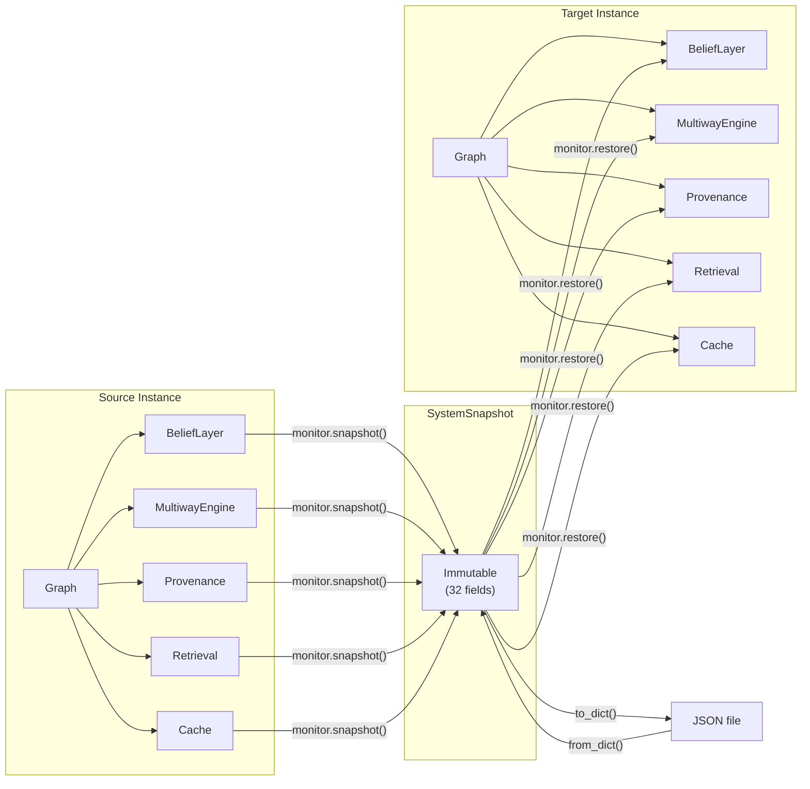

# Full System Snapshot and Restore

> **Cross-Subsystem State Serialization and Round-Trip Verification on a 12-Node Graph**

## 1. The Approach

Analysis sessions are stateful — belief distributions accumulate over multiple `create_distribution` and `sample` calls, multiway expansion builds branching state trees, provenance records track every inferred edge back to its source rules, retrieval feedback adjusts future recall rankings, rule analytics measure which rules produce useful edges, and cache entries accelerate repeated lookups. After a session processing thousands of concepts, all this subsystem state represents significant computational investment.

Without snapshotting, restarting the process loses everything. The `mem.monitor.snapshot()` method serializes every subsystem into a single immutable `SystemSnapshot` object, enabling checkpoint-restore workflows, session transfer between machines, and audit-compliant state archival. The graph structure is saved separately (via `save/load`), while the snapshot captures the subsystem layer above the graph. This separation means you can restore subsystem state onto a different graph topology if needed -- for example, restoring analytics and provenance onto a pruned version of the graph.



## 2. A Simple Analogy

Imagine you have spent hours setting up a complex simulation: model parameters tuned, intermediate results cached, analysis history recorded, and a dashboard displaying live metrics. If the computer crashes, everything is lost — you would have to re-run the entire simulation from scratch.

A system snapshot is like a "Save Game" button that freezes every piece of state into a single file. When you load the save, the simulation resumes exactly where you left off — same parameters, same cache, same dashboard. The graph structure (nodes and edges) is saved separately, like the game world map, while the snapshot captures the computational layer (beliefs, reasoning history, analytics), like your character's inventory and quest progress.

The separation matters: you can restore the computational layer onto a different graph, just as you could load your character's inventory into a modified game world. This enables workflows like "restore the analytics and provenance onto a pruned version of the graph for focused analysis."

## 3. Key Concepts

| Term | Plain English Meaning |
|------|----------------------|
| **SystemSnapshot** | Immutable cross-subsystem state container with 32 fields |
| **mem.monitor.snapshot()** | Public method that reads state from all subsystems into a SystemSnapshot |
| **mem.monitor.restore()** | Rebuilds subsystems from a snapshot, returning multiway/clustering/analytics engines |
| **save_state / load_state** | JSON file I/O for snapshots |
| **to_dict / from_dict** | Serialization round-trip enabling custom storage backends |
| **BeliefLayer state** | Quantum amplitude distributions and correlation records |
| **MultiwayEngine state** | Cumulative expansion DAG with branch states and overlay isolation |
| **ProvenanceTracker state** | Edge-to-rule-to-seed inference chains |
| **RetrievalEngine state** | Feedback signals and relevance rankings |

## 4. Quick Start

```bash
.venv/bin/python examples/showcase/workflow/system_snapshot/system_snapshot.py
```

```
SECTION 1: BUILD AND ENRICH THE KNOWLEDGE GRAPH
reasoning: edges_produced=31, states_created=32
unique inferred edges: 6 (deduplicated from 31 raw productions)
graph: nodes=12, edges=18 (12 base + 6 inferred)

SECTION 2: CAPTURE FULL SYSTEM SNAPSHOT
snapshot captured:
  version: 1
  belief states: 1
  multiway states: 43 (cumulative)
  provenance records: 6
  retrieval feedback: 6
  frame outcomes: 0
  cache items: 12
  feedback signals: 0

SECTION 3: SAVE SNAPSHOT TO DISK
saved graph to: graph.json (23479 bytes)
saved snapshot to: snapshot.json (96004 bytes, 93.8 KB)

SECTION 4: RESTORE INTO FRESH INSTANCE
nodes match: True
edges match: True
```

File sizes and graph byte counts vary by OS tempfile location. The snapshot JSON is typically ~94 KB for this 12-node enriched graph.

## 5. Analysis Pipeline

**Section 1 — Build and enrich the knowledge graph:** 12 quantum computing research concepts are stored and connected with 12 `influences` edges. A `TransitiveRule` on the `influences` label is registered at construction, and `reason()` produces 31 raw edge productions across 32 multiway states. After deduplication — each multiway branch explores independently, so the same logical edge can be produced in multiple branches — 6 unique inferred edges are committed to the graph. A belief distribution is created over three concepts (`quantum_computing`, `machine_learning`, `cryptography`). Two nodes are stimulated with activation energy and activation is spread for 2 iterations. Retrieval feedback is recorded for `machine_learning` and `cryptography`. The graph ends at 12 nodes, 18 edges (12 base + 6 inferred). Why this matters: the snapshot must capture the state of every subsystem that contributed to this enriched graph — not just the nodes and edges, but the belief amplitudes, the full cumulative multiway expansion DAG, provenance chains, retrieval rankings, and cache entries. Missing any one of these produces a restored system that silently disagrees with the original.

**Section 2 — Capture full system snapshot:** `mem.monitor.snapshot()` collects state from all subsystems through the public monitor namespace. The result is an immutable `SystemSnapshot` containing: 1 belief state, 43 cumulative multiway states (32 from the expansion call plus 11 from post-expansion convergence and clustering processing), 6 provenance records, 6 retrieval feedback entries, 0 frame outcomes, 12 cache items, and 0 feedback signals. Why this matters: the multiway state count in the snapshot (43) exceeds the per-call expansion count (32) because the `MultiwayGraph._states` dict is cumulative — it grows across the engine's lifetime and is never cleared between operations. Post-expansion processing (state convergence enforcement, coordinate assignment, simultaneity grouping) adds additional states to the graph. The snapshot captures this full accumulated state, not just the most recent expansion.

**Section 3 — Save snapshot to disk:** `mem.save()` writes the graph structure to `graph.json` (~23 KB). `mem.save(path, full=True)` writes the full system state (graph + subsystems) to `snapshot.json` (~94 KB). These are two separate files because the graph and subsystems have different serialization formats and different lifecycles. Why this matters: the graph JSON contains nodes, edges, weights, labels, and data payloads — the structural substrate. The snapshot JSON contains belief amplitudes, multiway states, provenance chains, retrieval feedback, analytics counters, cache entries, and monitor readings — the computational layer. Separating them allows restoring the graph alone (for structural analysis) or the subsystem state alone (for analytics audit) without the other.

**Section 4 — Restore into fresh instance:** A new `HypergraphMemory` is created with the same rules configuration. `mem2.load(graph_path)` restores the graph structure. `mem2.load(snapshot_path)` restores the subsystem state. The restored graph matches: 12 nodes, 18 edges. Why this matters: the fresh instance starts from zero — no nodes, no edges, no subsystem state. The two-step restore (graph first, then snapshot) rebuilds the complete session. The rules configuration must match the original because rule objects are not serialized — they are code, not data. A mismatch here means reasoning after restore may behave differently.

**Section 5 — Verify restored state:** All 12 concept labels are present in the restored graph. Density matches (0.1364 vs 0.1364). Confidence score for `quantum_computing` matches (1.0000 vs 1.0000). Average confidence across all nodes matches (3.0854 vs 3.0854). Why this matters: confidence scores depend on edge weights, connectivity, and provenance depth — all of which must be restored correctly for the numbers to match. A confidence mismatch would indicate that some subsystem state (edge weights, provenance chains, or activation values) was not restored faithfully.

**Section 6 — Serialization round-trip:** `snapshot.to_dict()` produces a dict with 32 keys. `SystemSnapshot.from_dict(data_dict)` reconstructs the snapshot. Belief states (1), multiway states (43), and provenance records (6) counts are preserved through the round-trip. Why this matters: `to_dict`/`from_dict` enables custom storage backends — you can write the dict to a database, send it over a network, or store it in an object store. The round-trip guarantee means no information is lost through JSON serialization, even for complex nested structures like multiway expansion trees and belief amplitude arrays.

## 6. Key Metrics

| Metric | Value |
|--------|-------|
| Nodes | 12 |
| Base edges | 12 |
| Unique inferred edges | 6 |
| Raw multiway edge productions | 31 |
| Expansion states (per-call) | 32 |
| Cumulative multiway states (snapshot) | 43 |
| Belief distributions | 1 |
| Provenance records | 6 |
| Retrieval feedback entries | 6 |
| Cache items | 12 |
| Graph JSON size | ~23 KB |
| Snapshot JSON size | ~94 KB |
| Snapshot dict keys | 32 |

## 7. What Makes This Different

**Multiway deduplication** means the raw `edges_produced` count from the multiway engine (31) does not equal the number of unique inferred edges committed to the graph (6). Each multiway branch explores independently with its own overlay, so the same logical edge — same source, target, and label — can be produced in multiple branches. The `_collect_branch_overlays()` step deduplicates by `(source_ids, target_ids, label)` before committing unique edges to the graph. The snapshot captures the full multiway DAG with all 43 cumulative states (including duplicates), while the graph ends up with only 6 new edges.

**Cumulative multiway state tracking** means the snapshot's multiway state count (43) exceeds the per-call expansion count (32). The `MultiwayGraph._states` dict grows across the engine's lifetime — `expand()` adds states, post-expansion processing (convergence enforcement, coordinate assignment) can add more, and nothing clears the dict between operations. The `ExpansionReport.states_created` metric reports only what the current `expand()` call contributed, while the snapshot captures everything accumulated so far. This distinction matters for understanding what the snapshot preserves: not a snapshot of one reasoning call, but the full computational history of all reasoning activity.

**Cross-subsystem completeness** means `mem.monitor.snapshot()` captures state from every subsystem in a single call: belief amplitudes and correlations, multiway expansion states and leaves, provenance edge-to-rule chains, retrieval feedback and rankings, rule analytics counters, cache entries and TTL, perspective frame outcomes, system monitor readings, and feedback signals. `mem.monitor.restore(snapshot)` rebuilds all of these into operational engines that produce identical results to the original session.

**Round-trip fidelity** through `to_dict`/`from_dict` ensures that no information is lost through JSON serialization. The 32-key dict preserves complex nested structures — multiway expansion trees with parent-child references, belief amplitude arrays with complex components, and provenance chains linking edges to rules to seed concepts. The round-trip guarantee is verified by comparing field counts before and after serialization.

**Separate graph/snapshot** serialization reflects the architectural separation between the structural substrate (nodes and edges) and the computational layer (belief, reasoning, analytics). The graph is restored via `save/load` using the graph's own serialization format. The snapshot is restored via `save_state/load_state` using the subsystem serialization format. This separation means you can restore subsystem state onto a different graph topology if needed — for example, restoring analytics and provenance onto a pruned version of the graph for a focused analysis session.

## 8. Code Implementation

**1. Build and enrich the graph:**

```python
from hyper3 import HypergraphMemory, TransitiveRule

mem = HypergraphMemory(evolve_interval=0, rules=[
    TransitiveRule(edge_label="influences", new_label="indirect_influence"),
])

for concept in ["quantum_computing", "machine_learning", "cryptography", ...]:
    mem.add(concept, data={"type": "concept"})

mem.link("quantum_computing", "machine_learning", label="influences", weight=3.0)

result = mem.reason(seeds={"quantum_computing"}, depth=3)
overlay_edges = result.overlay.get("edge_count", 0) if result.overlay else 0
print(f"edges_produced={result.expansion.edges_produced}, unique={overlay_edges}")
mem.belief.create(["quantum_computing", "machine_learning", "cryptography"])
```

**2. Capture a full system snapshot:**

```python
snapshot = mem.monitor.snapshot()

print(f"belief states: {len(snapshot.belief_states)}")
print(f"multiway states: {len(snapshot.multiway_states)}")
print(f"provenance records: {len(snapshot.provenance_records)}")
```

**3. Save to disk and restore:**

```python
import tempfile, os

tmpdir = tempfile.mkdtemp()
graph_path = os.path.join(tmpdir, "graph.json")
snapshot_path = os.path.join(tmpdir, "snapshot.json")

mem.save(graph_path)
mem.save(snapshot_path, full=True)

mem2 = HypergraphMemory(evolve_interval=0, rules=[
    TransitiveRule(edge_label="influences", new_label="indirect_influence"),
])
mem2.load(graph_path)
mem2.load(snapshot_path)
print(f"restored: nodes={mem2.size[0]}, edges={mem2.size[1]}")
```

**4. Restore a snapshot into a live instance:**

```python
mem.monitor.restore(snapshot)
```

**5. Serialization round-trip via to_dict/from_dict:**

```python
from hyper3.snapshot import SystemSnapshot

data_dict = snapshot.to_dict()
restored = SystemSnapshot.from_dict(data_dict)

assert len(restored.belief_states) == len(snapshot.belief_states)
assert len(restored.multiway_states) == len(snapshot.multiway_states)
```

## 9. Real-World Gap

This showcase snapshots a 12-node enriched graph. Real-world adoption involves additional considerations:

- **Large multiway states** — graphs with deep reasoning chains produce large multiway expansion trees. The snapshot serializes all cumulative states, which may produce multi-MB files for heavily reasoned graphs. The 43 states in this example produce a ~94 KB snapshot; a graph with thousands of states could produce files an order of magnitude larger.
- **Cache TTL and wall-clock time** — cache entries store creation timestamps. Restoring on a different machine with a different clock means TTL-based expiry may fire at different times relative to the restoration point.
- **No incremental snapshots** — each `mem.monitor.snapshot()` is a full capture. For large states, incremental or differential snapshots would reduce storage and transfer costs.
- **Rule objects are not serialized** — rules are code (Python classes), not data. The restored instance must be constructed with the same rules list for reasoning behavior to match.

## 10. Reference

| Method | Purpose |
|--------|---------|
| `mem.save(path)` | Serialize graph structure to JSON file |
| `mem.load(path)` | Restore graph structure from JSON file |
| `mem.save(path, full=True)` | Serialize full system state (graph + subsystems) to JSON file |
| `mem.monitor.snapshot()` | Capture all subsystem state into a SystemSnapshot |
| `mem.monitor.restore(snapshot)` | Restore subsystem state from a SystemSnapshot |
| `snapshot.to_dict()` | Convert snapshot to a JSON-serializable dict |
| `SystemSnapshot.from_dict(data)` | Reconstruct snapshot from a dict |
| `mem.describe()` | Return graph statistics (nodes, edges, density) |
| `mem.cognitive.confidence(concept)` | Compute confidence score for a concept |
| `mem.cognitive.all_confidences()` | Compute average confidence across all nodes |

| Related Example | Connection |
|----------------|------------|
| `graph_versioning` | Structural versioning of graph topology |
| `provenance_and_retraction` | Provenance records captured in the snapshot |
