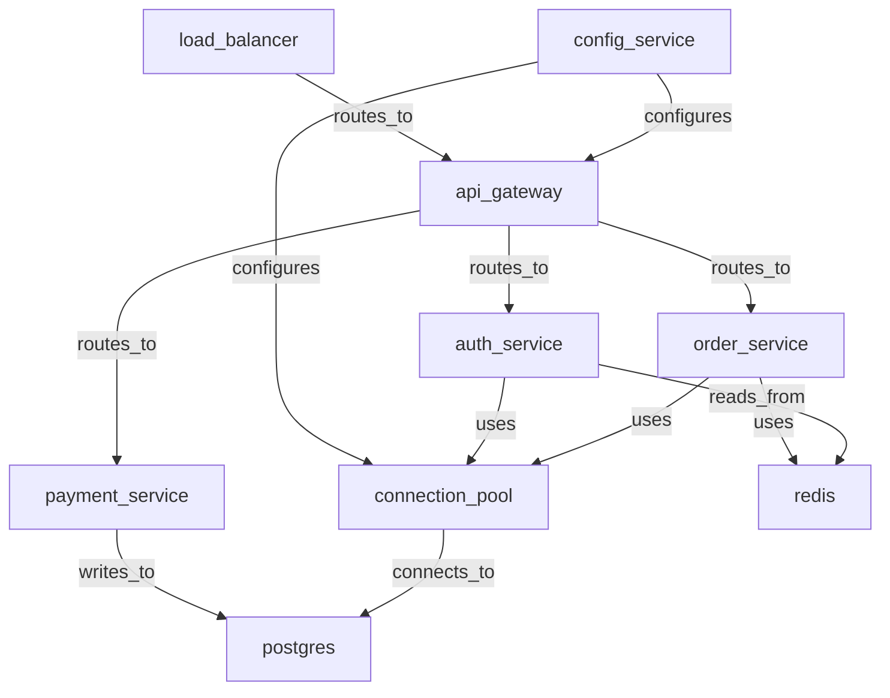

# Temporal Incident Forensics

> Production deployment incident forensics using temporal event registration, Allen interval relations, causal chain detection, and infrastructure impact analysis on a 20-node temporal-infrastructure graph.

## 1. The Approach

A production incident is both a structural event (which components are affected) and a temporal event (when things happen and in what order). This example models a SaaS deployment incident as a dual graph: an infrastructure dependency graph showing component relationships, and a temporal event graph showing the incident timeline. The temporal subsystem uses Allen interval algebra to analyze event ordering and auto-detect causal chains.

The graph contains 20 nodes total: 9 infrastructure components (api_gateway, auth_service, order_service, payment_service, connection_pool, postgres, redis, load_balancer, config_service) and 11 temporal events (routine_deploy_v2_3, stale_config_pushed, db_pool_growth_begins, api_latency_increase, customer_timeouts, pager_alert_fired, incident_declared, rollback_initiated, pool_draining, service_restored, post_mortem_scheduled). Temporal events are registered as graph nodes via `add_temporal_event`, so they participate in the same hypergraph as infrastructure components. This unified representation enables cross-domain queries like shortest-path from a config error to customer-facing impact.

This is the first Hyper3 example demonstrating the temporal namespace API: `mem.temporal.events`, `mem.temporal.detect_causal_chains()`, `mem.temporal.infer_constraints()`, and `mem.temporal.check_constraint_consistency()`.

## 2. Key Concepts

| Term | What it does |
|------|-------------|
| **Temporal event** | An event with start/end times and metadata, registered as a graph node |
| **Allen interval relation** | One of 13 possible relationships between two time intervals (before, after, overlaps, contains, meets, etc.) |
| **Causal chain** | A sequence of temporally-ordered events connected by graph edges |
| **Temporal constraint** | An inferred Allen relation between two events |
| **Constraint consistency** | Checking the inferred constraint network for contradictions |

## 3. Quick Start

```bash
.venv/bin/python examples/showcase/workflow/temporal_incident_forensics/temporal_incident_forensics.py
```

## 4. The Scenario

A routine deployment of config-service:v2.3 pushes a stale configuration (max_connections=50 instead of 500). Over the next 10 minutes, the connection pool fills, API latency spikes, customers experience timeouts, and the incident response team intervenes with a rollback.

### Timeline (11 events, T+0 to T+12 minutes)

```mermaid
timeline
    title Incident Timeline
    section T+0 - T+1 : routine_deploy_v2_3 : stale_config_pushed
    section T+2 - T+4 : db_pool_growth_begins : api_latency_increase
    section T+5 - T+6 : customer_timeouts : pager_alert_fired
    section T+7 - T+8 : incident_declared : rollback_initiated
    section T+8 - T+10 : pool_draining : service_restored
    section T+12 : post_mortem_scheduled
```

| Time | Event | Duration |
|------|-------|----------|
| T+0.0 | routine_deploy_v2_3 | 0.5m |
| T+0.3 | stale_config_pushed | 0.5m |
| T+2.0 | db_pool_growth_begins | 12.0m |
| T+4.0 | api_latency_increase | 12.0m |
| T+5.5 | customer_timeouts | 11.5m |
| T+6.0 | pager_alert_fired | 0.2m |
| T+7.0 | incident_declared | 0.1m |
| T+8.0 | rollback_initiated | 0.3m |
| T+8.5 | pool_draining | 2.5m |
| T+10.0 | service_restored | 0.5m |
| T+12.0 | post_mortem_scheduled | 0.2m |

### Infrastructure Graph (9 components, 12 dependencies)

Components: api_gateway, auth_service, order_service, payment_service, connection_pool, postgres, redis, load_balancer, config_service.

The knowledge graph contains 20 nodes total because temporal events are registered as graph nodes. The 12 dependency edges connect infrastructure components; temporal events are linked separately via `timeline_link` edges.



## 5. Analysis Pipeline

### Section 1: Infrastructure Graph Construction
Creates 9 infrastructure nodes and 12 dependency edges. The dependency graph enables impact propagation analysis.

### Section 2: Incident Timeline Registration
11 temporal events are registered with precise start/end times and metadata (metric names, thresholds, severity levels). Each event becomes a graph node, bringing the total to 20 nodes.

### Section 3: Allen Interval Analysis
Computes Allen interval relations between key event pairs:
- `routine_deploy` -> `stale_config_pushed`: **overlaps** (deploy still running when bad config pushed)
- `stale_config` -> `db_pool_growth`: **before** (config error precedes pool growth)
- `db_pool_growth` -> `api_latency`: **overlaps** (pool growth overlaps with latency impact)
- `rollback` -> `service_restored`: **before** (rollback precedes restoration)

The "overlaps" relation is the most informative: it indicates concurrent degrading conditions.

### Section 4: Automatic Causal Chain Detection (Two-Phase)

Chain detection operates in two phases by design:

1. **First attempt** calls `mem.temporal.detect_causal_chains()` before any timeline links exist. This returns empty, demonstrating that temporal events alone (even with intervals and metadata) do not imply causation -- graph edges are required to represent the "this event caused that event" relationship.

2. **Timeline links** are then added as directed `timeline_link` edges between consecutive incident events. After linking, the same call detects 109 causal chains. The most relevant chains trace the full incident lifecycle: `routine_deploy -> rollback_initiated -> service_restored -> post_mortem_scheduled`.

This two-phase approach is intentional: it shows that causal chain detection requires explicit causal edges, not just temporal proximity. Temporal ordering provides the Allen relations; graph edges provide the causation hypothesis.

### Section 5: Temporal Constraint Consistency
55 temporal constraints are inferred between all event pairs via `mem.temporal.infer_constraints()`. No consistency violations are found by `mem.temporal.check_constraint_consistency()`, confirming the timeline is internally consistent.

### Section 6: Infrastructure Impact Analysis
Shortest path from config_service to payment_service reveals the impact propagation route: `config_service -> api_gateway -> payment_service`. Betweenness centrality identifies api_gateway as the primary bottleneck.

## 6. Key Metrics

| Metric | Value |
|--------|-------|
| Infrastructure nodes | 9 |
| Temporal event nodes | 11 |
| **Total graph nodes** | **20 (9 infra + 11 temporal)** |
| Infrastructure edges | 12 |
| Allen relations analyzed | 7 pairs |
| Causal chains detected | 109 |
| Temporal constraints | 55 |
| Consistency violations | 0 |

## 7. What Makes This Different

**Allen interval algebra** provides a precise vocabulary for temporal relationships that goes beyond simple "before/after" timestamps. The 13 relations capture nuances like "overlaps" (both events active simultaneously) and "meets" (one ends exactly when the other begins) that reveal incident dynamics.

**Two-phase causal chain detection** separates temporal observation from causal hypothesis. Temporal events register what happened and when; explicit graph edges assert why one event caused another. The system detects chains only after both are present, preventing false causal inferences from temporal proximity alone.

**Infrastructure-temporal integration** bridges structural analysis (which components are affected) with temporal analysis (when they were affected). Because temporal events are graph nodes, a single shortest-path query can traverse from an infrastructure component to a temporal event and back, enabling forensic reconstruction of how a single config error cascaded through the system.

## 8. Code Implementation

```python
from hyper3 import HypergraphMemory, TransitiveRule

mem = HypergraphMemory(evolve_interval=0)

# Build infrastructure graph (9 nodes, 12 edges)
mem.add("api_gateway", data={"tier": "edge", "team": "platform"})
mem.link("config_service", "connection_pool", label="configures", weight=3.0)

# Register temporal events -- each becomes a graph node
mem.add_temporal_event("deploy", start=0.0, end=0.5,
                       deployer="ci_cd", artifact="config-service:v2.3")
mem.add_temporal_event("outage", start=2.0, end=10.0)

# Access registered events via namespace API
events = mem.temporal.events
print(f"Registered {len(events)} temporal events")

# Compute Allen relation between two events
relation = mem.allen_relation("deploy", "outage")
print(relation.value)  # "before"

# Phase 1: detect chains before timeline links -- returns empty
chains = mem.temporal.detect_causal_chains(min_chain_length=3)
assert len(chains) == 0  # no causal edges yet

# Phase 2: add timeline links, then detect chains
mem.link("deploy", "stale_config_pushed", label="timeline_link", weight=3.0)
mem.link("stale_config_pushed", "db_pool_growth_begins", label="timeline_link", weight=3.0)

chains = mem.temporal.detect_causal_chains(min_chain_length=3)
print(f"Found {len(chains)} chains")

# Check temporal consistency via namespace API
constraints = mem.temporal.infer_constraints()
issues = mem.temporal.check_constraint_consistency()

# Infrastructure impact analysis via analyze namespace
path = mem.analyze.shortest_path("config_service", "payment_service", weighted=True)
centrality = mem.analyze.centrality("betweenness", top_k=5)
```

## 9. Real-World Gap

- **Manual event registration.** Events are registered programmatically. A production system would ingest events from monitoring systems (Prometheus, Datadog) and incident management tools (PagerDuty, Jira).
- **Fixed time intervals.** Real incident timestamps are imprecise. The system assumes exact start/end times.
- **No probabilistic ordering.** Allen relations are deterministic. Real forensic analysis requires probabilistic ordering when timestamps are uncertain.
- **Causal chains are topological.** The detected chains are based on temporal ordering and graph connectivity, not proven causation. Correlation is not causation.

## 10. Reference

### API Methods

| Method | Purpose |
|--------|---------|
| `mem.add_temporal_event(label, start, end, **metadata)` | Register a temporal event as a graph node with time interval |
| `mem.allen_relation(source, target)` | Compute Allen interval relation between two events |
| `mem.temporal.detect_causal_chains(min_chain_length)` | Auto-detect causal chains from temporal+graph structure |
| `mem.temporal.infer_constraints()` | Infer Allen constraints between all event pairs |
| `mem.temporal.check_constraint_consistency()` | Check constraint network for contradictions |
| `mem.temporal.events` | List all registered temporal events |

### Related Examples

| Example | Topic |
|---------|-------|
| `examples/showcase/domain/infrastructure_self_healing/` | Feedback-driven infrastructure evolution |
| `examples/showcase/belief/quantum_diagnostics/` | Hypothesis management during incidents |
