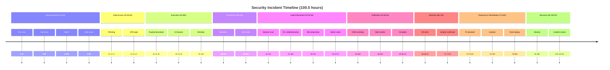
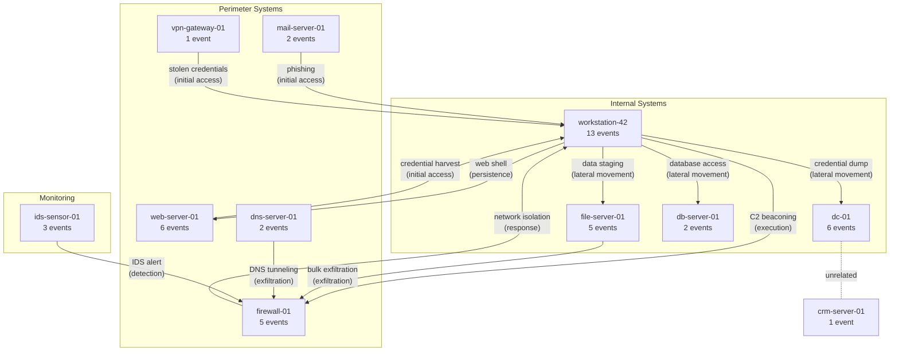
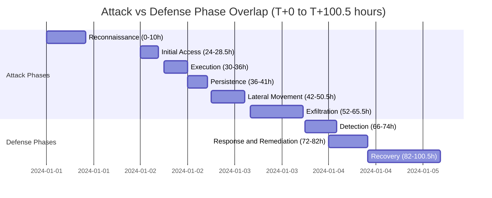

# Temporal Reasoning with Allen Interval Algebra

> Reconstructing and analyzing a multi-phase IT security incident timeline using Hyper3's temporal reasoning capabilities

### How to Read This Showcase

If you are new to temporal reasoning or Allen interval algebra, the following reading order will build understanding incrementally:

1. **Section 2** (analogy) grounds the abstract concepts in a familiar scenario.
2. **Section 3** (key concepts) defines the terminology used throughout.
3. **Section 5** (the scenario) introduces the concrete incident, its phases, and the 11 affected systems. The two diagrams there show the system topology and how attack and defense phases overlap in time.
4. **Section 4** (quick start) -- run the script to see the full output.
5. **Section 6** (analysis pipeline) walks through each of the eight analysis sections, explaining what each one produces and why it matters.
6. **Section 7** (understanding output) explains how to interpret Allen relations and includes a map of which relations surface in which analysis sections.
7. **Sections 8--11** summarize metrics, differentiators, code patterns, and real-world limitations.

Read sections 1--3 for theory, sections 5--7 for the worked example, and sections 8--11 for reference.

## 1. The Approach

Security incidents unfold over time. A single breach spans reconnaissance, exploitation, lateral movement, exfiltration, detection, response, and recovery -- often across hundreds of hours. Understanding the order, overlap, and gaps between these events is critical for root cause analysis, process compliance, and identifying parallel attacker activity.

Allen interval algebra provides a formal vocabulary for 13 mutually exclusive temporal relationships between two intervals: `before`, `after`, `meets`, `met_by`, `overlaps`, `overlapped_by`, `contains`, `during`, `starts`, `started_by`, `finishes`, `finished_by`, and `equals`. Unlike simple "before/after" ordering, Allen relations capture overlaps, containment, and adjacency -- the relationships that matter when determining whether two events could have influenced each other.

This showcase builds a 46-event incident timeline across 10 attack phases, then uses Allen relations to detect parallel attacker operations, trace causal chains, find the critical path, and catch process compliance violations.

## 2. A Simple Analogy

Imagine reconstructing a burglary from a security camera timeline. You know the thief scouted the building, entered through a window, ransacked rooms, and left. But you also need to know: did the alarm company call *before* or *after* the thief left? Did the cleaning crew arrive *during* the ransacking? Did the police response *meet* (immediately follow) the alarm, or was there a gap?

Simple timestamps answer "when." Allen relations answer "how" -- how two time windows relate to each other, including whether they overlap, contain each other, or are completely separate.

## 3. Key Concepts

| Concept | Description |
|---------|-------------|
| **Allen interval relation** | One of 13 mutually exclusive relationships between two time intervals (before, meets, overlaps, contains, starts, finishes, equals, and their inverses) |
| **Temporal event** | An occurrence with a start and end time, stored as a hypernode with interval metadata |
| **Causal chain** | An ordered sequence of events connected by `before` or `meets` relations, representing a plausible cause-and-effect progression |
| **Critical path** | The longest `before`/`meets` chain through the timeline -- the maximum sequence of causally-linked events |
| **Temporal constraint** | A required Allen relation between two events (e.g., "detection must complete `before` remediation starts") -- used for process compliance checking |
| **Constraint consistency** | Verification that actual Allen relations between events match declared constraints, flagging violations |

## 4. Quick Start

```bash
.venv/bin/python examples/showcase/workflow/temporal_reasoning/temporal_reasoning.py
```

<details>
<summary>Expected output (truncated)</summary>

```
SECTION 1: Incident Timeline Construction
  46 events across 10 phases

SECTION 2: Knowledge Graph - Affected Systems
  11 systems, 46 event-system edges

SECTION 6: Temporal Constraint Checking (Process Compliance)
  [PASS] Incident confirmed before response declared
  [FAIL] Detection complete before remediation starts
        actual: detect_confirmed [met_by] rem_av_update (expected [before])
  [FAIL] Isolation before malware removal
        actual: resp_isolate [equals] rem_malware_rm (expected [before])

  2 constraint violation(s):
    detect_confirmed vs rem_av_update: expected before, got met_by
    resp_isolate vs rem_malware_rm: expected before, got equals

SECTION 7: Allen Relation Distribution (All Event Pairs)
  1035 pairwise relations across 46 events:
    before           969
    after             32
    meets             21
    met_by             4
    contains           2
    starts             2
    equals             2
    finishes           1
    overlaps           1
    finished_by        1

SECTION 8: Incident Summary
  Total incident window:      100.5 hours
  Active attack phase:        65.5 hours (27 events)
  Defense/recovery phase:     34.5 hours (18 events)
  Detection gap:              0.5 hours
  Systems affected:           11
  Critical path length:       39 events
```

</details>

## 5. The Scenario

The script reconstructs a multi-stage security incident with **46 events** across **10 phases**, affecting **11 systems** over **100.5 hours**. Each event has a start time, end time, attack phase, and description. Events are linked to the systems they affect via `affects` edges in the knowledge graph.



The 11 affected systems and their involvement:

| System | Implicated Events | Role |
|--------|-------------------|------|
| workstation-42 | 13 | Primary compromise target -- phishing, execution, persistence, forensics |
| web-server-01 | 6 | Vulnerability scanning, phishing page, web shell, recovery |
| dc-01 | 6 | Lateral movement, credential dumping, password reset |
| firewall-01 | 5 | Perimeter scanning, C2 beaconing, exfiltration, isolation |
| file-server-01 | 5 | Lateral movement, data staging, exfiltration |
| ids-sensor-01 | 3 | IDS alerts, SIEM correlation, enhanced monitoring |
| dns-server-01 | 2 | DNS enumeration, DNS tunneling |
| mail-server-01 | 2 | Phishing delivery, credential capture |
| db-server-01 | 2 | Database compromise, service restoration |
| vpn-gateway-01 | 1 | VPN access with stolen credentials |
| crm-server-01 | 1 | Coincidental maintenance (red herring) |

### Knowledge Graph Topology -- Affected Systems

The diagram below shows the 11 systems and the attack-phase connections between them. An arrow from system A to system B indicates that events affecting A led to or coincided with events affecting B during the labeled phase. The `affects` edges in the knowledge graph link each of the 46 events to the systems it touches; this diagram collapses those edges to show the inter-system attack flow.



### Attack and Defense Phase Overlap

The Gantt chart below shows the six attack phases and four defense phases as parallel timelines. The overlap between Detection (66--74h) and Response & Remediation (72--82h) is the key structural anomaly: remediation began before detection was complete, which surfaces as a process compliance violation in Section 6.



## 6. Analysis Pipeline

The script runs eight analysis sections. Each builds on the shared timeline to produce a different view of the incident.

### Section 1: Incident Timeline Construction

Creates 46 temporal events across 10 phases. The timeline spans from the initial port scan (T+0h) to incident closure (T+100.5h). The exfiltration phase is the longest single attack phase at 13.5 hours, while recovery spans 18.5 hours.

### Section 2: Knowledge Graph -- Affected Systems

Links events to systems via `affects` edges (46 event-system edges). The distribution is heavily skewed: **workstation-42** accounts for 13 of 46 event-system connections, making it the focal point of both the compromise and the investigation. This asymmetry is typical of targeted attacks where one endpoint serves as the initial foothold.

### Section 3: Allen Relations Between Key Phase Transitions

Computes Allen relations for 9 critical phase-transition pairs:

| Transition | Relation | Meaning |
|------------|----------|---------|
| Recon -> Access | `before` | 14h gap between port scan and phishing campaign |
| Access -> Execution | `before` | 1.5h gap between VPN login and payload download |
| Execution -> Persistence | `meets` | Mimikatz ends exactly as backdoor installation begins -- no gap |
| Persistence -> Lateral | `before` | 1h gap between web shell and internal scanning |
| Lateral -> Exfiltration | `before` | 1.5h gap between admin credential theft and data staging |
| Exfiltration -> Detection | `before` | 0.5h gap -- attacker completed exfiltration just before IDS alert |
| Detection -> Response | `before` | 1.5h gap between confirmation and P1 declaration |
| Remediation vs Detection | `meets` | AV update starts exactly when detection is confirmed -- **anomaly** |
| Response -> Recovery | `meets` | IR team engagement ends exactly as restoration begins |

The `meets` relation between Execution and Persistence (exec_mimikatz -> persist_backdoor) reveals the attacker moved immediately from credential theft to persistence with no delay. The `meets` relation between remediation and detection is a process violation -- explored further in Section 6.

### Section 4: Simultaneous Activity

Queries five events for overlapping activity to identify parallel operations:

- **recon_osint** `contains` **recon_dns_enum**: OSINT research (6-10h) was active the entire time DNS enumeration (8-9h) ran -- the attacker ran reconnaissance tracks in parallel.
- **exfil_dns_tunnel** `overlaps` **exfil_transfer**: DNS tunneling (54-60h) overlapped with bulk transfer (58-65h) -- dual-channel exfiltration.
- **maint_window** and **persist_webshell**: The CRM maintenance window (40-44h) `starts` at the same time as web shell deployment (40-41h) -- a coincidence that could mask malicious activity in logs.

### Section 5: Critical Path Analysis

Finds the longest chain of events connected by `before` or `meets` relations: **39 events**. This path traces the full incident from the initial port scan (T+0h) through incident closure (T+100.5h). The causal chain ordering of 21 key milestones confirms the expected kill-chain progression.

### Section 6: Temporal Constraint Checking

Defines 4 process compliance constraints and checks actual Allen relations:

| Constraint | Expected | Actual | Result |
|------------|----------|--------|--------|
| Detection before response declared | `before` | `before` | PASS |
| Detection complete before remediation | `before` | `met_by` | FAIL |
| Forensic imaging before isolation | `before` | `before` | PASS |
| Isolation before malware removal | `before` | `equals` | FAIL |

**2 violations detected**:

1. **rem_av_update** (T+72h) `met_by` **detect_confirmed** (T+73h): The AV signature update was pushed at T+72h, but the incident was not confirmed until T+73h. Remediation started before the investigation concluded -- potentially destroying evidence or applying incomplete fixes.
2. **resp_isolate** (T+76h) `equals` **rem_malware_rm** (T+76h): Network isolation and malware removal began at the same time. Isolation should precede malware removal to prevent reinfection during cleanup.

### Section 7: Allen Relation Distribution

Computes all **1035 pairwise relations** across the 46 events:

| Relation | Count | Notes |
|----------|-------|-------|
| `before` | 969 | 93.6% -- most event pairs are sequential |
| `after` | 32 | Inverse of `before` for reverse-ordered pairs |
| `meets` | 21 | Events where one ends exactly as the next begins |
| `met_by` | 4 | Inverse of `meets` |
| `contains` | 2 | Long events fully spanning shorter ones |
| `starts` | 2 | Events beginning at the same time with different durations |
| `equals` | 2 | Events with identical start and end times |
| `finishes` | 1 | Events ending at the same time with different starts |
| `overlaps` | 1 | Events with partial time overlap |
| `finished_by` | 1 | Inverse of `finishes` |

The dominance of `before` (969 of 1035) reflects the timeline's predominantly sequential structure. The 21 `meets` relations identify tight handoffs between phases. The `overlaps`, `contains`, `starts`, and `equals` relations (6 total) pinpoint the parallel activity that sequential analysis would miss.

### Section 8: Incident Summary

Aggregates all metrics into a final report:

- **100.5 hour** total incident window
- **65.5 hour** active attack phase (27 events in 6 attack phases)
- **34.5 hour** defense/recovery phase (18 events in 4 defense phases)
- **0.5 hour** detection gap -- the attacker completed exfiltration at T+65.5h and the IDS triggered at T+66h

## 7. Understanding Output

### Allen Relation Semantics

The 13 Allen relations partition all possible interval relationships. Here is how to interpret the ones that appear in this scenario:

- **`before` / `after`**: The intervals are disjoint with a gap between them. Example: port scan ends at T+2h, phishing starts at T+24h -- a 22h gap.
- **`meets` / `met_by`**: The intervals are adjacent -- one ends exactly when the other starts, with zero gap. Example: Mimikatz ends at T+36h and the backdoor installation starts at T+36h. This indicates the attacker moved without hesitation.
- **`overlaps`**: Partial overlap -- the first interval starts before the second and ends during it. Example: DNS tunneling (54-60h) starts before bulk transfer (58-65h) and ends before it finishes.
- **`contains`**: The first interval fully encompasses the second. Example: OSINT (6-10h) fully contains DNS enumeration (8-9h).
- **`starts` / `started_by`**: Both intervals begin at the same time but have different end times. Example: CRM maintenance (40-44h) and web shell deployment (40-41h) start simultaneously.
- **`equals`**: Both intervals have identical start and end times. Example: network isolation (76-78h) and malware removal (76-78h) -- a process violation.

### Which Allen Relations Appear in Which Sections

Not all 13 Allen relations surface in every analysis section. The table below maps each relation to the sections where it is discussed or computed. A dot marks a section that produces or examines that relation. This helps when tracing a finding back to its source section.

| Allen relation | Sec 3: Phase transitions | Sec 4: Simultaneous activity | Sec 5: Critical path | Sec 6: Constraint checking | Sec 7: Distribution |
|----------------|:---:|:---:|:---:|:---:|:---:|
| `before` | . | | . | . | . |
| `after` | | | | | . |
| `meets` | . | | . | | . |
| `met_by` | . | | | . | . |
| `overlaps` | | . | | | . |
| `overlapped_by` | | | | | |
| `contains` | | . | | | . |
| `during` | | | | | |
| `starts` | | . | | | . |
| `started_by` | | | | | |
| `equals` | | | | . | . |
| `finishes` | | | | | . |
| `finished_by` | | | | | . |

Key observations:

- **Section 3** examines only sequential and adjacent relations (`before`, `meets`, `met_by`) because it focuses on phase transitions -- the handoffs between attack stages.
- **Section 4** isolates the non-sequential relations (`contains`, `overlaps`, `starts`) because its purpose is to find parallel and coincident activity.
- **Section 5** uses only `before` and `meets` because those are the two relations that imply causal ordering.
- **Section 6** surfaces violations (`met_by`, `equals`) where the actual relation deviates from the expected `before`.
- **Section 7** is comprehensive -- it tallies every relation across all 1035 pairwise comparisons. Three relations (`overlapped_by`, `during`, `started_by`) have zero occurrences in this scenario and do not appear.

### Why This Matters for Incident Response

The 6 non-sequential relations (overlaps, contains, starts, equals, met_by, finished_by) are where the operationally significant findings live. Sequential events (`before`, `after`, `meets`) confirm expected kill-chain progression. Non-sequential relations reveal:

- **Parallel attacker activity** (`overlaps`, `contains`) -- dual-channel exfiltration, simultaneous reconnaissance
- **Process violations** (`equals`, `met_by`) -- remediation before detection, simultaneous isolation and cleanup
- **Coincidental correlations** (`starts`, `started_by`) -- maintenance windows masking malicious activity

## 8. Key Metrics

| Metric | Value |
|--------|-------|
| Total events | 46 |
| Attack phases | 10 |
| Total incident window | 100.5 hours |
| Active attack phase duration | 65.5 hours |
| Attack phase events | 27 |
| Defense/recovery phase duration | 34.5 hours |
| Defense/recovery events | 18 |
| Detection gap | 0.5 hours |
| Systems affected | 11 |
| Event-system edges | 46 |
| Most impacted system | workstation-42 (13 events) |
| Critical path length | 39 events |
| Pairwise Allen relations | 1035 |
| Sequential relations (`before`) | 969 |
| Adjacent relations (`meets` + `met_by`) | 25 |
| Overlapping relations (`overlaps`, `contains`, `starts`, `equals`, `finishes`, `finished_by`) | 9 |
| Constraint violations | 2 |
| Key milestones in causal order | 21 |

## 9. What Makes This Different

**Allen relations capture overlaps, containment, and adjacency -- not just ordering.** A simple "A happened before B" timestamp comparison misses the operationally critical cases: events that overlap (parallel exfiltration), events that start simultaneously (maintenance masking malicious activity), and events with zero-gap handoffs (immediate transition from credential theft to persistence). Allen algebra provides a precise vocabulary for all 13 possible interval relationships, and each one corresponds to a distinct operational scenario.

**Temporal constraints enable process compliance checking.** Rather than manually reviewing timestamps, constraints declare expected relationships (e.g., "detection must complete `before` remediation starts") and the system automatically identifies violations. The two violations in this scenario -- remediation before detection completion, and simultaneous isolation with malware removal -- would require manual cross-referencing of 46 event timestamps without formal constraint checking.

**Critical path analysis finds the longest causal chain.** Among 46 events, the critical path of 39 events identifies the maximum sequence of causally-linked activity. Events not on the critical path (like the CRM maintenance window) are either parallel tracks or side activities that don't contribute to the primary attack progression.

**The knowledge graph links temporal events to affected systems.** Allen relations operate on time intervals, but the underlying hypergraph also stores system-event relationships. This means temporal queries return not just "when" but "what systems were involved" -- connecting temporal analysis to impact assessment.

## 10. Code Implementation

### Creating temporal events

```python
from hyper3 import HypergraphMemory

mem = HypergraphMemory(evolve_interval=0)

mem.add_temporal_event(
    "recon_port_scan",
    start=1700000000.0,
    end=1700007200.0,       # 2 hours later
    phase="reconnaissance",
    description="External port scan against perimeter",
)
```

### Querying overlapping events

```python
results = mem.temporal_query("recon_osint", relation="overlapping")
for r in results:
    print(f"  {r.label} overlaps recon_osint")
```

### Computing Allen relations between two events

```python
rel = mem.allen_relation("exec_mimikatz", "persist_backdoor")
print(rel)  # AllenRelation.MEETS
```

### Adding and checking temporal constraints

```python
from hyper3 import AllenRelation

mem.temporal.add_constraint(
    "detect_confirmed", "resp_declared",
    AllenRelation.BEFORE, confidence=1.0,
)

violations = mem.temporal.check_constraint_consistency()
for v in violations:
    print(f"VIOLATION: {v['event_a']} vs {v['event_b']}: "
          f"expected {v['expected_relation']}, got {v['actual_relation']}")
```

### Finding causal chains

```python
milestones = ["recon_port_scan", "access_phish_send", "access_vpn_login",
              "exec_payload_dl", "exfil_complete", "detect_ids_alert"]
ordered = mem.causal_chain(milestones)
for label in ordered:
    print(label)
```

### Inferring all pairwise relations

```python
constraints = mem.temporal.infer_constraints()
counts = {}
for c in constraints:
    name = c.relation.value
    counts[name] = counts.get(name, 0) + 1
for name, count in sorted(counts.items(), key=lambda x: -x[1]):
    print(f"  {name:15s} {count:4d}")
```

## 11. Real-World Gap

**Timestamp extraction**: The showcase uses hand-coded timestamps. Real incident timelines require extracting timestamps from log files (syslog, Windows Event Log, firewall logs, SIEM exports), normalizing time zones, and resolving clock skew between systems. This ETL work is outside Hyper3's scope.

**Event correlation**: The 46 events are pre-defined with known boundaries. In practice, event boundaries (start and end times) must be inferred from discrete log entries -- determining when an "exfiltration" event started and ended from a stream of network connection logs requires domain-specific correlation logic.

**Ambiguous timestamps**: Some log entries have missing or imprecise timestamps. Allen relations assume exact intervals; handling uncertainty (intervals with fuzzy boundaries) is not currently modeled.

**Scale**: The showcase operates on 46 events. Production incident timelines can contain thousands of events from dozens of systems. The O(n^2) pairwise relation computation (1035 pairs for 46 events) would need optimization for larger timelines.

## 12. Reference

### API Methods

| Method | Description |
|--------|-------------|
| `mem.add_temporal_event(label, start, end, **metadata)` | Create a temporal event with interval boundaries and optional metadata |
| `mem.temporal_query(label, relation="overlapping")` | Find events matching an Allen relation to the given event |
| `mem.allen_relation(source, target)` | Compute the Allen relation between two temporal events |
| `mem.causal_chain(labels)` | Order a list of event labels by causal (temporal) sequence |
| `mem.temporal.get_event(label)` | Retrieve a temporal event by label |
| `mem.temporal.add_constraint(a, b, relation, confidence=1.0)` | Declare an expected Allen relation between two events |
| `mem.temporal.check_constraint_consistency()` | Check all declared constraints against actual relations; return violations |
| `mem.temporal.infer_constraints()` | Compute Allen relations for all event pairs |

### Allen Relation Types

| Relation | Meaning | Example from Scenario |
|----------|---------|-----------------------|
| `before` | A ends before B starts | port scan -> phishing (22h gap) |
| `after` | A starts after B ends | inverse of `before` |
| `meets` | A ends exactly when B starts | mimikatz -> backdoor (0h gap) |
| `met_by` | B ends exactly when A starts | inverse of `meets` |
| `overlaps` | A starts before B, ends during B | DNS tunnel -> bulk transfer |
| `overlapped_by` | B starts before A, ends during A | inverse of `overlaps` |
| `contains` | A fully encloses B | OSINT contains DNS enumeration |
| `during` | A is fully enclosed by B | inverse of `contains` |
| `starts` | A and B start together, A ends first | CRM maintenance starts with web shell |
| `started_by` | A and B start together, A ends later | inverse of `starts` |
| `finishes` | A and B end together, A starts later | inverse of `finished_by` |
| `finished_by` | A and B end together, A starts first | maintenance finished by network scan |
| `equals` | A and B have identical boundaries | isolation equals malware removal |
